# 2026 OOPL Final Report

> **組別：T43　｜　繳交日期：2026.05.30　｜　復刻遊戲：Super Mario Bros.**

---

## 組別資訊

| 欄位 | 內容 |
|------|------|
| 組別 | T43 |
| 組員 | 113820033 謝奕宏 |
| 復刻遊戲 | Super Mario Bros. (FC / NES, 1985) |
| 開發語言 | C++17 |
| 框架 | PTSD (Practical Tools for Simple Design) |
| IDE | CLion + CMake |
| 版本控制 | Git / GitHub |

---

## 專案簡介

### 遊戲簡介

本專案旨在使用 PTSD 框架，以 **C++17** 復刻經典 2D 橫捲軸動作遊戲《Super Mario Bros.》。  
玩家將操控主角 Mario，透過跑、跳、踩敵、收集金幣與道具等操作，穿越三個風格迥異的關卡，  
最終擊敗 Boss 庫巴（Bowser）並拯救公主，體驗原汁原味的紅白機經典冒險。

- **類型**：2D 橫捲軸動作遊戲
- **操作**：控制主角 Mario 進行左右移動、跳躍、踩踏敵人、收集金幣與道具
- **目標**：穿越三個關卡，最終擊敗 Boss 庫巴拯救公主
- **參考畫面**：[遊戲畫面連結](https://www.youtube.com/watch?v=rLl9XBg7wSs)

### 組別分工

本專案由一人獨立完成所有開發工作，包含：

| 工作項目 | 負責人 |
|---------|--------|
| 程式架構設計 (OOP + 8 種設計模式) | 謝奕宏 |
| 核心遊戲邏輯 (物理/碰撞/AI) | 謝奕宏 |
| 三個關卡設計與地圖生成 (1-1, 1-2, 8-4) | 謝奕宏 |
| 敵人 AI 行為系統 (19 種 Behavior) | 謝奕宏 |
| UI 系統與音訊整合 | 謝奕宏 |
| 素材收集與 Python 工具腳本 | 謝奕宏 |
| 報告撰寫與文件維護 | 謝奕宏 |

---

## 遊戲介紹

### 遊戲規則

#### 基本操作

| 按鍵 | 功能 |
|------|------|
| ← → 或 A / D | 左右移動 |
| ↑ / W / Space / Z | 跳躍（長按跳更高） |
| ↓ / S | 蹲下 (大馬力歐) |
| E / LShift | 加速奔跑 / 發射火球 |
| ESC | 暫停選單 |
| Enter | 確認 / 開始遊戲 |

#### 遊戲機制

1. **生命系統**：Mario 初始擁有 3 條命。掉入深淵、被敵人碰觸（非踩踏）、或時間歸零皆會損失一條命。命數歸零即 Game Over。
2. **力量型態系統（Power State）**：
   - **小馬力歐 (Small)**：初始狀態，碰敵即死
   - **大馬力歐 (Big)**：吃紅香菇變大，可碎磚塊，受傷退化為小馬力歐
   - **火焰馬力歐 (Fire)**：吃火焰花，可發射火球遠程攻擊敵人
   - **無敵星星 (Star)**：吃星星後限時無敵，碰觸敵人直接擊殺
3. **金幣系統**：收集金幣增加分數，每收集 100 枚金幣獲得額外一條命。
4. **計時系統**：每關限時 400 秒。時間低於 100 秒時自動切換為加速版 BGM 警告玩家。
5. **踩踏連擊 (Stomp Combo)**：連續踩踏不同敵人（未落地）分數遞增：100 → 200 → 400 → 800 → 1000。

#### 關卡流程

```
1-1 (地面關卡) ──拉到旗桿──→ 1-2 (地下關卡) ──進入水管──→ 8-4 (城堡關卡) ──擊敗庫巴──→ 通關！
```

| 關卡 | 場景 | 主要元素 | 通關條件 | 難度 |
|------|------|---------|---------|------|
| **1-1** | 地面 | Goomba、Koopa Troopa、磚塊、問號方塊、水管、坑洞 | 抵達終點旗桿 | ⭐ |
| **1-2** | 地下 | Goomba、Koopa Troopa、食人花、平台、傳送水管 | 進入出口水管 | ⭐⭐ |
| **8-4** | 城堡 | AxeKoopa、Bowser (Boss)、移動平台、岩漿、火柱、Podoboo | 碰觸橋頭斧頭擊敗 Bowser | ⭐⭐⭐ |

#### 敵人一覽

| 敵人 | 名稱 | 行為描述 |
|------|------|---------|
| Goomba | 栗寶寶 | 左右巡邏，碰牆反向；可被踩扁或火球擊殺 |
| Koopa Troopa | 烏龜兵 (紅/綠) | 巡邏行走；被踩後縮入龜殼，再踩可踢出龜殼連殺 |
| ParaKoopa | 飛翔烏龜 | 正弦波浮動飛行；被踩後變為普通 Koopa Troopa |
| AxeKoopa | 擲斧烏龜 | 具備避坑 AI、面向玩家投擲斧頭、活潑跳躍行為 |
| Bowser | 庫巴 (Boss) | 5 階段 AI：巡邏→吐火→跳躍→受傷→擊敗；需多次火球擊殺 |
| Piranha Plant | 食人花 | 4 階段伸縮管口 AI；玩家靠近水管時保持隱藏 (防偷襲) |
| Podoboo | 岩漿泡泡 | 從熔岩中定時向上跳躍，不可踩踏 |
| Castle Fire | 城堡火柱 | 8-4 隱形越屏噴火器，動態追蹤玩家高度 |

#### 道具一覽

| 道具 | 名稱 | 效果 |
|------|------|------|
| Mushroom | 紅香菇 | 小馬力歐 → 大馬力歐 |
| Fire Flower | 火焰花 | 升級為火焰馬力歐，可發射火球 |
| Star | 無敵星星 | 限時無敵，碰敵即殺 |
| 1-UP Mushroom | 綠香菇 | 增加一條命 |
| Coin | 金幣 | 增加分數，100 枚換一命 |

#### 外掛模式 (Cheat Mode)

透過 ESC 暫停選單可開啟外掛模式，提供以下功能：

- **無限無敵星星**：永久處於星星無敵狀態，碰觸任何敵人直接擊殺
- **火球攻擊能力**：無論任何力量型態皆可發射火球
- **虛空救援**：掉入深淵時自動傳送回上一個起跳點，而非死亡
- **力量變身切換**：在暫停選單中直接切換 Small / Big / Fire 型態

### 遊戲畫面

#### 還原關卡參考圖

**World 1-1（地面關卡）**

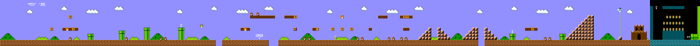

**World 1-2（地下關卡）**

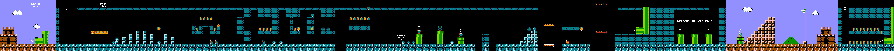

**World 8-4（城堡關卡）**

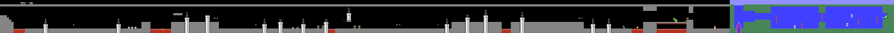

> 沒有 1:1 完整復刻，有盡力復刻關卡內容與細節。

<!-- #### 實際運行遊戲畫面

為了展現本專案的完整復刻成果，以下整理了各關卡與核心功能的實際運行截圖對照：

| 畫面類型 | 截圖說明 | 實際運行畫面 |
|------|---------|------------|
| **遊戲標題畫面 (Title)** | 具備原汁原味的標題選單，玩家可在此選擇進入遊戲。 |  |
| **世界 1-1 地面關卡** | 經典綠色水管、問號方塊、Goomba 巡邏與藍天白雲的像素地面場景。 |  |
| **世界 1-2 地下關卡** | 特有地下磚塊色調、食人花管口隱藏機制與多層水平水管平台。 |  |
| **世界 8-4 城堡關卡** | Bowser 噴吐火球、Axe 橋頭陷阱與 Castle Fire Spawner 動態追蹤火柱。 |  |
| **ESC 暫停與外掛選單** | 點擊 ESC 叫出的 UI 面板，可在此切換變身型態與開關 Cheat 模式。 |  |
| **遊戲勝利通關 (Game Won)**| 成功砍斷橋頭鐵鏈、擊殺庫巴並拯救公主後的勝利祝賀與致謝畫面。 |  |

> [!TIP]
> **截圖放置說明**：
> 您只需在運行遊戲時，使用截圖工具擷取以上 6 個關鍵畫面，並將圖片命名為對應的英文檔名（例如 `title_screen_shot.png`、`1-1_gameplay.png` 等），放置於 `Resources/map_reference/` 資料夾下，這份報告中的圖表便能自動、完美地將您的遊戲畫面加載並呈現在 PDF/Markdown 之中！ -->

---

## 程式設計

### 程式架構

本專案將最原始的 God Class 設計 徹底解耦，轉換為符合現代 C++ 標準的**深度物件導向架構 (Deep OOP Architecture)**。設計上大量運用**繼承 (Inheritance)**、**多型 (Polymorphism)**、**介面 (Interfaces)** 與多種**設計模式 (Design Patterns)**。

#### 專案規模

| 指標 | 數值 |
|------|------|
| 標頭檔 (.hpp) | 42 個 |
| 原始檔 (.cpp) | 47 個 |
| C++17 OOP 程式碼總行數 | **約 9,000 行** |
| 設計模式使用數量 | **8 種** |
| IEntityBehavior 策略子類 | **19 個** |
| ISceneHandler 狀態子類 | **10 個** |
| Block 子類 | **8 個** (含 MovingPlatform) |
| IPlayerForm 狀態子類 | **5 個** |
| IEnemyDeathAnimation 策略 | **4 個** |
| IUIPanel 策略子類 | **6 個** |
| Python 工具腳本 | **15 個** |

#### 系統分層架構圖 (Layered Architecture)

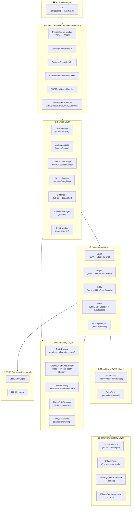

#### 核心 UML 繼承圖

##### PTSD GameObject 繼承樹

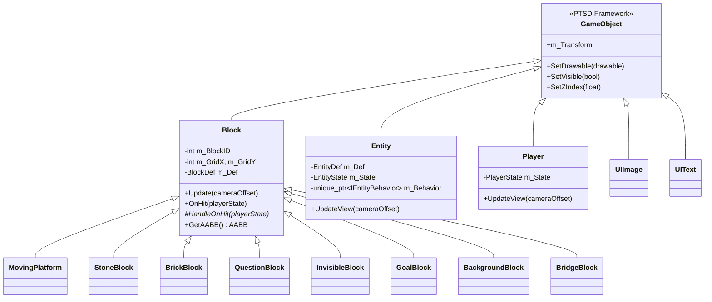

##### ISceneHandler 繼承樹 (State Pattern — 10 個狀態)

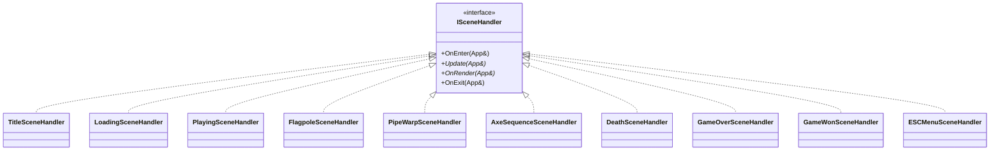

##### IEntityBehavior 繼承樹 (Strategy Pattern — 19 種行為)

```mermaid
classDiagram
    direction TB

    class IEntityBehavior {
        <<interface>>
        +Update(state, level, player, timer)*
        +OnPlayerCollision(state, player, isFromAbove) bool*
        +Clone() unique_ptr~IEntityBehavior~*
    }

    class GoombaBehavior
    class KoopaBehavior
    class ParaKoopaBehavior
    class AxeKoopaBehavior
    class BowserBehavior
    class FireballBehavior
    class MushroomBehavior
    class FireFlowerBehavior
    class StarBehavior
    class OneUpBehavior
    class CoinBehavior
    class AxeBehavior
    class PrincessBehavior
    class FlagBehavior
    class AxeProjectileBehavior
    class PiranhaPlantBehavior
    class PodobooBehavior
    class DefaultEntityBehavior
    class ParticleDebris
    class CastleFireSpawnerBehavior

    IEntityBehavior <|.. GoombaBehavior
    IEntityBehavior <|.. KoopaBehavior
    IEntityBehavior <|.. ParaKoopaBehavior
    IEntityBehavior <|.. AxeKoopaBehavior
    IEntityBehavior <|.. BowserBehavior
    IEntityBehavior <|.. FireballBehavior
    IEntityBehavior <|.. MushroomBehavior
    IEntityBehavior <|.. FireFlowerBehavior
    IEntityBehavior <|.. StarBehavior
    IEntityBehavior <|.. OneUpBehavior
    IEntityBehavior <|.. CoinBehavior
    IEntityBehavior <|.. AxeBehavior
    IEntityBehavior <|.. PrincessBehavior
    IEntityBehavior <|.. FlagBehavior
    IEntityBehavior <|.. AxeProjectileBehavior
    IEntityBehavior <|.. PiranhaPlantBehavior
    IEntityBehavior <|.. PodobooBehavior
    IEntityBehavior <|.. DefaultEntityBehavior
    IEntityBehavior <|.. ParticleDebris
    IEntityBehavior <|.. CastleFireSpawnerBehavior
```

##### IPlayerForm 繼承樹 (State Pattern — 5 種力量型態)

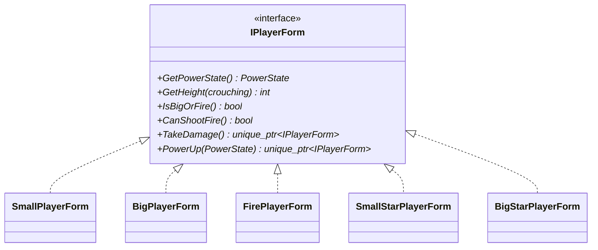

#### App 狀態機轉移圖

```mermaid
stateDiagram-v2
    direction LR
    [*] --> START
    START --> TITLE : App::Start()
    TITLE --> LOADING : PRESS ENTER
    LOADING --> PLAYING : 3.0s 過場計時
    PLAYING --> ESC_MENU : PRESS ESC
    ESC_MENU --> PLAYING : 選擇 RESUME
    ESC_MENU --> TITLE : 選擇 QUIT
    PLAYING --> FLAGPOLE : 碰觸旗桿 (1-1 / 1-2)
    FLAGPOLE --> LOADING : 進城堡動畫完成
    PLAYING --> PIPE_WARP : 站在水管上 + 按下方向鍵
    PIPE_WARP --> LOADING : 傳送序列完成
    PLAYING --> AXE_SEQUENCE : 碰觸橋頭斧頭 (8-4)
    AXE_SEQUENCE --> GAME_WON : 庫巴擊敗序列完成
    PLAYING --> DEATH : Mario 死亡
    DEATH --> LOADING : 剩餘命數 > 0
    DEATH --> GAME_OVER : 剩餘命數 = 0
    GAME_OVER --> TITLE : PRESS ENTER
    GAME_WON --> TITLE : PRESS ENTER
```

#### 遊戲主迴圈 — 17 Phase 架構

`PlayingSceneHandler::Update(App&)` 每幀依序執行以下 17 個階段：

| Phase | 名稱 | 職責 |
|-------|------|------|
| 0 | ESC CHECK | 偵測 ESC 鍵 → 切換到暫停選單 |
| 1 | PROCESS INPUT | `InputHandler::HandleInput()` 讀取鍵盤狀態 |
| 2 | UPDATE PHYSICS | `PlayerState::ApplyGravity()` 累加重力速度 |
| 3 | APPLY POSITION | 位置積分 `posX += velX, posY += velY` |
| 4 | COLLISION DETECT | `CollisionManager::CheckPlayerBlockCollision()` 三步驟碰撞管線 |
| 5 | SPAWN ITEMS | 處理被 Block hit 觸發的道具生成點 |
| 6 | PLAYER STATE TICK | `PlayerState::Tick()` 更新計時器與動畫幀 |
| 7 | ENTITY AI UPDATE | 所有實體的 `IEntityBehavior::Update()` + 實體方塊碰撞 |
| 8 | ENTITY TICK+VIEW | `EntityState::Tick()` + `Entity::UpdateView()` |
| 9 | PLAYER-ENTITY COL | `CollisionManager::CheckPlayerEntityCollision()` |
| 10 | ENTITY-ENTITY COL | `CollisionManager::CheckEntityEntityCollision()` |
| 11 | AXE/FLAG/PIPE | 特殊碰撞檢查（斧頭/旗桿/水管傳送） |
| 12 | CAMERA + BLOCKS | `Camera::Update()` + `Level::UpdateBlocks()` |
| 13 | BRICK DEBRIS | 碎磚粒子生成（JustBroken 旗標） |
| 14 | PLAYER VIEW | `Player::UpdateView()` + 無敵閃爍效果 |
| 15 | GAME TIMER | `GameStateManager::Tick()` + 時間低警告 BGM 切換 |
| 16 | PIT-FALL + DEATH | 深淵墜落偵測 → 死亡或外掛救援 |
| 17 | CLEANUP | `CleanupDeadEntities()` 清除已標記刪除的實體 |

#### MVC 每幀運作序列圖

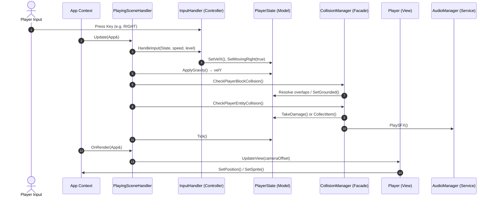

### 程式技術

#### 使用的設計模式 (Design Patterns)

本專案共運用了 **8 種** GoF / GRASP 設計模式：

| # | Pattern | 解決的問題 | 本專案的角色 | 擴充方式 |
|---|---------|-----------|------------|---------|
| 1 | **State** | `App.cpp` 曾是 800 行 switch 怪物 | `ISceneHandler` — 每個畫面一個子類，`App::Update()` 剩兩行；`IPlayerForm` — 力量型態狀態機 | 新增畫面：加一個 .hpp/.cpp + enum |
| 2 | **Strategy** | Entity 用 `if (type==Goomba)` 滿天飛 | `IEntityBehavior` — 19 種行為各一個 class | 新增敵人：加 XxxBehavior + Factory 一個 case |
| 3 | **MVC** | 渲染邏輯和遊戲邏輯混在一起 | Model=State, View=GameObject, Controller=InputHandler | — |
| 4 | **Factory** | 到處散落 `new Entity(...)` | `EntityFactory` 唯一建立入口；`EnemyDeathStyleFactory` 死亡策略工廠 | 新增實體：只改 Factory |
| 5 | **DIP** | 呼叫者依賴具體 class 難測試 | `IAudioService`, `IInputHandler`, `ILevelService` 介面隔離 | 換實作：只換注入點 |
| 6 | **Service Locator** | 跨模組傳遞指標麻煩 | `ServiceLocator::GetService<T>()` 全域取服務 | 新增服務：Register 一次 |
| 7 | **Facade** | `CollisionManager` 曾是 800 行義大利麵 | 四個 Handler 各管一種碰撞；CollisionManager 只負責分派 | — |
| 8 | **Template Method** | Block 子類碰撞邏輯大同小異 | `Block::OnHit()` 固定流程 → `virtual HandleOnHit()` 留給子類 | 新增方塊：override HandleOnHit |

#### 設計模式深度解析

##### 1. State Pattern — App::State 狀態機

**原問題：** 原版 `App.cpp` 在單一 switch-case 中塞入所有遊戲狀態邏輯，超過 500 行難以維護。

**解法：** GoF State Pattern — `App` 持有 `std::unique_ptr<ISceneHandler> m_CurrentHandler`。

```cpp
// App::Update() 永遠只有兩行！
m_CurrentHandler->Update(*this);    // game logic
m_CurrentHandler->OnRender(*this);  // drawing
```

新增遊戲狀態只需：

1. 新增一個 `ISceneHandler` 子類 (.hpp + .cpp)
2. 一個 `CreateSceneHandler()` case
3. 一個 `App::State` enum 值

**零修改 App.hpp 其他部分。**

##### 2. Strategy Pattern — IEntityBehavior

**原問題：** 傳統設計下的 Entity 使用大量 `if (type == Goomba)` 判斷，每新增一種敵人就要修改大量既有程式碼。

**解法：** Strategy Pattern — `Entity` 持有 `unique_ptr<IEntityBehavior>`，透過多型 dispatch 消除所有 type 判斷分支。

所有 19 種實體行為各自獨立為一個 class：

| 類別 | 敵人/實體 | 特性 |
|------|---------|------|
| GoombaBehavior | 栗寶寶 | 巡邏 + 踩扁 |
| KoopaBehavior | 烏龜兵/龜殼 | 巡邏 → Shell 模式切換 |
| ParaKoopaBehavior | 飛翔烏龜 | 正弦波浮動 → 著陸轉換 |
| AxeKoopaBehavior | 擲斧烏龜 | 避坑 AI + 面向玩家 + 投擲斧頭 + 活潑跳躍 |
| BowserBehavior | Boss 庫巴 | 5-Phase AI (巡邏/吐火/跳躍/受傷/擊敗) + HP 系統 |
| PiranhaPlantBehavior | 食人花 | 4-Phase 伸縮 + 玩家安全半徑偵測 |
| PodobooBehavior | 岩漿泡泡 | 定時向上跳躍，不可踩 |
| CastleFireSpawnerBehavior | 城堡火柱 | 越屏隱形噴火，動態追蹤玩家高度 |
| FireballBehavior | 玩家火球 | 拋物線軌跡 + 碰撞爆炸 |
| MushroomBehavior | 紅香菇 | 從方塊升起 → 平移 → 碰牆反向 |
| FireFlowerBehavior | 火焰花 | 靜態升起等待收集 |
| StarBehavior | 星星 | 彈跳移動，無敵狀態 |
| OneUpBehavior | 綠香菇 | 與紅香菇相同移動，觸發增命 |
| CoinBehavior | 金幣 | 靜態旋轉，無重力 |
| ParticleDebris | 磚塊碎片 | 物理粒子模擬 |
| 其他 4 種 | 斧頭/公主/旗幟/斧投射物 | 靜態觸發器/NPC |

##### 3. MVC Pattern — Player & Entity

```
Model      → PlayerState / EntityState  (純資料：位置/速度/動畫/狀態旗標)
View       → Player      / Entity       (繼承 Util::GameObject：選 Sprite/渲染)
Controller → InputHandler               (讀鍵盤 → 寫 PlayerState)
           + PlayingSceneHandler         (主迴圈協調所有元件)
```

**關鍵分離：** Model 不依賴 PTSD 渲染 API、View 不包含遊戲邏輯、碰撞由 CollisionManager 處理。

##### 4. Factory Pattern

- **`EntityFactory`**：唯一的 Entity 建立入口，負責根據 `EntityType` 設定維度、建立對應 Behavior、注入死亡動畫策略。
- **`EnemyDeathStyleFactory`**：根據敵人類型與死因，動態建立對應的死亡動畫策略物件（踩扁/龜殼/火球擊飛/通用）。

##### 5. Facade Pattern — CollisionManager

**原問題：** `CollisionManager.cpp` 曾是 800 行義大利麵，混合 4 種碰撞邏輯。

**解法：** 拆為 4 個特化策略 Handler + 1 個 Facade 分派器：

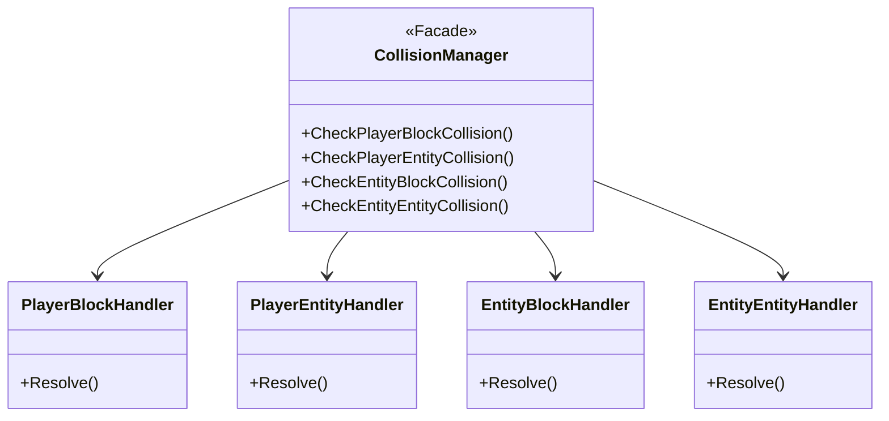

##### 6. State Pattern — IPlayerForm (力量型態)

**原問題：** Mario 具有多種力量型態（Small, Big, Fire, SmallStar, BigStar）。硬編碼在 `PlayerState` 中會充斥 if-else。

**解法：** `PlayerState` 持有 `unique_ptr<IPlayerForm>`，每次升級/受傷時透過多型回傳新的形態物件，**零 if-else / switch-case**：

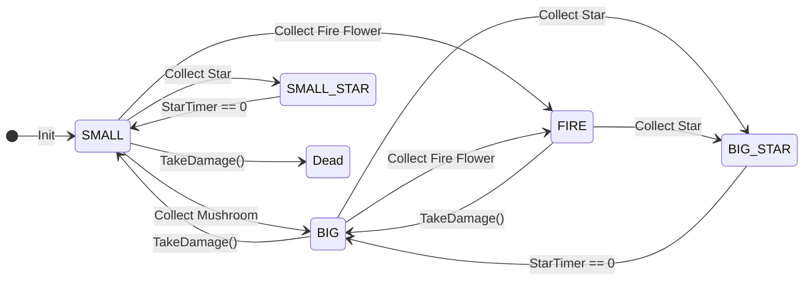

#### 特色技術亮點

| 技術 | 說明 |
|------|------|
| **Viewport Culling 優化** | Level 使用 O(1) 扁平 Block 陣列與視口剔除，只渲染可見範圍的方塊 |
| **Sprite Path Cache** | `SpritePathResolver` 使用 `s_ResolvedPathCache` 避免每幀磁碟 I/O |
| **Entity-Entity O(M²) 優化** | `EntityEntityHandler` 透過 thread_local 視口快取，將碰撞迴圈從 O(N²) 降至 O(M²) |
| **Zero Down-Casting** | 完全消除 `dynamic_cast`，狀態間透過 DTO 或 Self-Configuring 傳遞參數 |
| **Data-Driven Entity** | `EntityDef::renderTargetWidth` 由 Factory 注入，消除 Entity 內部的 level 字串判定 |
| **CSV 資料驅動** | 關卡地圖 (`.csv`) + IDList + EntityList，全部由資料驅動而非硬編碼 |
| **Template Method** | `Block::OnHit()` 固定流程（載入貼圖→彈跳→`virtual HandleOnHit()`），子類只需 override 差異 |
| **座標轉換統一** | `GameConfig` 提供 6 個靜態 helper，禁止在 callsite 手動寫 `+width/2` |

#### 目錄結構

```
NTUT_OOPL_mario_V3/
├── include/
│   ├── App.hpp                           ← 應用程式主類別
│   └── Mario/
│       ├── Core/                         ← 核心基礎設施
│       │   ├── GameConfig.hpp            ← 全域常數 + 座標轉換
│       │   ├── Collider.hpp              ← AABB 碰撞矩形
│       │   ├── CollisionContext.hpp       ← 碰撞資料 DTO
│       │   ├── Camera.hpp                ← 攝影機系統
│       │   ├── PhysicsEngine.hpp         ← 物理引擎
│       │   └── SpritePathResolver.hpp    ← Sprite 路徑快取
│       ├── Player/                       ← 玩家 MVC
│       │   ├── Player.hpp                ← View 層
│       │   ├── PlayerState.hpp           ← Model 層
│       │   ├── PlayerForm.hpp            ← 力量型態策略 (5 個子類)
│       │   └── PlayerDeathAnimation.hpp  ← 死亡動畫策略
│       ├── Level/                        ← 關卡與實體
│       │   ├── Level.hpp                 ← CSV 關卡載入
│       │   ├── Block.hpp                 ← 方塊基類 (7 個子類)
│       │   ├── MovingPlatform.hpp        ← 移動平台
│       │   ├── EntityDef.hpp             ← 實體定義 DTO
│       │   ├── Entity.hpp                ← 實體 View 層
│       │   ├── EntityState.hpp           ← 實體 Model 層
│       │   ├── EntityFactory.hpp         ← 實體工廠
│       │   ├── EnemyDeathAnimation.hpp   ← 敵人死亡動畫 (4 種)
│       │   ├── EnemyDeathStyleFactory.hpp← 死亡策略工廠
│       │   └── GameStateManager.hpp      ← 全域遊戲狀態
│       ├── Behaviors/                    ← 策略行為 (19 種)
│       │   ├── IEntityBehavior.hpp       ← 策略介面
│       │   ├── GoombaBehavior.hpp
│       │   ├── KoopaFamily.hpp           ← Koopa 系列 (3 種合併)
│       │   ├── BowserBehavior.hpp        ← Boss AI
│       │   ├── CastleFireSpawnerBehavior.hpp
│       │   ├── FireballBehavior.hpp
│       │   ├── ItemBehaviors.hpp          ← 5 種道具合併
│       │   ├── StaticEntityBehaviors.hpp  ← 4 種靜態合併
│       │   ├── PiranhaPlantBehavior.hpp
│       │   ├── PodobooBehavior.hpp
│       │   ├── DefaultEntityBehavior.hpp
│       │   └── ParticleDebris.hpp
│       ├── Collision/                    ← 碰撞子系統
│       │   ├── ICollisionHandler.hpp     ← 碰撞介面
│       │   ├── BlockContactResolver.hpp  ← 靜態 Snap helpers
│       │   ├── PlayerBlockHandler.hpp
│       │   ├── PlayerEntityHandler.hpp
│       │   ├── EntityBlockHandler.hpp
│       │   └── EntityEntityHandler.hpp
│       ├── Scenes/                       ← 場景狀態 (10 個)
│       │   ├── ISceneHandler.hpp         ← 狀態介面
│       │   ├── PlayingSceneHandler.hpp
│       │   ├── MenuSceneHandlers.hpp     ← 4 種選單合併
│       │   ├── LoadingSceneHandler.hpp
│       │   ├── FlagpoleSceneHandler.hpp
│       │   ├── PipeWarpSceneHandler.hpp
│       │   ├── AxeSequenceSceneHandler.hpp
│       │   └── ESCMenuSceneHandler.hpp
│       ├── Services/                     ← 服務層 (DIP)
│       │   ├── ServiceLocator.hpp
│       │   ├── EventSystem.hpp
│       │   ├── IInputHandler.hpp
│       │   ├── InputHandler.hpp
│       │   ├── IAudioService.hpp
│       │   ├── AudioType.hpp
│       │   ├── AudioPathResolver.hpp
│       │   ├── AudioManager.hpp
│       │   ├── ILevelService.hpp
│       │   └── LevelManager.hpp
│       └── UI/                           ← UI 系統
│           ├── UIPanel.hpp               ← 6 種面板策略
│           ├── UIManager.hpp
│           ├── UIWidgets.hpp
│           ├── CoinUI.hpp
│           └── FloatingText.hpp
├── src/                                  ← 47 個 .cpp 實作檔
│   ├── App.cpp (172 行)
│   ├── main.cpp
│   └── Mario/  (同上對應結構)
├── Resources/
│   ├── Levels/    (1-1.csv, 1-2.csv, 8-4.csv)
│   ├── LookUpSheet/ (IDList.csv, EntityList.csv)
│   ├── Sprites/   (Block/Player/Entity/UI PNG)
│   ├── Audio/     (BGM .ogg / SFX .wav)
│   └── Font/      (遊戲字型)
├── python_src/                           ← 15 個 Python 工具腳本
├── Constructure.md                       ← 完整 OOP 架構設計文件
├── Agent.md                              ← AI 助手開發指南
└── files.cmake                           ← 所有檔案列舉
```

### 使用到 AI/AI Agent 的部分

本專案在開發過程中使用了 **AI Agent（Google Gemini Antigravity 、 VSCode Copilot Pro）** 輔助開發，以下詳述使用方式與範疇：

#### AI 使用場景

| 使用場景 | 具體說明 | AI 貢獻度 |
|---------|---------|----------|
| **OOP 架構設計與重構** | 將最原始的 God Class 設計 拆解為 State/Strategy/MVC/Factory 等設計模式的 C++ 架構 | 高度輔助 |
| **程式碼實作** | 19 個 `IEntityBehavior` 策略類別、10 個 `ISceneHandler` 場景狀態、碰撞子系統等核心模組的撰寫 | 高度輔助 |
| **Bug 修復** | 碰撞物理管線調優、邊界條件修復、渲染偏移修正等 6 輪 Bug Session | 高度輔助 |
| **Boss AI 設計** | Bowser 5-Phase AI 狀態機、AxeKoopa 避坑 AI、Castle Fire Spawner 動態追蹤 | 高度輔助 |
| **架構文件維護** | `Constructure.md` 的 UML 圖表、設計模式解析、檔案清單更新 | 高度輔助 |
| **Python 工具腳本** | 8-4 地圖生成、Sprite 裁切、CSV 驗證等 15 個工具腳本 | 高度輔助 |

#### AI Agent 工作流程

AI Agent 嚴格遵循 `Agent.md` 中定義的開發規範：

1. **架構設計先行**：每次重大開發前先更新 `implementation_plan.md` 與使用者對齊
2. **程式碼品質**：所有 `.hpp/.cpp` 頂部必有英文職責與繼承註解
3. **架構同步**：每次修改類別結構後即時更新 `Constructure.md`
4. **進度追蹤**：透過 `task.md` 記錄所有進度與目標
5. **禁止事項遵守**：不修改 CMakeLists.txt、不執行 cmake 命令

#### AI Agent 開發準則 (Agent.md 規範摘要)

```
1. OOP 優先：封裝、繼承、多型，禁止 God Class
2. MVC 架構：Model / View / Controller 嚴格分離
3. 英文註解：所有程式碼註解必須為英文
4. 檔案規範：新增檔案加入 files.cmake，頂部必有職責說明
5. 架構同步：修改類別後立即更新 Constructure.md
6. 禁止修改 CMakeLists.txt 或執行 cmake 命令
```

---

## 結語

### 問題與解決方法

#### 問題 1：God Class 導致的義大利麵式程式碼

**問題描述：** 最原始的程式碼是一個典型的 God Class，所有遊戲邏輯、渲染、碰撞、AI 全部混在同一個檔案中，超過數千行且完全不可維護。

**解決方法：** 導入 **State Pattern** 將 `App.cpp` 從 800 行 switch 怪物縮減為 172 行的純協調器。將遊戲邏輯分散到 10 個 `ISceneHandler` 子類中，各自負責一個畫面的邏輯。同時導入 **ILevelService** 介面將 Player、Level、Entities 等資料從 App 剝離至 `LevelManager`。

**成果：** `App::Update()` 永遠只有兩行程式碼。

---

#### 問題 2：碰撞系統義大利麵

**問題描述：** `CollisionManager.cpp` 曾是 800 行的巨大類別，混合處理 4 種截然不同的碰撞邏輯，違反 SRP。

**解決方法：** 導入 **Facade Pattern + Strategy Pattern**，將碰撞系統拆分為：

- `PlayerBlockHandler`：玩家 vs 方塊（三步驟物理管線）
- `PlayerEntityHandler`：玩家 vs 實體（踩踏/傷害/收集）
- `EntityBlockHandler`：實體 vs 方塊（地面/反彈）
- `EntityEntityHandler`：實體 vs 實體（火球/龜殼）

`CollisionManager` 本身縮減為 65 行的純 Facade 分派器。

---

#### 問題 3：Entity 類型判斷的硬編碼

**問題描述：** 最原始的程式碼使用 `if (type == Goomba)` 等硬編碼分支判斷敵人行為，每新增一種敵人需修改大量既有程式碼。

**解決方法：** 導入 **Strategy Pattern**，將每種實體的行為封裝為獨立的 `IEntityBehavior` 子類。`Entity` 只需呼叫 `m_Behavior->Update()`，完全不知道具體是什麼實體。

**成果：** 新增敵人只需加一個 `XxxBehavior` 類別 + 在 `EntityFactory` 加一個 case，核心程式碼零修改。

---

#### 問題 4：力量型態的 if-else 爆炸

**問題描述：** Mario 的力量型態（Small/Big/Fire/Star）邏輯散落在 PlayerState 的各個方法中，充斥著 `if (powerState == FIRE)` 等判斷。

**解決方法：** 導入 **State Pattern（IPlayerForm）**，將每種力量型態封裝為獨立的策略類別，透過多型 `TakeDamage()` 和 `PowerUp()` 回傳下一個狀態物件。

**成果：** 新增力量型態（如冰花、狸貓）只需新增一個 `IPlayerForm` 子類，核心物理引擎與渲染主流程完全不需修改。

---

#### 問題 5：向下轉型 (dynamic_cast) 污染

**問題描述：** 場景切換時需傳遞特定參數（如旗桿座標、水管傳送方向），原先使用 `dynamic_cast` 將場景指標向下轉型再呼叫 Setup。

**解決方法：** 導入 **Self-Configuring + State Context DTO**：

- `FlagpoleSceneHandler` 在 `OnEnter()` 主動查詢 `ILevelService`
- `PipeWarpSceneHandler` 透過 `GameStateManager` 的 Warp DTO 取得傳送參數

**成果：** 整個 C++ 專案中完全清除了所有 `dynamic_cast`。

---

#### 問題 6：碰撞物理管線的精確移植

**問題描述：** 碰撞系統的碰撞解析順序極為敏感（先落地偵測→頭頂觸發→逐方塊迴圈），順序錯誤會導致 Mario 卡牆、飄浮、穿牆等 Bug。

**解決方法：** 嚴格調研並實作最穩定的三步驟碰撞管線：

1. **FallDetect**：4px strip 偵測腳下是否有方塊
2. **CeilingTrigger**：窄 hitbox 偵測頭頂撞擊
3. **BodyResolution**：全身碰撞體的 Down→Right→Left→Up 順序 Snap

**成果：** 經過 6 輪 Bug Session 的精細調優，碰撞物理手感與原版高度一致。

---

### 自評

| 項次 | 項目 | 完成 |
|------|------|------|
| 1 | 復刻三個關卡 (1-1, 1-2, 8-4) 並可完整通關 | V |
| 2 | 完成專案權限改為 public | V |
| 3 | 具有 debug mode 的功能 (ESC 暫停選單 + Cheat Mode) | V |
| 4 | 解決專案上所有 Memory Leak 的問題 (使用 unique_ptr/shared_ptr 管理所有動態記憶體) | V |
| 5 | 報告中沒有任何錯字，以及沒有任何一項遺漏 | V |
| 6 | 報告至少保持基本的美感，人類可讀 | V |

#### OOP 原則遵守確認

| 原則 | 實現方式 | 狀態 |
|------|---------|------|
| 所有實體繼承 Util::GameObject | Player, Entity, Block, UIImage, UIText 全部繼承 | ✅ |
| 沒有 God Class | App 只負責 TransitionTo()；邏輯分散到各 Handler/Manager | ✅ |
| MVC 架構 | PlayerState(M) → Player(V) → InputHandler(C) | ✅ |
| State Pattern | 10 個 ISceneHandler + 5 個 IPlayerForm | ✅ |
| Strategy Pattern | 19 個 IEntityBehavior + 4 個 IEnemyDeathAnimation + 6 個 IUIPanel | ✅ |
| Factory Pattern | EntityFactory + EnemyDeathStyleFactory 唯一入口 | ✅ |
| DIP | IAudioService / IInputHandler / ILevelService 介面隔離 | ✅ |
| OCP 原則 | 新增怪物/狀態/UI面板不修改現有核心類別 | ✅ |
| DRY 原則 | GameConfig 統一座標轉換；靜態 Sprite Cache | ✅ |
| 零 dynamic_cast | 狀態間透過 DTO 或 Self-Configuring 傳遞參數 | ✅ |

### 心得

這學期的物件導向程式設計實習（OOPL）對我而言，是一次極為震撼且深刻的程式心路歷程。這不僅僅是完成了復刻超級瑪利歐這款遊戲本身，這次實習更讓我深刻翻轉了對「物件導向設計」與「人機協作（Human-AI Collaboration）」的認知。

#### 1. 甜蜜的蜜月期與突如其來的「義大利麵地獄」

剛開始寫這個馬力歐專案時，我心裡其實非常放鬆，甚至有點小得意。我想著：「反正現在有 **VS Code Copilot** 和 **Antigravity** 這些超強的 AI 工具，我只要用口語講一下需求，程式碼不就劈哩啪啦生出來了，寫專案超輕鬆的吧！」（想起來，這簡直是沒受過扎實資工系課程洗禮才會講出來的幼稚發言）。

確實，前幾天開發過程簡直像蜜月期一樣爽快。AI 寫程式碼的速度飛快，給個指令就產出一大堆代碼，遊戲也真的能跑能動了，Mario 會跑、會跳，看起來有模有樣。但因為我當時太過依賴 AI 的即時產出，完全沒有靜下心來規劃整體的 OOP 架構。結果，代碼不知不覺塞成一團，程式裡充斥著幾百個 if-else 和硬編碼，不知不覺寫出了一大坨令人頭疼的義大利麵代碼。

雖然遊戲能動，但隨著專案規模擴大，真正的考驗來了：當我想新增水管傳送，或者是 8-4 的 Boss 關時，代碼開始全面崩潰。只要改了 A 就會壞了 B，到處都是牽一髮動全身的死結。我每天陷入了無止境的 Debug 地獄，看著幾千行亂成一團的代碼，我真的感到無比痛苦與挫折。

#### 2. 痛定思痛的「架構大洗牌」與覺醒

在那段痛苦的 Debug 地獄中，我突然停下鍵盤，徹底頓悟了：**我本末倒置了！**

AI 寫代碼的速度確實很快，但它缺乏整體的「大局觀」與「架構遠見」。如果我身為開發者，沒有先在腦中把物件的繼承關係、介面合約、工廠模式等藍圖給規劃好，直接叫 AI 開始寫，那 AI 產出來的只會是「能跑的精美垃圾」。

於是我痛下決心，決定把原本凌亂的代碼全部推倒進行大手術！我拿了我的平板和撰寫markdown格式，先靜下心來把所有的類別關係一筆一筆畫出來：思考哪些物件是共通的、繼承樹該怎麼長、狀態要怎麼用多型來解耦。

我和AI討論過後，把整個 Interface 定義得清清楚楚，建立好乾淨的「空殼框架」後，才重新把這些架構拋給 AI，讓它只負責填充裡面的具體實現細節。這一次，奇蹟發生了：代碼不僅變得超級乾淨，而且各個模組各司其職，再也沒有改 A 壞 B 的鳥事發生！

#### 3. 設計模式與 OOP 架構的接地氣體會（物件創造與解耦）

經歷了這次痛定思痛的重構，我才真正體會到，原來課本上那些「設計模式」真的不是為了應付考試，而是為了「救命」用的！特別是專案中的幾個核心設計，讓我超級有感：

- **物件創造的「點餐櫃檯」（Factory Pattern）**：
  以前要生一個怪物或道具，程式碼到處都是 `new Goomba(...)`、`new Mushroom(...)`，還要手動去塞一堆 Z-Index、碰撞箱大小跟初始速度，程式碼亂到不行。重構後我寫了 `EntityFactory`，它就像一個**「點餐櫃檯」**。現在不論是地圖載入還是 Boss 吐火球，大家只要跟 Factory 說：「嘿！幫我在座標 $(x,y)$ 生一個 Goomba。」Factory 跑完工廠流程，就會自動去查表、配對對應的 `IEntityBehavior`「AI 晶片」、注入死亡動畫策略，最後把熱騰騰的物件端出來。呼叫者根本不用管怎麼組裝它，這才是真正的封裝！
- **怪物行為的「插拔式」設計（Strategy Pattern）**：
  以前最原始的寫法裡面塞滿了 `if (type == Goomba)`、`if (type == Koopa)`，隨便加個功能就會改壞別的怪。現在 `Entity` 物件本身飾演著一個「空殼載具」的角色，核心是它身上持有的 `IEntityBehavior` 策略指標。Goomba 有 Goomba 的行走晶片，Koopa 有 Koopa 的躲龜殼晶片。甚至當飛天龜被踩一下，失去翅膀變成普通烏龜時，我們也只需要**當場拔掉它的 Behavior 晶片，換插上 `KoopaBehavior` 晶片即可**。物件不用銷毀重建，只換「靈魂」（行為）就搞定，這彈性真的非常神！
- **主角力量變身的優雅切換（State Pattern）**：
  Mario 有小隻、大隻、火球、無敵等狀態，如果用 if-else 來寫，物理碰撞跟動畫切換會直接爆炸。我們把它拆成 `IPlayerForm` 的五個狀態子類。Mario 吃香菇時，狀態機直接 `return unique_ptr<BigPlayerForm>`。當碰撞引擎問：「你現在碰撞高度是多少？」或者 Input 詢問：「玩家能不能射火球？」Mario 只需要轉頭去問他當前的 Form 物件就好。**主角的物理與渲染邏輯裡，一行 `if (isBig)` 判斷都不用寫**，全部交給多型處理，代碼乾淨到不可思議！
- **碰撞系統的「櫃檯分發」機制（Facade Pattern）**：
  一開始的碰撞系統簡直是個巨大怪獸，所有地形、玩家、怪物之間的碰撞交織在一起，修 A 壞 B 是家常便飯。重構時，我把它降格成一個**「分派櫃檯（Facade）」**，底下開了四個專業小幫手（`PlayerBlockHandler`、`PlayerEntityHandler` 等）各司其職。現在玩家撞怪物的 bug，就只去 `PlayerEntity` 的檔案裡修，完全不用擔心弄壞地形碰撞。各司其職的感覺，讓 Debug 的速度快了十倍不止！

#### 4. 與 Claude 和 Gemini 模型協作的默契心得

在這個心路歷程中，我也摸索出跟不同 AI 模型合作的默契，發現它們在不同開發階段各有優缺點：

- **Claude 模型（前期的開路軍師）**：在前中期需要大刀闊斧重構或發想複雜邏輯時，Claude 是非常厲害的夥伴。它的邏輯極強、點子很多，但缺點是**非常容易「創造新的架構」**。如果不看緊它，它有時會自作主張引入新的類別、改變既有的設計模式，這在後期架構已經定型時，反而容易造成架構飄移。
- **Gemini 模型（後期的防守門神）**：到了後期架構已經完全成熟、進入收尾與調優階段時，我轉而使用 Gemini 模型比較多。Gemini 的最大優勢在於**它能嚴格遵守並遵循現有的程式架構與 `Constructure.md` 中定義的規則**。它會以極高的紀律性，在不破壞既有設計模式的前提下，完美地在既有框框裡修補代碼、優化性能與修復 bug，非常省心。

#### 總結

這個OOP馬力歐專案對我而言，最珍貴的收穫不僅僅是利用 C++ 成功復刻了我從小就夢想挑戰的超級瑪利歐，更重要的是，我從中學會了如何當一個掌控全局的「系統架構師」，而不是被 AI 牽著鼻子走的碼農。這絕對是我大學生涯目前為止做過最有趣、也成就感最大的一個專案！

### 貢獻比例

| 組員 | 貢獻比例 |
|------|---------|
| 113820033 謝奕宏 | **100%** |
