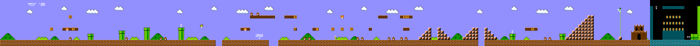
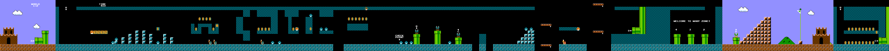
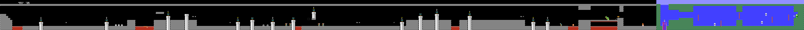
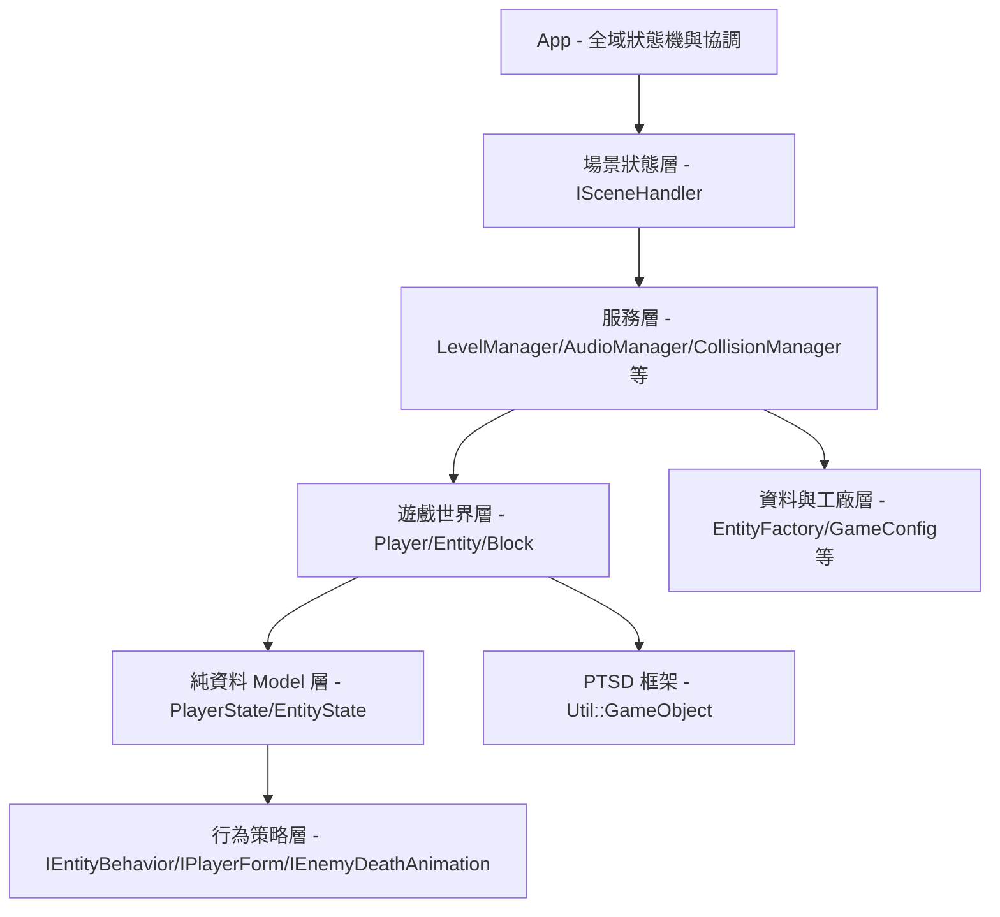
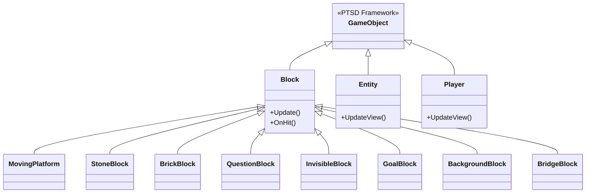
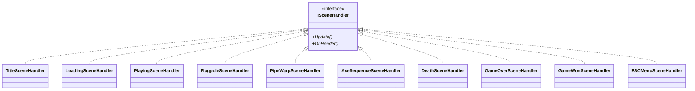
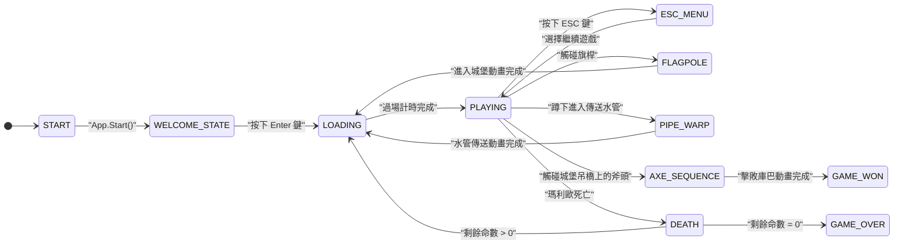
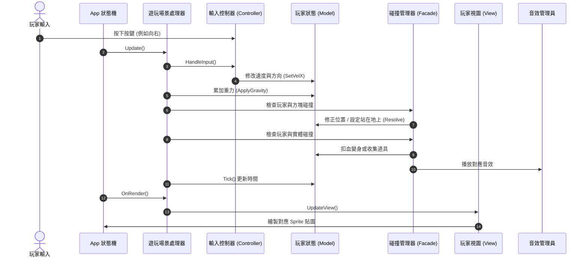

# 2026 OOPL Final Report

## 組別資訊

組別：T43
組員：113820033 謝奕宏
復刻遊戲：Super Mario Bros. (FC / NES, 1985)

## 專案簡介

### 遊戲簡介

- 這次專案我是使用助教提供的 PTSD 框架，以 C++17 復刻經典的 2D 橫捲軸動作遊戲《超級瑪利歐兄弟》（Super Mario Bros.）。
- 玩家在遊戲中可以操控主角 Mario 進行左右移動、跳躍、踩踏敵人，並且吃香菇變大、吃火焰花發射火球、吃無敵星星變得刀槍不入。
- 專案中我實作了三個關卡，分別是經典的 World 1-1（地面關卡）、World 1-2（地下關卡）以及 World 8-4（城堡關卡），玩家需要穿越重重障礙與不同的敵人，最後在城堡擊敗 Boss 庫巴（Bowser）並拯救公主。

### 組別分工

- 因為我是一個人一組，所以這個瑪利歐遊戲的所有開發工作都是由我一個人完成，包含程式架構設計、核心遊戲與物理碰撞邏輯、關卡地圖設計與生成、敵人 AI 行為系統、UI 與音效整合，以及撰寫報告和工具腳本等。

## 遊戲介紹

### 遊戲規則

- **操作方式** - 按鍵
  - ← → (或 A / D) - 控制 Mario 左右移動
  - ↑ / W / Space / Z - 跳躍（按得越久可以跳得越高）
  - ↓ / S - 蹲下（只有在大瑪利歐或火球瑪利歐狀態下才可以蹲下）
  - E / LShift - 加速跑步，或是發射火球（在火球狀態下）
  - ESC - 開啟暫停選單（可以進行變身、開關外掛）
  - Enter - 開始遊戲，或是確認選單
- **遊戲機制**
  - **生命系統**：Mario 一開始有 3 條命，如果掉進懸崖、被敵人碰到（沒踩到的話）、或是時間歸零，就會死掉並扣一條命。命扣完就 Game Over。
  - **力量型態 (Power State)**：
    - **小瑪利歐 (Small)**：最基本的狀態，被敵人碰到就會死。
    - **大瑪利歐 (Big)**：吃紅香菇變大，可以撞碎磚塊。被敵人碰到的話會縮小成小瑪利歐，不會直接死。
    - **火焰瑪利歐 (Fire)**：吃火焰花變身，可以按 Shift/E 丟火球打倒敵人。
    - **無敵星星 (Star)**：吃星星之後會閃爍，這段時間是無敵的，碰到敵人直接把敵人撞飛。
  - **金幣與分數**：路上收集金幣可以加分，每收集滿 100 枚金幣會額外獲得一條命。
  - **時間限制**：每個關卡限時 400 秒，如果時間低於 100 秒，遊戲背景音樂會自動變快，提醒玩家要抓緊時間。
  - **踩踏連擊**：如果連續踩踏多個敵人而且中間沒有落地，獲得的分數會一直翻倍（100 -> 200 -> 400 -> 800 -> 1000）。
- **關卡流程**
  - 遊戲共有三個關卡：World 1-1 (經典地面關卡) -> 觸碰旗桿 -> World 1-2 (地下關卡，有食人花與平台) -> 進入傳送水管 -> World 8-4 (城堡關卡，有岩漿與 Boss 庫巴) -> 踩下橋頭斧頭擊敗庫巴 -> 通關！
- **敵人行為**
  - **栗寶寶 (Goomba)**：最基礎的敵人，只會左右巡邏，碰到牆壁會折返。玩家可以直接跳起來踩扁它，或是用火球打飛。
  - **烏龜兵 (Koopa Troopa)**：分為紅綠兩色。被踩了之後會縮入龜殼。玩家可以走過去踢飛龜殼，龜殼會快速滑動並砸死路上的其他敵人。
  - **飛天龜 (ParaKoopa)**：有翅膀的烏龜，會成正弦波浮動飛行。被玩家踩中一次後會失去翅膀，降為普通烏龜兵。
  - **擲斧烏龜 (AxeKoopa)**：會左右走動、避開坑洞，並主動往玩家的方向跳躍及投擲斧頭，是比較棘手的敵人。
  - **Boss 庫巴 (Bowser)**：關卡 8-4 的終極 Boss。它有五個 AI 階段，會左右走動、朝玩家噴吐火球、活潑地跳躍。玩家需要射出多個火球才能擊殺它，或者直接衝到它身後砍斷吊橋。
  - **食人花 (Piranha Plant)**：藏在綠色水管裡，定時上下伸縮。我設計了安全偵測，如果玩家站得離水管太近，食人花就不會伸出來，避免玩家剛好走過去被偷襲。
  - **岩漿泡泡 (Podoboo)**：從 8-4 關卡的熔岩中定時往上跳起，再掉回岩漿中，這種敵人是不能踩踏的。
  - **城堡火柱 (Castle Fire)**：在 8-4 城堡裡旋轉的越屏火柱，會動態追蹤並傷害玩家。
- **道具介紹**
  - **紅香菇 (Mushroom)**：吃掉後可以從小瑪利歐變身為大瑪利歐，身體變高且能敲碎一般磚塊。
  - **火焰花 (Fire Flower)**：吃掉後可以升級為火焰瑪利歐，按 E / Shift 鍵可以投擲火球。
  - **無敵星星 (Star)**：吃掉後會有一段時間無敵，此時碰到任何敵人都可以直接撞飛消滅。
  - **綠香菇 (1-UP Mushroom)**：吃掉後可以額外增加一條命。
  - **金幣 (Coin)**：路上或磚塊裡的金幣，每收集滿 100 枚金幣就能加一條命。
- **外掛模式 (Cheat Mode)**
  - 在遊戲中按下 ESC 叫出暫停選單，我寫了外掛功能可以自由切換：
    - 可以自由變身成小瑪利歐、大瑪利歐或火焰狀態。
    - 可以開啟「無限無敵星星」讓 Mario 永久無敵。
    - 可以開啟「火球射擊能力」，讓小瑪利歐也能射火球。
    - 可以開啟「虛空救援」，掉進深淵時會自動傳送回上一個起跳平台，不用擔心死掉。

### 遊戲畫面

| 階段 | 遊戲畫面 |
|:---:|:---:|
| 開始畫面 (Title Screen) |  |
| 關卡 1-1 (World 1-1) |  |
| 關卡 1-2 (World 1-2) |  |
| 關卡 8-4 (World 8-4) |  |
| 暫停與外掛選單 |  |
| 勝利通關畫面 |  |

## 程式設計

### 程式架構

在這次的程式設計中，我花了很多心思把原本混在一起的程式碼（God Class）徹底拆開，改成更符合物件導向原則的架構。我使用了 C++17 來開發，並大量使用了繼承、多型與多種設計模式。

以下是整個專案的專案規模與系統分層：

#### 專案規模

- 標頭檔 (`.hpp`)：42 個
- 原始檔 (`.cpp`)：47 個
- 程式碼總行數：約 9,000 行
- 設計模式使用數量：8 種
- 實體行為策略子類 (`IEntityBehavior`)：19 個
- 場景狀態子類 (`ISceneHandler`)：10 個
- 方塊子類 (`Block`)：8 個
- 玩家型態子類 (`IPlayerForm`)：5 個

#### 系統分層架構圖

我將整個專案分為多個層級，從最上層的 App，到場景控制、服務層、遊戲世界物件、行為策略，以及最底層的資料工廠：

```mermaid
graph TD
    App[App - 全域狀態機與協調] --> Scenes[場景狀態層 - ISceneHandler]
    Scenes --> Services[服務層 - LevelManager/AudioManager/CollisionManager等]
    Services --> GameWorld[遊戲世界層 - Player/Entity/Block]
    GameWorld --> Model[純資料 Model 層 - PlayerState/EntityState]
    Model --> Behaviors[行為策略層 - IEntityBehavior/IPlayerForm/IEnemyDeathAnimation]
    Services --> Factories[資料與工廠層 - EntityFactory/GameConfig等]
    GameWorld --> PTSD[PTSD 框架 - Util::GameObject]
```

#### 核心類別繼承關係與說明

為了讓大家方便看懂，我畫了幾個核心的繼承關係圖：

##### 1. 遊戲物件繼承樹 (PTSD GameObject)

所有在地圖上看得見的物體，我讓它們都繼承自 PTSD 框架的 `Util::GameObject`：

```mermaid
classDiagram
    direction TB
    class GameObject {
        <<PTSD Framework>>
    }
    class Block {
        +Update()
        +OnHit()
    }
    class Entity {
        +UpdateView()
    }
    class Player {
        +UpdateView()
    }
    GameObject <|-- Block
    GameObject <|-- Entity
    GameObject <|-- Player
    Block <|-- MovingPlatform
    Block <|-- StoneBlock
    Block <|-- BrickBlock
    Block <|-- QuestionBlock
    Block <|-- InvisibleBlock
    Block <|-- GoalBlock
    Block <|-- BackgroundBlock
    Block <|-- BridgeBlock
```

- `Util::GameObject`：PTSD 中的遊戲基礎物件。
- `Player`：玩家的 View 顯示類別，負責依據狀態更新 Mario 的 Sprite 渲染。
- `Entity`：所有實體（敵人、道具、火球等）的 View 顯示類別。
- `Block`：所有地圖方塊的基類，包含：`BrickBlock` (一般磚塊)、`QuestionBlock` (問號方塊)、`StoneBlock` (石頭地基)、`InvisibleBlock` (隱形方塊)、`GoalBlock` (終點旗桿底座)、`BackgroundBlock` (背景物件)、`BridgeBlock` (庫巴橋梁)、`MovingPlatform` (會移動的平台)。

##### 2. 場景切換狀態樹 (ISceneHandler)

為了避免 switch-case 爆炸，我用 State Pattern 做了場景管理，每一個畫面都繼承自 `ISceneHandler`：

```mermaid
classDiagram
    class ISceneHandler {
        <<interface>>
        +Update()*
        +OnRender()*
    }
    ISceneHandler <|.. TitleSceneHandler
    ISceneHandler <|.. LoadingSceneHandler
    ISceneHandler <|.. PlayingSceneHandler
    ISceneHandler <|.. FlagpoleSceneHandler
    ISceneHandler <|.. PipeWarpSceneHandler
    ISceneHandler <|.. AxeSequenceSceneHandler
    ISceneHandler <|.. DeathSceneHandler
    ISceneHandler <|.. GameOverSceneHandler
    ISceneHandler <|.. GameWonSceneHandler
    ISceneHandler <|.. ESCMenuSceneHandler
```

- `TitleSceneHandler`：標頭選單畫面。
- `LoadingSceneHandler`：關卡過場載入畫面（會顯示剩餘命數）。
- `PlayingSceneHandler`：主要遊玩畫面，裡面有非常嚴謹的每幀更新流程。
- `FlagpoleSceneHandler`：瑪利歐滑下旗桿並走進城堡的過場動畫。
- `PipeWarpSceneHandler`：瑪利歐蹲下進入水管的傳送動畫。
- `AxeSequenceSceneHandler`：瑪利歐砍斷城堡吊橋、庫巴落水死亡的劇情動畫。
- `DeathSceneHandler` / `GameOverSceneHandler` / `GameWonSceneHandler`：死亡、遊戲結束、通關祝賀畫面。
- `ESCMenuSceneHandler`：暫停選單與外掛開啟介面。

##### 3. 實體行為策略樹 (IEntityBehavior)

所有敵人與道具的 AI 邏輯，我全部抽出來做成 Strategy Pattern，繼承自 `IEntityBehavior`：

- `IEntityBehavior`：策略介面。
  - `GoombaBehavior`：栗寶寶的左右巡邏與被踩扁行為。
  - `KoopaBehavior`：烏龜兵的巡邏、被踩後縮入龜殼、以及被踢飛的行為。
  - `ParaKoopaBehavior`：飛天龜的正弦波飛行行為。
  - `AxeKoopaBehavior`：擲斧烏龜的避坑、主動跳躍與投擲斧頭。
  - `BowserBehavior`：Boss 庫巴的五階段 AI（巡邏、吐火球、跳躍、受傷、被擊敗）。
  - `PiranhaPlantBehavior`：食人花的伸縮與安全範圍判定。
  - `PodobooBehavior`：岩漿泡泡定時向上跳躍。
  - `MushroomBehavior` / `FireFlowerBehavior` / `StarBehavior` / `OneUpBehavior` / `CoinBehavior`：各種道具從方塊中升起、移動與被吃掉的行為。
  - `FireballBehavior`：火球的拋物線彈跳與碰撞爆炸。
  - `CastleFireSpawnerBehavior`：城堡旋轉火柱的生成與旋轉軌跡。

##### 4. 玩家力量型態狀態樹 (IPlayerForm)

我使用 State Pattern 處理 Mario 變身狀態：

- `IPlayerForm`：力量型態介面。
  - `SmallPlayerForm`：小瑪利歐狀態。
  - `BigPlayerForm`：大瑪利歐狀態。
  - `FirePlayerForm`：火焰瑪利歐狀態。
  - `SmallStarPlayerForm` / `BigStarPlayerForm`：小/大瑪利歐的無敵星星狀態。

#### 遊戲狀態移轉圖 (App State Machine)

這是整個遊戲主程式的狀態機運作流程：

```mermaid
stateDiagram-v2
    direction LR
    [*] --> START
    START --> WELCOME_STATE : "App.Start()"
    WELCOME_STATE --> LOADING : "按下 Enter 鍵"
    LOADING --> PLAYING : "過場計時完成"
    PLAYING --> ESC_MENU : "按下 ESC 鍵"
    ESC_MENU --> PLAYING : "選擇繼續遊戲"
    PLAYING --> FLAGPOLE : "觸碰旗桿"
    FLAGPOLE --> LOADING : "進入城堡動畫完成"
    PLAYING --> PIPE_WARP : "蹲下進入傳送水管"
    PIPE_WARP --> LOADING : "水管傳送動畫完成"
    PLAYING --> AXE_SEQUENCE : "觸碰城堡吊橋上的斧頭"
    AXE_SEQUENCE --> GAME_WON : "擊敗庫巴動畫完成"
    PLAYING --> DEATH : "瑪利歐死亡"
    DEATH --> LOADING : "剩餘命數 > 0"
    DEATH --> GAME_OVER : "剩餘命數 = 0"
```

#### 遊戲主迴圈 — 17 Phase 架構

當我在寫主要遊玩畫面 (`PlayingSceneHandler`) 時，為了確保物理碰撞、輸入、AI、粒子特效等的執行順序不會出錯，我把每一幀的更新分成了 17 個嚴格的步驟：

| Phase | 名稱 | 職責說明 |
|-------|------|------|
| 0 | ESC CHECK | 偵測 ESC 鍵，是否需要切換到暫停選單 |
| 1 | PROCESS INPUT | 透過 `InputHandler` 讀取鍵盤狀態 |
| 2 | UPDATE PHYSICS | 累加重力速度與物理運算 |
| 3 | APPLY POSITION | 位置積分更新（計算新的 X 與 Y 軸位置） |
| 4 | COLLISION DETECT | 進行玩家與地圖方塊的三步驟碰撞偵測與修正 |
| 5 | SPAWN ITEMS | 處理被方塊敲擊所產生的道具生成動畫 |
| 6 | PLAYER STATE TICK | 更新瑪利歐的計時器與動畫影格 |
| 7 | ENTITY AI UPDATE | 呼叫所有實體的 AI 更新與實體與方塊碰撞 |
| 8 | ENTITY TICK+VIEW | 更新實體的計時器與視圖渲染狀態 |
| 9 | PLAYER-ENTITY COL | 偵測玩家與怪物/道具之間的碰撞 |
| 10 | ENTITY-ENTITY COL | 偵測實體與實體（例如火球打怪、龜殼砸怪）的碰撞 |
| 11 | AXE/FLAG/PIPE | 檢查特殊碰撞（是否碰到旗桿、斧頭或要傳送的水管） |
| 12 | CAMERA + BLOCKS | 攝影機追隨玩家，並更新畫面內方塊狀態 |
| 13 | BRICK DEBRIS | 生成敲碎方塊時的磚塊碎片粒子效果 |
| 14 | PLAYER VIEW | 更新玩家的貼圖顯示與無敵狀態下的閃爍特效 |
| 15 | GAME TIMER | 全域遊戲時間計時，並在低於 100 秒時更換加速音樂 |
| 16 | PIT-FALL + DEATH | 偵測玩家是否掉進懸崖，並觸發死亡或外掛救援 |
| 17 | CLEANUP | 清除已經死掉的敵人或已被吃掉的道具物件 |

#### MVC 每幀運作序列圖

這是我實作的 MVC（Model-View-Controller）模式在每一幀的運作流程：

```mermaid
sequenceDiagram
    autonumber
    actor Player as 玩家輸入
    participant App as App 狀態機
    participant Handler as 遊玩場景處理器
    participant Input as 輸入控制器 (Controller)
    participant State as 玩家狀態 (Model)
    participant Col as 碰撞管理器 (Facade)
    participant View as 玩家視圖 (View)
    participant Sfx as 音效管理員

    Player->>Input: 按下按鍵 (例如向右)
    App->>Handler: Update()
    Handler->>Input: HandleInput()
    Input->>State: 修改速度與方向 (SetVelX)
    Handler->>State: 累加重力 (ApplyGravity)
    Handler->>Col: 檢查玩家與方塊碰撞
    Col->>State: 修正位置 / 設定站在地上 (Resolve)
    Handler->>Col: 檢查玩家與實體碰撞
    Col->>State: 扣血變身或收集道具
    Col->>Sfx: 播放對應音效
    Handler->>State: Tick() 更新時間
    App->>Handler: OnRender()
    Handler->>View: UpdateView()
    View->>App: 繪製對應 Sprite 貼圖
```

### 程式技術

以下是我在寫這個瑪利歐專案時，所使用到的物件導向程式技術與設計模式：

- **狀態模式 (State Pattern) 控制場景與玩家力量**
  - **場景控制**：我本來把所有畫面的 switch-case 都寫在 `App.cpp` 裡，但這樣檔案變得超大。後來我用 State Pattern 建立了 `ISceneHandler` 介面，把標頭畫面、載入中、遊戲中、暫停選單等畫面各寫成獨立的類別。這樣 App 的 `Update` 就只需要呼叫當前狀態的 `Update`，整潔了許多，未來要加新畫面也很方便。
  - **力量變身**：瑪利歐有小隻、大隻、火球、無敵等多種型態。我設計了 `IPlayerForm` 介面與五種對應的狀態類別。每次變身或受傷時，我只要讓狀態機回傳新的型態物件即可。這樣在計算瑪利歐的高度或是判斷能不能發射火球時，完全不需要寫 `if (isBig)` 這種判斷，全靠多型解決。
- **策略模式 (Strategy Pattern) 實作敵人 AI**
  - 我本來在處理敵人行為時，寫了大量的 `if (type == Goomba)` 分支。為了解耦，我將每種實體的行為封裝成繼承自 `IEntityBehavior` 的策略類別。現在 `Entity` 只是個顯示載具，它身上持有一個 Behavior 晶片，例如 Goomba 裝 `GoombaBehavior`，飛天龜被踩到沒翅膀時，我只要把它的 Behavior 晶片當場換成 `KoopaBehavior` 即可，不需要重新 `new` 一個物件，彈性非常好。
- **工廠模式 (Factory Pattern) 統一生成物件**
  - 為了避免程式碼中到處都是 `new Entity(...)`，我寫了 `EntityFactory` 來統一處理實體的建立。當需要生成怪物或道具時，呼叫端只需要告訴工廠類型與座標，工廠就會自動幫它設定好 Z-Index、碰撞箱、載入貼圖並注入對應的 AI 行為，非常省事。
  - 另外我也寫了 `EnemyDeathStyleFactory`，根據敵人的死法（被踩扁、被火球擊飛等）來動態決定它要播放哪種死亡動畫策略。
- **門面模式 (Facade Pattern) 重構碰撞系統**
  - 碰撞系統是我花最多時間的地方。一開始所有物件的碰撞判斷都混在 `CollisionManager` 中，多達 800 行且非常容易出 bug。後來我把它做成 Facade 模式，只當作一個分派櫃檯，底下分拆成 `PlayerBlockHandler`、`PlayerEntityHandler`、`EntityBlockHandler` 和 `EntityEntityHandler` 四個子處理器，分別管不同類型的碰撞。這樣我修 bug 時就不會互相影響。
- **依賴反轉 (DIP) 與服務定位器 (Service Locator)**
  - 為了讓跨模組調用服務（像是播放音效、讀取地圖）更方便，我建立了 `ServiceLocator` 來管理所有全域服務。我先定義好 `IAudioService` 和 `ILevelService` 的介面，並將實作註冊進去。這樣其他類別只需要透過 `ServiceLocator::GetService<T>()` 就能拿到服務，不需要把各個 Manager 的指標傳來傳去。
- **範本方法模式 (Template Method Pattern) 設計方塊**
  - 我設計了方塊基底類別 `Block`，定義了碰撞被撞擊時的固定流程（播放彈跳動畫、更換貼圖狀態等），並開出一個 `virtual HandleOnHit()` 的虛擬函式。像問號方塊和磚塊等子類別只需要實作這個 `HandleOnHit` 去生金幣或碎裂即可，重複的流程都被鎖在基類中，符合 DRY 原則。
- **Viewport Culling (視口剔除) 優化渲染效能**
  - 瑪利歐的地圖非常長，如果每一幀都把所有的方塊和怪物拿去畫，效能會非常差。因此我實作了視口剔除，在 `Level` 更新和渲染時，我會先計算當前攝影機的位置，只去渲染和更新在畫面可見範圍內的方塊與實體，大大提升了 FPS。
- **Sprite Path Cache (貼圖路徑快取)**
  - 遊戲中如果每次更新 Sprite 都去讀取硬碟，會有很嚴重的 I/O 延遲。我設計了 `SpritePathResolver`，裡面用 `std::unordered_map` 把解析過的路徑快取起來，第二次之後讀取貼圖就能直接從記憶體拿，避免掉幀。
- **CSV 資料驅動關卡**
  - 我把地圖的設計全部做成 CSV 檔（如 `1-1.csv`），並用 `IDList.csv` 和 `EntityList.csv` 來定義方塊和實體的代號。這樣我不需要在程式碼中寫死地圖，只要改 CSV 檔案就能直接改變關卡的設計，實作了資料驅動。

### 使用到 AI/AI Agent 的部分 (沒有用到者，不需要寫這篇)

在開發這個專案的過程中，我使用了 AI 助手（Google Gemini Antigravity、VSCode Copilot Pro）來協助我進行開發。以下是我如何與 AI 協作的心得與分工：

- **架構發想與重構建議**：當我遇到 God Class 義大利麵程式碼崩潰的時候，我請 AI 幫我分析並給予重構建議。AI 幫我提出了使用 State Pattern 拆解 App 和 IPlayerForm，以及使用 Strategy Pattern 拆解 AI 行為的點子。我根據它的點子，畫出 UML 繼承圖，定義好類別介面後，再由我引導 AI 寫出具體實作。
- **輔助撰寫核心程式碼**：在定義好 `IEntityBehavior` 和 `ISceneHandler` 的空殼後，我讓 AI 協助生成一些重覆性高但繁瑣的實作，例如 19 種 Behaviors 的具體狀態邏輯，以及 10 個場景狀態的跳轉流程，大幅節省了我的打字時間。
- **協助除錯與優化效能**：在碰撞物理管線調優的過程中，瑪利歐常會出現卡牆或抖動的 Bug，我把程式碼片段和 Bug 狀況貼給 AI，AI 幫我分析出是物理 Snap 的順序問題（必須先做 FallDetect，再做 BodyResolution），並提供了 Viewport Culling 的優化邏輯，幫助我解決了效能瓶頸。
- **自動化工具腳本**：為了快速編輯 8-4 的 CSV 地圖與裁切 Sprite 圖片，我請 AI 幫我用 Python 寫了 15 個小工具腳本，讓地圖產生的工作快了許多。
- **我與 AI 協作的開發流程**：
  我嚴格遵守著「架構設計先行」的原則。每次做重大修改前，我都會先整理好我的 implementation_plan 檔案，確認邏輯沒問題才動手。我也會及時更新 Constructure.md 確保架構與程式碼同步。

## 結語

### 問題與解決方法

- **最初的 God Class 義大利麵程式碼**
  - **問題**：剛開始寫的時候，我把遊戲的邏輯、畫面繪製、碰撞判斷和敵人 AI 全塞在 `App.cpp` 裡，導致程式碼變得非常長（幾千行），稍微修改一個地方別的地方就會壞掉，完全無法維護。
  - **解決方法**：我痛定思痛進行重構，導入 **State Pattern** 將 `App` 解耦。我建立了 10 個 `ISceneHandler` 子類別，將各個畫面的邏輯移出去。現在 `App::Update()` 只需要兩行，其他全交給當前的場景處理器去跑。
- **碰撞系統太過混亂**
  - **問題**：原先 `CollisionManager.cpp` 塞了 800 行程式碼，混合處理玩家、方塊、怪物和火球之間的各種碰撞，經常發生修改了玩家碰撞卻導致怪物掉出地圖的 bug。
  - **解決方法**：我導入 **Facade Pattern**，將碰撞管理器當作單一分派櫃檯，並將具體的碰撞判斷拆分到 `PlayerBlockHandler`、`PlayerEntityHandler`、`EntityBlockHandler` 和 `EntityEntityHandler` 四個處理器中，讓它們各司其職，修 bug時不會再互相干擾。
- **新增敵人需要修改大量舊程式碼**
  - **問題**：一開始每種怪物的行為都用 `if (type == Goomba)` 判斷，導致如果我想新增飛天龜或 Boss 庫巴，就得去好幾個檔案裡加一堆 if-else，非常痛苦。
  - **解決方法**：我使用 **Strategy Pattern**，讓 `Entity` 只有一個 `IEntityBehavior` 策略指標。我把 19 種實體行為各自寫成獨立的類別，新增怪物時只需要寫一個新的 Behavior 並註冊到 `EntityFactory` 裡，核心代碼完全不用修改。
- **瑪利歐力量變身的 if-else 爆炸**
  - **問題**：瑪利歐有小隻、大隻、火球、無敵等狀態，這些狀態的碰撞高度、能不能丟火球、動畫路徑等邏輯散落在 PlayerState 中，充斥著各種 if-else。
  - **解決方法**：我導入 **State Pattern (IPlayerForm)**，把 5 種變身型態拆成獨立的類別。現在瑪利歐吃香菇變大時，狀態機直接回傳 `BigPlayerForm` 物件。物理引擎和動畫要取得高度時直接呼叫 `m_Form->GetHeight()` 即可，免去了所有 if-else 判斷。
- **向下轉型 (dynamic_cast) 造成的效能與架構污染**
  - **問題**：在切換場景時，我原本為了傳遞特定參數（像是玩家在水管的傳送方向或旗桿座標），使用了 `dynamic_cast` 將 `ISceneHandler` 轉型成具體的 Handler，這在 OOP 中是不良的設計。
  - **解決方法**：我改用 **Self-Configuring** 與 **GameState DTO**。讓 `FlagpoleSceneHandler` 自行去跟 `LevelService` 查旗桿座標，而水管傳送參數則存在 `GameStateManager` 的資料傳輸物件中，成功在整個 C++ 專案中清除了所有 `dynamic_cast`。
- **碰撞物理管線極度敏感，容易卡牆或抖動**
  - **問題**：在移植瑪利歐碰撞時，我發現如果碰撞解析的順序不對，玩家很容易卡在磚塊裡、抖動或是穿牆。
  - **解決方法**：我研究後實作了嚴謹的三步驟碰撞物理管線：第一步 `FallDetect` 偵測腳下是否有踩到東西；第二步 `CeilingTrigger` 偵測頭頂是否撞到磚塊；第三步 `BodyResolution` 依據下、右、左、上的順序去 Snap 邊界。經過多輪調優，手感終於跟原版一致。

### 自評

| 項次 | 項目                   | 完成 |
|------|------------------------|-------|
| 1    | 這是範例 |  V  |
| 2    | 完成專案權限改為 public |  V  |
| 3    | 具有 debug mode 的功能  |  V  |
| 4    | 解決專案上所有 Memory Leak 的問題  |  V  |
| 5    | 報告中沒有任何錯字，以及沒有任何一項遺漏  |  V  |
| 6    | 報告至少保持基本的美感，人類可讀  |  V  |

### 心得

- **113820033 謝奕宏**

這學期的物件導向程式設計實習（OOPL）對我而言，是一次極為震撼且深刻的程式心路歷程。這不僅僅是完成了復刻超級瑪利歐這款遊戲本身，更讓我深刻翻轉了對「物件導向設計」與「人機協作（Human-AI Collaboration）」的認知。

#### 1. 以為的「AI魔法」與突如其來的「義大利麵地獄」

剛開始寫這個瑪利歐專案時，我心裡其實非常放鬆，甚至有點小得意。我想著：「反正現在有 VS Code Copilot 和 Antigravity 這些超強的 AI 工具，我只要用口語講一下需求，程式碼不就劈哩啪啦生出來了，寫專案超輕鬆的吧！」（想起來，這簡直是沒受過扎實資工系課程洗禮才會講出來的幼稚發言）。

確實，前幾天開發過程簡集像蜜月期一樣爽快。AI 寫程式碼的速度飛快，給個指令就產出一大堆代碼，遊戲也真的能跑能動了，Mario 會跑、會跳，看起來有模有樣。但因為我當時太過依賴 AI 的即時產出，完全沒有靜下心來規劃整體的 OOP 架構。結果，代碼不知不覺塞成一團，程式裡充斥著幾百個 if-else 和硬編碼，不知不覺寫出了一大坨令人頭疼的義大利麵代碼。

雖然遊戲能動，但隨著專案規模擴大，真正的考驗來了：當我想新增水管傳送，或者是 8-4 的 Boss 關時，代碼開始全面崩潰。只要改了 A 就會壞了 B，到處都是牽一髮動全身的死結。我每天陷入了無止境的 Debug 地獄，看著幾千行亂成一團的代碼，我真的感到無比痛苦與挫折。

#### 2. 痛定思痛的「架構大洗牌」與覺醒

在那段痛苦的 Debug 地獄中，我突然停下鍵盤，徹底頓悟了：**我本末倒置了！！！**

AI 寫代碼的速度確實很快，但它缺乏整體的「大局觀」與「架構遠見」。如果我身為開發者，沒有先在腦中把物件的繼承關係、介面合約、工廠模式等藍圖給規劃好，直接叫 AI 開始寫，那 AI 產出來的只會是「能跑的精美垃圾」。

於是我痛下決心，決定把原本凌亂的代碼全部推倒進行大手術！我拿了我的平板和撰寫 markdown 格式，先靜下心來把所有的類別關係一筆一筆畫出來：思考哪些物件是共通的、繼承樹該怎麼長、狀態要怎麼用多型來解耦。

我和 AI 討論過後，把整個 Interface 定義得清清楚楚，建立好乾淨的「空殼框架」後，才重新把這些架構拋給 AI，讓它只負責填充裡面的具體實現細節。這一次，奇蹟發生了：代碼不僅變得超級乾淨，而且各個模組各司其職，再也沒有改 A 壞 B 的鳥事發生！

#### 3. 設計模式與 OOP 架構的接地氣體會（物件創造與解耦）

經歷了這次痛定思痛的重構，我才真正體會到，原來課本上那些「設計模式」真的不是為了應付考試，而是為了「救命」用的！特別是專案中的幾個核心設計，讓我超級有感：

- **物件創造的「點餐櫃檯」（Factory Pattern）**：
  以前要生一個怪物或道具，程式碼到處都是 `new Goomba(...)`、`new Mushroom(...)`，還要手動去塞一堆 Z-Index、碰撞箱大小跟初始速度，程式碼亂到不行。重構後我寫了 `EntityFactory`，它就像一個**「點餐櫃檯」**。現在不論是地圖載入還是 Boss 吐火球，大家只要跟 Factory 說：「嘿！幫我在座標 $(x,y)$ 生一個 Goomba。」Factory 跑完工廠流程，就會自動去查表、配對對應的 `IEntityBehavior`「AI 晶片」、注入死亡動畫策略，最後把熱騰騰的物件端出來。呼叫者根本不用管怎麼組裝它，這才是真正的封裝！
- **怪物行為的「插拔式」設計（Strategy Pattern）**：
  以前最原始的寫法裡面塞滿了 `if (type == Goomba)`、`if (type == Koopa)`，隨便加個功能就會改壞別的怪。現在 `Entity` 物件本身飾演著一個「空殼載具」的角色，核心是它身上持有的 `IEntityBehavior` 策略指標。Goomba 有 Goomba 的行走晶片，Koopa 有 Koopa 的躲龜殼晶片。甚至當飛天龜被踩一下，失去翅膀變成普通烏龜時，我們也只需要**當場拔掉它的 Behavior 晶片，換插上 `KoopaBehavior` 晶片即可**。物件不用銷毀重建，只換「靈魂」（行為）就搞定，這彈性真的非常神！
- **主角力量變身的優雅切換（State Pattern）**：
  Mario 有小隻、大隻、火球、無敵等狀態，如果用 if-else 來寫，物理碰撞跟動畫切換會直接爆炸。我們把它拆成 `IPlayerForm` 的五個狀態子類。Mario 吃香菇時，狀態機直接 `return unique_ptr<BigPlayerForm>`。當碰撞引擎問：「你現在碰撞高度是多少？」或者 Input 詢問：「玩家能不能射火球？」Mario 只需要轉頭去問他當前的 Form 物件就好。**主角的物理與渲染邏輯裡，一行 `if (isBig)` 判斷都不用寫**，全部交給多型處理，代碼乾淨到不可思議！
- **碰撞系統的「櫃檯分發」機制（Facade Pattern）**：
  一開始的碰撞系統簡直是個巨大怪獸，所有地形、玩家、怪物之間的碰撞交織在一起，修 A 壞 B 是家常便飯。重構時，我把它降格成一個**「分派櫃檯（Facade）」**，底下開了四個專業小幫手（`PlayerBlockHandler`、`PlayerEntityHandler` 等）各司其職。現在玩家撞怪物的 bug，就只去 `PlayerEntity` 的檔案裡修，完全不用擔心弄壞地形碰撞。各司其職的感覺，讓 Debug 的速度快了十倍不止！

#### 4. 與 Claude 和 Gemini 模型協作的默契心得

在這個心路歷程中，我也摸索出跟不同 AI 模型合作的默契，發現它們在不同開發階段各有優缺點：

- **Claude 模型（前期的開路軍師）**：在前中期需要大刀闊斧重構或發想複雜邏輯時，Claude 是非常厲害的夥伴。它的邏輯極強、點子很多，但缺點是**非常容易「創造新的架構」**。如果不看緊它，它有時會自作主張引入新的類別、改變既有的設計模式，這在後期架構已經定型時，反而容易造成架構飄移。
- **Gemini 模型（後期的防守門神）**：到了後期架構已經完全成熟、進入收尾與調優階段時，我轉而使用 Gemini 模型比較多。Gemini 的最大優勢在於**它能嚴格遵守並遵循現有的程式架構與 `Constructure.md` 中定義的規則**。它會以極高的紀律性，在不破壞既有設計模式的前提下，完美地在既有框框裡修補代碼、優化性能與修復 bug，非常省心。

#### 總結

這個 OOP 瑪利歐專案對我而言，最珍貴的收穫不僅僅是利用 C++ 成功復刻了我從小就想做的遊戲，更重要的是，我從中學會了如何當一個掌控全局的「系統架構師」，而不是被 AI 牽著鼻子走的碼農（不然未來工作也可能被 AI 取代）。這是我大學生涯目前為止做過最有趣、也成就感最大的一個專案！

### 貢獻比例

| 組員 | 貢獻度 |
|:---:|:---:|
| 113820033 謝奕宏 | 100% |
