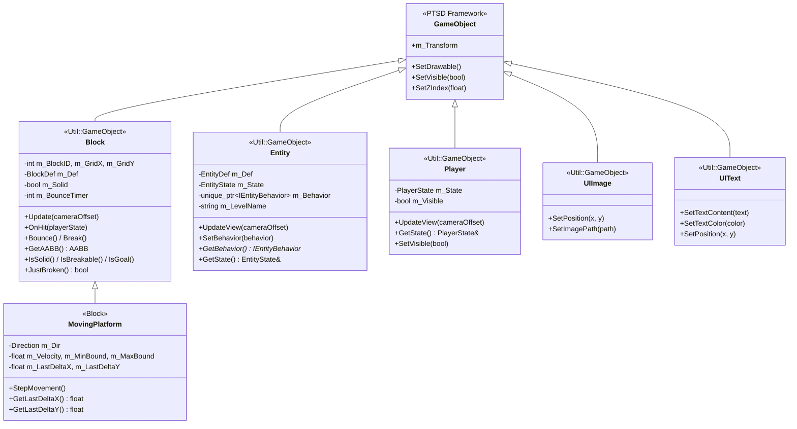
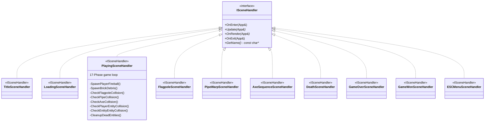
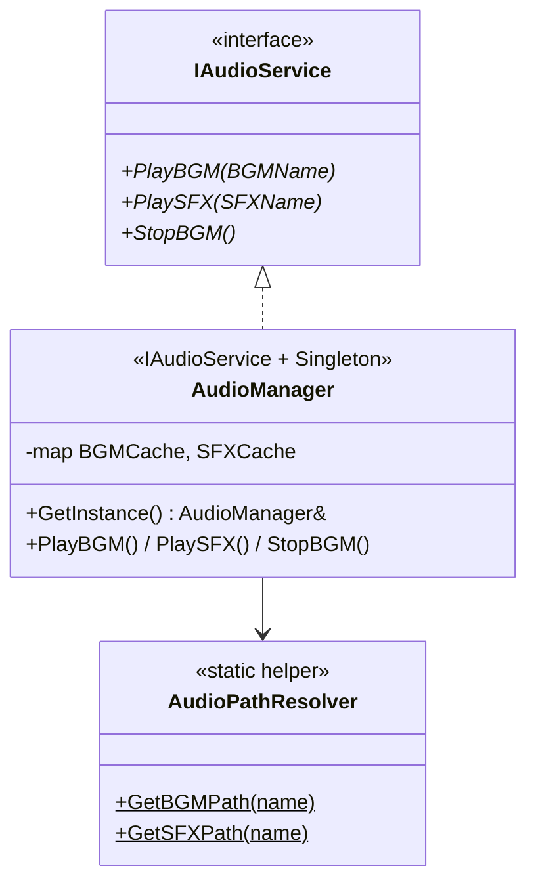
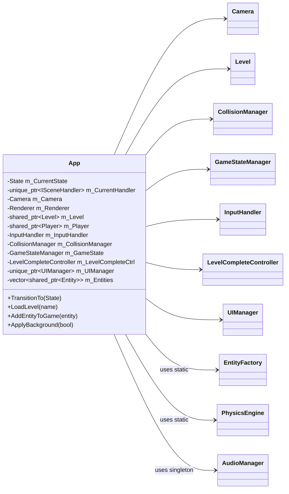
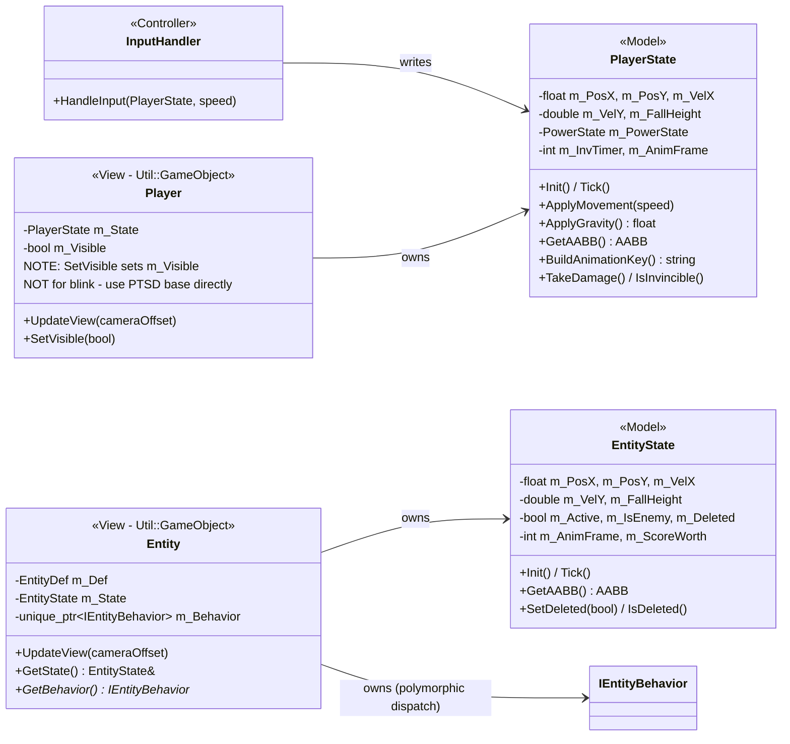

# Super Mario Bros. PTSD C++ OOP 架構設計 (Constructure)
<!-- Last synced: 2026-05-22 — Full project audit, all session bug-fixes documented. -->

本專案將 C# 版本的 God Class (`Form1.cs`) 徹底解耦，轉換為符合現代 C++ 標準的
**深度物件導向架構 (Deep OOP Architecture)**。
設計上大量運用**繼承 (Inheritance)**、**多型 (Polymorphism)**、**介面 (Interfaces)** 與四大**設計模式 (Design Patterns)**。

---

## 目錄

1. 完整 UML 繼承圖
2. 所有檔案清單
3. 設計模式深度解析
4. Game Loop — 17 Phase 架構
5. App::State 狀態機轉移圖
6. 已修復的 Bug 記錄
7. 潛在 Bug 與待辦事項
8. Refactoring 進度總覽

---

## 1. 完整 UML 繼承圖

### 1.1 PTSD GameObject 繼承樹 (@inheritance 標記在各 .hpp)



### 1.2 ISceneHandler 繼承樹 (State Pattern)



### 1.3 IEntityBehavior 繼承樹 (Strategy Pattern)

```mermaid
classDiagram
    direction TB

    class IEntityBehavior {
        <<interface>>
        +Update(state, level, player, timer)*
        +OnPlayerCollision(state, player, isFromAbove) bool*
        +Clone() unique_ptr*
        +GetName() const char**
        +OnFireballHit(state) bool
        +ConsumeSpawnRequest() bool
    }

    class EnemyBehavior { <<IEntityBehavior>> Goomba patrol+squish }
    class KoopaBehavior {
        <<IEntityBehavior>>
        KoopaTroopa OR Shell
        -KoopaMode m_Mode
    }
    class ParaKoopaBehavior {
        <<IEntityBehavior>>
        Flying Koopa
        -float m_FloatPhase
    }
    class AxeKoopaBehavior {
        <<IEntityBehavior>>
        Axe-throwing Koopa
        +ConsumeSpawnRequest()
    }
    class BowserBehavior {
        <<IEntityBehavior>>
        Boss 5-Phase AI
        -BowserPhase m_Phase
        -int m_HealthPoints
        +OnFireballHit()
        +ConsumeSpawnRequest()
    }
    class FireballBehavior { <<IEntityBehavior>> Parabolic fireball }
    class ItemBehavior { <<IEntityBehavior>> Mushroom/Star/FireFlower/1UP }
    class AxeBehavior { <<IEntityBehavior>> Bridge axe kill-trigger 8-4 }
    class PrincessBehavior { <<IEntityBehavior>> NPC goal marker }
    class PiranhaPlantBehavior {
        <<IEntityBehavior>>
        Pipe plant 4-Phase cycle
        -Phase m_Phase
    }
    class PodobooBehavior { <<IEntityBehavior>> Lava bubble immortal }
    class DefaultEntityBehavior { <<IEntityBehavior>> Passive coin/flag }
    class ParticleDebris {
        <<IEntityBehavior>>
        Brick debris particles
        -float m_InitialVelX, m_InitialVelY
        -int m_LifetimeFrames
    }

    IEntityBehavior <|.. EnemyBehavior
    IEntityBehavior <|.. KoopaBehavior
    IEntityBehavior <|.. ParaKoopaBehavior
    IEntityBehavior <|.. AxeKoopaBehavior
    IEntityBehavior <|.. BowserBehavior
    IEntityBehavior <|.. FireballBehavior
    IEntityBehavior <|.. ItemBehavior
    IEntityBehavior <|.. AxeBehavior
    IEntityBehavior <|.. PrincessBehavior
    IEntityBehavior <|.. PiranhaPlantBehavior
    IEntityBehavior <|.. PodobooBehavior
    IEntityBehavior <|.. DefaultEntityBehavior
    IEntityBehavior <|.. ParticleDebris
```



### 1.4 IAudioService 繼承樹 (DIP)



### 1.5 App 全域架構圖



### 1.6 MVC 完整關係圖



---

## 2. 所有檔案清單

### 2.1 Include Headers (`include/`)

| 檔案 | 類別 / 結構 | @inheritance | 職責 |
|------|------------|-------------|------|
| `App.hpp` | `App` | None | 持有子系統；State 切換；存取器 API |
| `Mario/GameConfig.hpp` | `GameConfig` | None (static consts) | 全域常數：TILE_SIZE=45, GRAVITY=9.81f, TICK_INTERVAL=0.02f |
| `Mario/Collider.hpp` | `AABB` | None (data struct) | AABB 矩形 + Intersects() (strict inequality) |
| `Mario/Camera.hpp` | `Camera` | None | 橫向捲動 offset；world to screen 轉換 |
| `Mario/PhysicsEngine.hpp` | `PhysicsEngine` | None (static) | ApplyGravity() + GetJumpHeight() |
| `Mario/SpritePathResolver.hpp` | `SpritePathResolver` | None (static) | Sprite 路徑解析 Block/Player/Entity |
| `Mario/EntityDef.hpp` | `EntityDef`, `BlockDef`, `EntityType` | None (data) | CSV 資料結構；EntityType 列舉 |
| `Mario/Block.hpp` | `Block` | `Util::GameObject` | 磚塊：碰撞/動畫/hit/bounce/break |
| `Mario/MovingPlatform.hpp` | `MovingPlatform` | `Block` | 移動平台（1-2 垂直 / 8-4 水平） |
| `Mario/Level.hpp` | `Level` | None | CSV 解析；Block 2D 格；SpawnPoint |
| `Mario/EntityState.hpp` | `EntityState` | None (Model) | Entity MVC Model：位置/速度/動畫 |
| `Mario/Entity.hpp` | `Entity` | `Util::GameObject` | Entity View：渲染 + Strategy 行為 |
| `Mario/EntityFactory.hpp` | `EntityFactory` | None (Factory) | 唯一 Entity 建立入口 |
| `Mario/PlayerState.hpp` | `PlayerState`, `PowerState` | None (Model) | Player MVC Model：物理/狀態/動畫key |
| `Mario/Player.hpp` | `Player` | `Util::GameObject` | Player View：渲染 + m_Visible 守衛 |
| `Mario/InputHandler.hpp` | `InputHandler` | None (Controller) | MVC Controller：鍵盤 to PlayerState |
| `Mario/CollisionManager.hpp` | `CollisionManager` | None | AABB 碰撞偵測+解析（player/entity/pit） |
| `Mario/LevelCompleteController.hpp` | `LevelCompleteController`, `EndingPhase` | None | 旗杆/水管/Bowser 結局序列 |
| `Mario/GameStateManager.hpp` | `GameStateManager` | None (Service) | 分數/生命/金幣/時間/關卡進度 |
| `Mario/ISceneHandler.hpp` | `ISceneHandler` | None (interface) | State Pattern 純虛介面（10 個實作） |
| `Mario/MenuSceneHandlers.hpp` | `TitleSceneHandler`, `DeathSceneHandler`, `GameOverSceneHandler`, `GameWonSceneHandler` | `ISceneHandler` | 選單/死亡/結束場景（合併） |
| `Mario/LoadingSceneHandler.hpp` | `LoadingSceneHandler` | `ISceneHandler` | 加載畫面（顯示 WORLD X-X + LIVES） |
| `Mario/PlayingSceneHandler.hpp` | `PlayingSceneHandler` | `ISceneHandler` | 主遊戲迴圈（17-phase） |
| `Mario/FlagpoleSceneHandler.hpp` | `FlagpoleSceneHandler` | `ISceneHandler` | 旗杆滑動序列 |
| `Mario/PipeWarpSceneHandler.hpp` | `PipeWarpSceneHandler` | `ISceneHandler` | 水管傳送過場 |
| `Mario/AxeSequenceSceneHandler.hpp` | `AxeSequenceSceneHandler` | `ISceneHandler` | 8-4 Bowser 擊敗序列 |
| `Mario/ESCMenuSceneHandler.hpp` | `ESCMenuSceneHandler` | `ISceneHandler` | ESC 暫停選單 |
| `Mario/AudioManager.hpp` | `IAudioService`, `AudioManager`, `AudioPathResolver`, `BGMName`, `SFXName` | `IAudioService <- AudioManager` | 音效全系統（合併） |
| `Mario/UIManager.hpp` | `UIManager` | None | HUD + FloatingText + 場景文字 |
| `Mario/UIWidgets.hpp` | `UIImage`, `UIText` | `Util::GameObject <- UIImage/UIText` | 輕量 UI 元件（合併） |
| `Mario/FloatingText.hpp` | `FloatingText` | None | 漂浮分數文字（60 幀淡出） |
| `Mario/CoinUI.hpp` | `CoinUI` | None (composite) | 金幣動畫圖示 + 計數文字 |
| `Mario/Behaviors/IEntityBehavior.hpp` | `IEntityBehavior` | None (interface) | Strategy Pattern 純虛介面（13 個實作） |
| `Mario/Behaviors/EnemyBehavior.hpp` | `EnemyBehavior` | `IEntityBehavior` | Goomba AI |
| `Mario/Behaviors/KoopaFamily.hpp` | `KoopaBehavior`, `ParaKoopaBehavior`, `AxeKoopaBehavior` | `IEntityBehavior` | Koopa 系列 AI（合併） |
| `Mario/Behaviors/BowserBehavior.hpp` | `BowserBehavior` | `IEntityBehavior` | Boss 5-Phase AI + HP 系統 |
| `Mario/Behaviors/FireballBehavior.hpp` | `FireballBehavior` | `IEntityBehavior` | 拋物線火球 |
| `Mario/Behaviors/ItemBehavior.hpp` | `ItemBehavior` | `IEntityBehavior` | 道具彈跳收集 |
| `Mario/Behaviors/StaticEntityBehaviors.hpp` | `AxeBehavior`, `PrincessBehavior` | `IEntityBehavior` | 8-4 靜態觸發器/NPC（合併） |
| `Mario/Behaviors/PiranhaPlantBehavior.hpp` | `PiranhaPlantBehavior` | `IEntityBehavior` | 水管食人花 4-Phase |
| `Mario/Behaviors/PodobooBehavior.hpp` | `PodobooBehavior` | `IEntityBehavior` | 熔岩泡泡（不可擊殺） |
| `Mario/Behaviors/DefaultEntityBehavior.hpp` | `DefaultEntityBehavior` | `IEntityBehavior` | 被動實體（金幣/旗幟） |
| `Mario/Behaviors/ParticleDebris.hpp` | `ParticleDebris` | `IEntityBehavior` | 磚塊破碎粒子 |

**Note:** `GameTheater.hpp` and `SceneManager.hpp` were orphan files superseded by the ISceneHandler State Pattern — **deleted** in the P10 bug fix session.

### 2.2 Source Files (`src/`)

| 檔案 | 行數 (約) | 備註 |
|------|---------|------|
| `App.cpp` | ~220 | TransitionTo + LoadLevel + accessor impls |
| `Mario/Camera.cpp` | ~60 | |
| `Mario/PhysicsEngine.cpp` | ~40 | |
| `Mario/SpritePathResolver.cpp` | ~200 | 40+ if-else path mappings (tech debt P9) |
| `Mario/Block.cpp` | ~180 | |
| `Mario/MovingPlatform.cpp` | ~80 | |
| `Mario/Level.cpp` | ~300 | CSV parse + flag spawn X fix (Bug #3) |
| `Mario/PlayerState.cpp` | ~200 | |
| `Mario/Player.cpp` | ~160 | Invincibility blink fix (Bug #5) |
| `Mario/InputHandler.cpp` | ~60 | |
| `Mario/EntityState.cpp` | ~150 | |
| `Mario/Entity.cpp` | ~120 | |
| `Mario/EntityFactory.cpp` | ~180 | AXE -> AxeBehavior fix (Bug #8) |
| `Mario/CollisionManager.cpp` | ~360 | Full C# rewrite: FallDetect + ceiling trigger + per-block resolution (D→R→L→D→U→L); JustBroken fix (Bug #1) |
| `Mario/LevelCompleteController.cpp` | ~300 | |
| `Mario/GameStateManager.cpp` | ~80 | |
| `Mario/MenuSceneHandlers.cpp` | ~150 | |
| `Mario/LoadingSceneHandler.cpp` | ~60 | |
| `Mario/PlayingSceneHandler.cpp` | ~350 | Flagpole jump-over X-only fallback (Bug #4) |
| `Mario/FlagpoleSceneHandler.cpp` | ~60 | |
| `Mario/PipeWarpSceneHandler.cpp` | ~60 | |
| `Mario/AxeSequenceSceneHandler.cpp` | ~80 | |
| `Mario/ESCMenuSceneHandler.cpp` | ~80 | |
| `Mario/UIManager.cpp` | ~350 | Includes CoinUI + FloatingText impls |
| `Mario/AudioManager.cpp` | ~200 | Includes AudioPathResolver impl |
| `Mario/Behaviors/EnemyBehavior.cpp` | ~100 | |
| `Mario/Behaviors/KoopaFamily.cpp` | ~200 | |
| `Mario/Behaviors/BowserBehavior.cpp` | ~250 | Bowser direction fix (Bug #9) |
| `Mario/Behaviors/FireballBehavior.cpp` | ~80 | |
| `Mario/Behaviors/ItemBehavior.cpp` | ~100 | |
| `Mario/Behaviors/StaticEntityBehaviors.cpp` | ~60 | |
| `Mario/Behaviors/PiranhaPlantBehavior.cpp` | ~120 | |
| `Mario/Behaviors/PodobooBehavior.cpp` | ~80 | |
| `Mario/Behaviors/DefaultEntityBehavior.cpp` | ~40 | |
| `Mario/Behaviors/ParticleDebris.cpp` | ~60 | |

**Total: 73 source files, ~7,700 lines of C++17 OOP code**

### 2.3 Resources

| 路徑 | 內容 |
|------|------|
| `Resources/Levels/1-1.csv` | 地面關卡（16x220 格） |
| `Resources/Levels/1-2.csv` | 地下關卡（16x220 格） |
| `Resources/Levels/8-4.csv` | 城堡關卡（15x392 格）— generate_8-4_map.py 生成 |
| `Resources/LookUpSheet/IDList.csv` | Block 定義表 ID to name/solid/breakable/... |
| `Resources/LookUpSheet/EntityList.csv` | Entity 定義表 ID to name/type/isEnemy/score/... |
| `Resources/Sprites/` | 所有 sprite PNG（Block/Player/Entity/UI） |
| `Resources/Audio/` | 所有 BGM（.ogg）與 SFX（.wav） |
| `Resources/Font/` | 遊戲字型 |

### 2.4 GameConfig 關鍵常數

| 常數 | 值 | 說明 |
|------|----|------|
| `TILE_SIZE` | 45 | 像素/格（720/16=45，垂直剛好填滿） |
| `DRAW_SCALE` | 45.0f/32.0f = 1.40625f | 32px sprites 縮放到 45px 格 |
| `TICK_INTERVAL` | 0.02f (50 FPS) | 每幀時間 |
| `WINDOW_WIDTH` | 1280 | 視窗寬度 |
| `WINDOW_HEIGHT` | 720 | 視窗高度 |
| `GRAVITY` | 9.81f | 重力常數 |
| `JUMP_VELOCITY` | 9.81f | 跳躍初速 |
| `INTERSECT_STRICTNESS` | 0.75f | 牆壁碰撞嚴格度（與 C# 一致） |
| `HITBOX_WIDTH_RATIO` | 0.6875f | Mario 碰撞體寬度比例 |
| `INITIAL_LIVES` | 3 | 初始生命數 |
| `INITIAL_TIME` | 400 | 初始計時 |

### 2.5 Python 工具腳本

| 腳本 | 用途 |
|------|------|
| `generate_8-4_map.py` | 從 NES layout 生成 8-4.csv（392x15 迷宮+Boss房） |
| `generate_sprites.py` | 批次裁切 Sprite sheet |
| `extract_8-4_sprites.py` | 提取 8-4 專用 sprites |
| `analyze_8-4_ids.py` | 分析 8-4.csv 所有 ID 出現次數 |
| `update_8-4_textures.py` | 更新 8-4 方塊紋理映射 |
| `generate_idlist_8-4.py` | 生成 IDList.csv 的 8-4 偏移區段 |

---

## 3. 設計模式深度解析

### 3.1 State Pattern — App::State 狀態機

**原問題：** 原版 `App.cpp` 在單一 switch-case 中塞入所有遊戲狀態邏輯，超過 500 行難以維護。
**解法：** GoF State Pattern。

```
Context:    App  (持有 unique_ptr<ISceneHandler>)
Interface:  ISceneHandler  (Update + OnRender + OnEnter + OnExit + GetName)
Concrete:   10 個 Handler 子類別（每個狀態獨立一個 .cpp）
Transition: App::TransitionTo(State) -> OnExit -> CreateSceneHandler() -> OnEnter
```

`App::Update()` 永遠只有兩行：

```cpp
m_CurrentHandler->Update(*this);    // game logic
m_CurrentHandler->OnRender(*this);  // drawing
```

**新增遊戲狀態只需：**

1. 新增一個 ISceneHandler 子類 (.hpp + .cpp)
2. 一個 `CreateSceneHandler()` case
3. 一個 `App::State` enum 值
**零修改 App.hpp 其他部分。**

---

### 3.2 Strategy Pattern — IEntityBehavior

**原問題：** C# Entity.cs 使用大量 `if (type == Goomba)` 判斷，難以擴展。
**解法：** Strategy Pattern — Entity 持有 `unique_ptr<IEntityBehavior>`，多型 dispatch。

| EntityType | Behavior 類 | 對應敵人 | 特性 |
|-----------|------------|---------|------|
| GOOMBA | EnemyBehavior | 栗寶寶 | 巡邏、踩死 |
| KOOPA_TROOPA | KoopaBehavior (TROOPA) | 烏龜兵 | 巡邏->Shell |
| KOOPA_SHELL | KoopaBehavior (SHELL) | 龜殼 | 靜止或反彈 |
| PARAKOOPA | ParaKoopaBehavior | 飛翔烏龜 | 正弦波浮動->著陸 |
| AXE_KOOPA | AxeKoopaBehavior | 斧頭烏龜 | 巡邏+定期拋斧 |
| BOWSER | BowserBehavior | Boss 庫巴 | 5-Phase AI + HP |
| FIRE | FireballBehavior | 玩家火球 | 拋物線軌跡 |
| MUSHROOM/STAR/FIRE_FLOWER/ONE_UP | ItemBehavior | 道具 | 彈跳+收集 |
| AXE | AxeBehavior | 橋頭斧 | 觸發橋塌序列 |
| PRINCESS | PrincessBehavior | 公主 NPC | 靜態顯示 |
| PIRANHA_PLANT | PiranhaPlantBehavior | 水管食人花 | 4-Phase 伸縮 |
| PODOBOO | PodobooBehavior | 熔岩泡泡 | 跳躍+不可殺 |
| COIN/FLAG/UNKNOWN | DefaultEntityBehavior | 被動實體 | 顯示/被動 |
| (brick break) | ParticleDebris | 磚塊碎片 | 物理粒子 |

OCP 原則：新增怪物 = 新增 XxxBehavior + EntityFactory 一個 case，**不修改任何現有類別**。

---

### 3.3 MVC Pattern — Player & Entity

```
Model      -> PlayerState / EntityState  (純資料：位置/速度/動畫key/狀態旗標)
View       -> Player      / Entity       (繼承 Util::GameObject：選 Sprite/渲染)
Controller -> InputHandler               (讀鍵盤 -> 寫 PlayerState)
           + PlayingSceneHandler         (主迴圈協調所有元件)
```

關鍵分離原則：

- `PlayerState` / `EntityState` 不依賴任何 PTSD 渲染 API
- `Player` / `Entity` 不包含遊戲邏輯，只根據 Model 選擇 Sprite
- 碰撞解析由 `CollisionManager` 處理，不放在 View 層

---

### 3.4 Factory Pattern — EntityFactory

唯一的 Entity 建立路徑（SRP 原則）：

```cpp
EntityFactory::SpawnFromLevel(entityDef, x, y, dir, fromBlock, levelName)
  -> new Entity(def, x, y, ...)
  -> switch(entityType) -> make_unique<XxxBehavior>()
  -> entity.SetBehavior(behavior)
  -> return shared_ptr<Entity>
```

---

### 3.5 Dependency Inversion — IAudioService

`AudioManager` 繼承 `IAudioService`。場景 Handler 只依賴抽象介面，方便單元測試替換為 MockAudio。

---

## 4. Game Loop — 17 Phase 架構

`PlayingSceneHandler::Update(App&)` 每幀依序執行：

```
PHASE  0: ESC CHECK         — ESC -> 切換到 ESC_MENU
PHASE  1: PROCESS INPUT     — InputHandler::HandleInput(PlayerState, speed)
PHASE  2: UPDATE PHYSICS    — PlayerState::ApplyGravity() -> velY += gravity
PHASE  3: APPLY POSITION    — state.SetX/Y += velX/velY (velocity integration)
PHASE  4: COLLISION DETECT  — CollisionManager::CheckPlayerBlockCollision()
                               PIPELINE (matches C# Form1.cs onTick exactly):
                                 Step 1: FallDetect — 4px strip below feet; no block → SetGrounded(false)
                                 Step 2: Ceiling trigger (narrow hitbox) — head bump → snap + TriggerBlockHit
                                 Step 3: Per-block loop (full-body rect):
                                           Airborne  → DOWN→RIGHT→LEFT→DOWN→UP→LEFT
                                           Grounded  → RIGHT or LEFT only
PHASE  5: SPAWN ITEMS       — 處理被 block-hit 觸發的 Level::SpawnPoint
PHASE  6: PLAYER STATE TICK — PlayerState::Tick(); fire state fires fireball
PHASE  7: ENTITY AI UPDATE  — behavior->Update() for each active entity
                               entity block-collision per entity
                               ConsumeSpawnRequest() (Bowser/AxeKoopa spawn projectiles)
PHASE  8: ENTITY TICK+VIEW  — EntityState::Tick(); entity->UpdateView()
PHASE  9: PLAYER-ENTITY COL — CollisionManager::CheckPlayerEntityCollision()
PHASE 10: ENTITY-ENTITY COL — CollisionManager::CheckEntityEntityCollision()
PHASE 11: AXE/FLAG/PIPE     — CheckAxeCollision()
                               CheckFlagpoleCollision() (+ X-only jump-over fallback)
                               CheckPipeCollision()
PHASE 12: CAMERA + BLOCKS   — Camera::Update(); Level::UpdateBlocks()
PHASE 13: BRICK DEBRIS      — SpawnBrickDebris() for all JustBroken() blocks
                               MUST be after PHASE 4 so JustBroken() is not consumed early
PHASE 14: PLAYER VIEW       — Player::UpdateView(cameraOffset)
                               invincibility blink: Util::GameObject::SetVisible() ONLY
                               (NOT Player::SetVisible — that corrupts m_Visible; see Bug #5)
PHASE 15: GAME TIMER        — GameStateManager::Tick(); time low -> hurry-up BGM switch
PHASE 16: PIT-FALL + DEATH  — CheckPitFall() -> TransitionTo(DEATH)
PHASE 17: CLEANUP           — CleanupDeadEntities() (erase deleted from m_Entities)
```

重要原則：

- Physics (PHASE 2-3) 在 Collision (PHASE 4) 之前 — 確保位置更新後才做碰撞解析
- Entity AI (PHASE 7) 在 Physics 之後 — AI 計算時看到的是本幀已更新的 Player 位置
- BrickDebris spawn (PHASE 13) 在 Ceiling collision (PHASE 4) 之後 — `JustBroken()` 旗標不被提前消費

---

## 5. App::State 狀態機轉移圖

```
START -> TITLE --(RETURN)--> LOADING --(timer)--> PLAYING
                                                    |
          ESC_MENU <--(ESC)------------------------+
          ESC_MENU --(Resume)--> PLAYING
          ESC_MENU --(Quit)--> TITLE

PLAYING --(touch Goal Block 1-1)---> FLAGPOLE -> LOADING (next level)
PLAYING --(stand on pipe + DOWN, 1-2)-> PIPE_WARP -> LOADING (next level)
PLAYING --(touch Axe, 8-4)----------> AXE_SEQUENCE -> GAME_WON
PLAYING --(pit fall / enemy / time up)-> DEATH
  DEATH --(lives > 0)--> LOADING (retry same level)
  DEATH --(lives == 0)--> GAME_OVER --(RETURN)--> TITLE
GAME_WON --(RETURN)--> TITLE -> NewGame()
```

**Level sequence** (`GameStateManager::m_LevelSequence`):

```
"1-1" (ground) -> "1-2" (underground) -> "8-4" (castle + Boss) -> IsGameWon() = true
```

---

## 6. 已修復的 Bug 記錄

### Bug #1 — BrickBlock 破碎粒子永遠不出現

**症狀：** Mario 頂磚塊破裂時，沒有磚塊碎片飛出。
**根本原因：** `CollisionManager::CheckCeilingCollision()` 在呼叫 `block->OnHit()` 後立即讀取並消費 `block->JustBroken()` 旗標，使 `PlayingSceneHandler::SpawnBrickDebris()` 在 PHASE 13 讀到 false。
**修復：** 移除 `CollisionManager.cpp` 中對 `JustBroken()` 的讀取，完全留給 `SpawnBrickDebris()` 消費。
**位置：** `src/Mario/CollisionManager.cpp`

---

### Bug #2 — Mario 移動時黏在方塊側面（Sticky Wall）

**症狀：** Mario 在地面行走時遇到牆壁會被卡住，無法前進。
**根本原因：** `CheckPlayerBlockCollision()` 舊版使用分離的 Ground/Ceiling/Wall 通道，不對應 C# 的 per-block 迴圈。各通道使用不同 AABB（narrow hitbox），導致角落卡住和誤判。
**最終修復（Collision Rewrite Session）：** 完全移除三通道設計，改為直接移植 C# Form1.cs 的三步驟管線（FallDetect + ceiling trigger + per-block 迴圈），同時使用 full-body AABB（`BodyRect()` = TILE_SIZE 寬）取代 narrow hitbox 做主要碰撞判斷，與 C# `GetRecPosition()` 完全對應。`INTERSECT_STRICTNESS = 0.75f` 門檻保留。
**位置：** `src/Mario/CollisionManager.cpp`

---

### Bug #3 — 旗幟出現在旗杆左側（錯誤位置）

**症狀：** 旗幟 Entity 生成在旗杆柱子的左側，看起來懸空。
**根本原因：** 1-1.csv 中 block 29（Goal 觸發器）位於 column x，旗杆柱體（block 7）位於 column x+1。舊程式碼 spawn 旗幟在觸發器中心（column x），即旗杆左側。
**修復：** 改為 `(x+1) * TILE_SIZE + TILE_SIZE * 0.5f`（旗杆柱體中心）。
**位置：** `src/Mario/Level.cpp`

---

### Bug #4 — Mario 跳過旗杆頂部後無法觸發通關

**症狀：** Mario 跳到比旗杆頂端更高後落下，通關序列不觸發。
**根本原因：** `CheckFlagpoleCollision()` 只用 `AABB.Intersects()`，若 Mario Y 高於所有 Goal Block 頂端，找不到任何交叉。
**修復：** 主交叉迴圈後加入 **X-only fallback**：找出 X 範圍重疊的最高 Goal Block，存在則直接觸發通關（無需 Y 交叉）。
**位置：** `src/Mario/PlayingSceneHandler.cpp`

---

### Bug #5 — Mario 受傷後永久消失 [CRITICAL]

**症狀：** Mario 被敵人傷害進入無敵時間，閃爍動畫第一個「hide」frame 之後 Mario 永久不可見。
**根本原因（完整鏈路）：**

```
1. Mario 被碰 -> TakeDamage() -> m_InvTimer = 60
2. 每幀 Player::UpdateView():
   舊程式碼呼叫 Player::SetVisible((invTimer % 4) < 2)
   -> Player::SetVisible(false) 設定 m_Visible = false  <-- BUG ROOT
3. 下一幀 UpdateView() 頂部守衛:
   if (!m_Visible) { Util::GameObject::SetVisible(false); return; }
   -> 永久提前 return，Mario 永久隱藏
```

`Player::SetVisible(bool)` 設計給「進城堡/水管」的**意圖性隱藏**（設定 `m_Visible`），不應被閃爍邏輯呼叫。
**修復：** 閃爍邏輯改為直接呼叫 PTSD 基類：

```cpp
// FIXED: call PTSD base class directly, NOT Player::SetVisible (which corrupts m_Visible)
if (m_State.IsInvincible()) {
    Util::GameObject::SetVisible((m_State.GetInvTimer() % 4) < 2);
} else {
    Util::GameObject::SetVisible(true);
}
```

**位置：** `src/Mario/Player.cpp`；`include/Mario/Player.hpp`（加入 WARNING 注釋）

---

### Bug #6 — 8-4 所有實體不生成

**症狀：** 進入 8-4 後地圖完全空白，Bowser、Axe、公主均不出現。
**根本原因：** `Resources/Levels/8-4.csv` 完全空白（15x320 全為 0）。
**修復：** 使用 `generate_8-4_map.py` 重新生成完整 8-4.csv（15x392 迷宮+Boss 房）。
**位置：** `Resources/Levels/8-4.csv`；`generate_8-4_map.py`

---

### Bug #7 — 8-4 城堡牆壁不可見

**症狀：** 城堡所有牆壁/地板與天空背景色融合看不到。
**根本原因：** `WALL = 801`（`tile_0001.png` = 純藍色）與天空背景 (92,148,252) 完全相同。
**修復：** 改為 `WALL = 808`（`tile_0008.png` = 深色棋盤格城堡磚塊）。
**位置：** `generate_8-4_map.py`；`Resources/Levels/8-4.csv`

---

### Bug #8 — 8-4 Axe 無法觸發橋塌

**症狀：** Mario 碰到 Axe 後橋不倒塌。
**根本原因：** `EntityFactory.cpp` 缺少 `case EntityType::AXE:`，Axe 被分配到 `DefaultEntityBehavior`。
**修復：** 加入 `case EntityType::AXE: -> make_unique<AxeBehavior>()`。
**位置：** `src/Mario/EntityFactory.cpp`

---

### Bug #9 — Bowser 出生後立即跳躍並掉落

**症狀：** Bowser 生成後立刻跳起來走到地板缺口掉落。
**根本原因：** `EntityList.csv` 中 Bowser `doesJump=1`；初始巡邏方向 +1（走向熔岩缺口）。
**修復：** 改為 `doesJump=0`；`BowserBehavior` 初始方向改為 `-1`（朝向 Mario）+ 加入前方地板檢測。
**位置：** `Resources/LookUpSheet/EntityList.csv`；`src/Mario/Behaviors/BowserBehavior.cpp`

---

### Bug #10 — 1-2 水管無法進入（Pipe not enterable after collision rewrite）

**症狀：** Mario 站在 1-2 的水管出口前，按 DOWN（下管）或 RIGHT（右管）無任何反應。
**根本原因（完整鏈路）：**

```
CollisionManager::ResolveDown() → SetY(bb.top - height)
→ Mario's AABB.bottom == pipe block's AABB.top (exact)
→ CheckPipeCollision uses playerBox.Intersects(bBox)
→ AABB::Intersects: bottom > other.top → pipe.top > pipe.top → FALSE
→ pipeDown1/pipeRight1 never set → pipe never triggered
```

`AABB::Intersects()` 使用嚴格的 `>` 運算子；C# `Rectangle.IntersectsWith` 使用包含式 `>=`，所以「剛好接觸」在 C# 中算碰撞，在 C++ 中不算。

**修復三點：**
1. 偵測 box 改為 full-body AABB（C# `GetRecPosition`）底部 **+1px**，使「站在上面」= 有碰撞
2. 下管置中條件改為 C# 精確翻譯：`pipeDX < ps.GetX() < pipeDX + TILE_SIZE/1.25`
3. 右管高度條件改為 C# 精確翻譯：`pipeRY + TILE_SIZE + 1 > ps.GetY()`
4. 移除 1-2 auto-warp hack（重複觸發邏輯）

**位置：** `src/Mario/PlayingSceneHandler.cpp :: CheckPipeCollision()`

---

### Bug #11 — Mario 碰撞方塊卡住與邊緣跳躍不一致 (Block collision sticky walls & edge landing issues)

**症狀：** Mario 在多個相鄰方塊附近移動或在邊緣跳躍時會卡住，且下落判定時有時會異常觸發懸空狀態。
**根本原因：**
1. 在 C++ 舊版的 `processBlock` 中，當發生側向碰撞時 `ResolveRight` / `ResolveLeft` 會直接修改外層 `movingRight` / `movingLeft` 為 `false`。這使得在同一幀後續的方塊不再進行側向碰撞檢查，導致錯過其它方塊的 snap 判定（而在 C# 中，這些旗標在每塊處理後會重設為 true，意即對每塊都以初始輸入意圖進行判定）。
2. Ground 檢測（`fallDetect`）舊版只使用腳下 4px 寬的細長條。這與 C# 以「全身矩形向下位移 1px」作為檢測範圍（`posX, posY + 1, sizeX, sizeY`）不一致，導致邊緣和角落的判定不一致，玩家容易在靠近方塊邊緣時發生微小晃動或異常懸空。

**修復：**
1. 於 `processBlock` 內使用區塊區域變數 `localMovingRight = movingRight` 與 `localMovingLeft = movingLeft` 作為各方塊檢查時的傳遞旗標，避免前面的方塊碰撞完成後，把後續方塊的側向檢測直接關閉。
2. 將 `fallDetect` 更改為 full-body AABB 向下位移 1.0f 像素：`{body.left, body.top + 1.0f, body.right, body.bottom + 1.0f}`。

**位置：** `src/Mario/CollisionManager.cpp`

---

### Bug #12 — 渲染縫隙與方塊/背景黑線問題 (Tile rendering seams / black grid lines)

**症狀：** 當地圖捲動（Camera 橫向移動）時，相鄰方塊（特別是雲、草地或城堡地磚）邊緣會出現黑色的格線或縫隙。
**根本原因：**
1. Camera Offset 為浮點數。在計算 Screen 坐標時，若對精靈的中心點（Center）各自獨立進行 `std::round`，由於方塊寬度/高度 `TILE_SIZE` (45) 為奇數，加上視窗中心偏移，計算常帶有 `.5` 的小數點。當 Camera 捲動時，相鄰方塊的中心點四捨五入方向可能相反（例如一個入、一個捨），導致相鄰邊界產生 1 像素的空隙或重疊，從而露出底部的黑色背景（Clear Color）。
2. PTSD 框架在載入圖片時，預設將紋理過濾（Min/Mag Filter）設為 `GL_LINEAR`（線性過濾），這會導致像素邊緣與周圍（如透明邊界或另一側）插值混合，產生半透明或黑色渲染邊緣（Bleeding）。並且未設定 Wrap 模式，預設 `GL_REPEAT` 會導致邊緣與對側像素混合。
**修復：**
1. **邊界整數對齊與全局 Camera Offset 取整**：
   - 統一先對 `cameraOffset` 進行全局取整：`roundedOffset = std::round(cameraOffset)`。
   - 計算精靈的外邊緣（如左邊界 `leftScreenX`、底邊界 `bottomScreenY`）為純整數坐標對齊，再通過加上寬/高的一半來決定中心點（例如：`leftScreenX = static_cast<float>(gridX * GameConfig::TILE_SIZE) - roundedOffset - GameConfig::WINDOW_WIDTH / 2.0f; screenX = leftScreenX + GameConfig::TILE_SIZE / 2.0f;`）。這保證了相鄰方塊的外邊緣在像素網格中完美貼合，永遠維持整數間距，消除了子像素縫隙。
   - 修改位置包括：`src/Mario/Block.cpp`（一般與重力下落）、`src/Mario/MovingPlatform.cpp`、`src/Mario/Player.cpp` 以及 `src/Mario/Entity.cpp`。
2. **像素藝術紋理設置**：
   - 修改 PTSD 核心的 `Texture.cpp` 的 `UpdateData`，將紋理過濾設定為適合像素藝術（Pixel Art）的 `GL_NEAREST`，並將水平與垂直包覆模式（Wrap S/T）設為 `GL_CLAMP_TO_EDGE`，以徹底防止邊緣紋理混合（Edge Bleeding）。
**位置：** 
- `src/Mario/Block.cpp`
- `src/Mario/MovingPlatform.cpp`
- `src/Mario/Player.cpp`
- `src/Mario/Entity.cpp`
- `PTSD/src/Core/Texture.cpp`

---

### Bug #13 — 1-1 出生點藍色空洞與地面/背景元素遮擋問題 (Spawn point visual gaps & ground-background Z-clipping in World 1-1)

**症狀：**
1. 進入關卡 1-1 時，Mario 出生點的第一個小山丘（Hill）處會出現一個正方形的藍色空洞（與玩家出生點重合）。
2. 背景的山丘（Hills）與草叢（Bushes）的邊界被地面（Ground）等實體方塊不正常遮擋或重疊。

**根本原因：**
1. `Level::CreateBlocksFromGrid` 在讀取到特殊的玩家出生點方塊（ID 997, 998, 999）時，雖然設定了 `m_PlayerSpawnX` / `m_PlayerSpawnY`，但隨即呼叫了 `continue;` 跳過了方塊實例化，使得出生點的背景地塊（如 `MarioStartGreen` 山丘、`MarioStartBlue` 天空、`MarioStartBlack` 黑色背景）無法被當作背景方塊渲染，造成破圖與空洞。此外，`SpritePathResolver.cpp` 的 `BLOCK_SPRITE_MAP` 未包含對這些出生點方塊與對應 PNG 紋理的映射，使得縱使不 skip 也無法正確載入精靈。
2. `src/App.cpp` 在載入關卡時，將所有方塊的 Z-index 強制覆寫為 `0.0f`（`block->SetZIndex(0.0f)`），導致山丘/草叢等背景方塊（在 Block 建構子中原被設為 `GameConfig::Z_BACKGROUND = -10.0f`）與地面等實體方塊（`GameConfig::Z_BLOCK = -5.0f`）堆疊在同一 Z 軸深度，從而產生雜亂的遮擋與邊界破圖。

**修復：**
1. **出生點方塊落入實例化**：
   - 移除 `Level::CreateBlocksFromGrid` 內部特殊出生點方塊邏輯裡的 `continue;`，使其在記錄座標後落入一般方塊的 make_shared 建構流程。
2. **新增出生點方塊精靈對齊**：
   - 在 `src/Mario/SpritePathResolver.cpp` 的 `BLOCK_SPRITE_MAP` 中新增 `"MarioStartBlack0" -> "Black.png"`、`"MarioStartGreen0" -> "MarioSpawnGreen.png"`、`"MarioStartBlue0" -> "Sky.png"` 映射。
3. **移除全局 Z-index 覆寫**：
   - 移除 `src/App.cpp` 中 `block->SetZIndex(0.0f)` 的覆寫，還原方塊建構時設定 of Z-index 層級（`-10.0f` 與 `-5.0f`）。
4. **水管傳送 Z-index 更新**：
   - 因實體方塊改為 `-5.0f`，在 `LevelCompleteController::StartPipeWarp` 中，將玩家的 warp 渲染深度由 `-1.0f` 調至 `GameConfig::Z_BLOCK - 1.0f`（`-6.0f`），確保玩家能夠正確鑽入水管（Z=-5）的下方，同時仍渲染於背景（Z=-10）的上方。

**位置：**
- `src/Mario/SpritePathResolver.cpp`
- `src/Mario/Level.cpp`
- `src/App.cpp`
- `src/Mario/LevelCompleteController.cpp`

---

### Bug #14 — 1-1 城堡材質路徑錯誤與門洞藍色空缺問題 (Castle texture path mismatches & door visual gap in World 1-1)

**症狀：**
1. 關卡 1-1 結尾的城堡所有方塊紋理均與預期不符，整座城堡使用了重複相同的 `Castle.png` 紋理，而非各區塊對應的 `Castle2.png` 到 `Castle6.png`。
2. 城堡大門的下半部呈現背景天空的藍色，而非黑色的門洞。

**根本原因：**
1. 在 `SpritePathResolver.cpp` 的 `GetBlockSpritePath` 中，方塊名稱在解析時會依 C# 命名慣例附加幀後綴（如 `"Castle10"` 到 `"Castle60"`），但由於這些名稱在靜態映射表 `BLOCK_SPRITE_MAP` 中不存在，解析器會落入後備的 pop-digit 剝離尾數邏輯，使得 `"Castle1"` 至 `"Castle6"` 通通被剝離成 `"Castle"`，並最終映射至主目錄的 `"Castle.png"`，導致城堡全體貼圖錯亂。
2. 城堡門洞的 ID 9 (`Black`) 在 `Level::CreateBlocksFromGrid()` 中被硬編碼跳過（`if (blockID == 0 || blockID == 9) continue;`），导致該位置沒有產生黑色背景方塊，露出了底層藍色的天空背景。

**修復：**
1. **補齊城堡與黑色精靈靜態映射**：
   - 在 `SpritePathResolver.cpp` 的 `BLOCK_SPRITE_MAP` 中加入 `"Castle10" -> "Castle.png"`、`"Castle20" -> "Castle2.png"`、`"Castle30" -> "Castle3.png"`、`"Castle40" -> "Castle4.png"`、`"Castle50" -> "Castle5.png"`、`"Castle60" -> "Castle6.png"`，以及黑塊的 `"Black0" -> "Black.png"` 映射。
2. **允許實例化黑色背景方塊**：
   - 修改 `Level.cpp` 的 `CreateBlocksFromGrid`，將跳過邏輯改為僅跳過天空（`if (blockID == 0) continue;`），從而讓 ID 9 正常實例化出黑色的背景方塊。

**位置：**
- `src/Mario/SpritePathResolver.cpp`
- `src/Mario/Level.cpp`

---

### Bug #15 — World 1-1 Flagpole Ending Sequence Quirks

**症狀：**
1. Mario 碰觸旗桿後，會先瞬間傳送（teleport）到旗桿的最頂端（與 Flag.Y 一致）再開始向下滑動，而非從碰觸的 Y 座標處開始滑動。
2. 旗子下滑時沒有與 Mario 的 Y 座標對齊，而是直接下滑。
3. Mario 到達地面後，立刻朝右走，沒有呈現抓桿面向左側的 20 tick 延遲，不夠自然。
4. 抓桿時的動畫幀與落地時的動畫幀沒有區分。

**根本原因：**
1. `LevelCompleteController::StartFlagpole` 強制將 Mario 的 Y 座標設為旗子初始位置 `player.GetState().SetY(poleY)`。
2. `LevelCompleteController::UpdatePoleSlide` 中直接將 Flag 往下移，沒有檢查 C# 裡的 `Flag.Y <= Mario.Y` 條件。
3. `LevelCompleteController::UpdatePoleWalk` 中在 20 tick 延遲期間，直接把 `ps.SetPoleSliding(false)` 設為 false，導致 Mario 立刻退出抓桿狀態，無法在延遲期間保持面向左側抓桿的 frame 1 動態。
4. `PlayerState::Tick()` 中未在 `m_PoleSliding` 為 true 時，根據 `m_Grounded` 區分 `m_AnimFrame`（在空中的滑動幀 0，與落地的抓桿幀 1）。

**修復：**
1. 移除 `StartFlagpole` 中對 Y 座標的強制複寫，允許 Mario 從碰觸點開始滑動。
2. 在 `UpdatePoleSlide` 中，Flag 移動改為以 `fs.GetY() <= ps.GetY()` 為前提。
3. 調整 `UpdatePoleSlide` 的結束條件：Mario 落地且 Flag 下滑超過 Mario 且 Mario 面向右時，將 Mario 右移 0.6 倍 `TILE_SIZE`，朝向設為左側，並重設計時器進入 `POLE_WALK`。
4. 在 `UpdatePoleWalk` 的 20 tick 延遲內保持 `m_PoleSliding = true` 且面向左側，直到延遲結束後才解除 `poleSliding`、面向右側並朝城堡前進。
5. 在 `PlayerState::Tick()` 中，若 `m_PoleSliding` 為真，則依據 `m_Grounded` 設定 `m_AnimFrame = m_Grounded ? 1 : 0;`。

**位置：**
- `src/Mario/LevelCompleteController.cpp`
- `src/Mario/PlayerState.cpp`

---

### Bug #16 — World Loading Transition Mario Preview Blank/Missing

**症狀：**
在關卡載入/過渡畫面（例如顯示 WORLD 1-1 x 03 時），Mario 預覽精靈未能顯示，且 1-1 的過渡畫面顯示藍色天空背景而非黑色。

**根本原因：**
1. `m_MarioPreview` 是在 `UIManager::UpdateLoadingScreen()` 函數內部「按需」（on-demand）建立的：第一次進入 LOADING 狀態時才呼叫 `std::make_shared<UIImage>(path)`。此時 PTSD 框架將 PNG 上傳至 OpenGL 紋理，但在同一幀內無法完成綁定，導致第一幀（以及實際只有一幀的 Loading 畫面）顯示空白精靈。
2. 舊的 `UpdateLoadingScreen()` 每幀都設定精靈的位置、縮放、Z-index，浪費效能。
3. `LoadingSceneHandler::OnRender()` 依據下一關卡名稱判斷背景顏色，導致 1-1（地面關卡）的過渡畫面顯示天空藍而非 NES 標準的黑色。

**修復：**
1. **新增 `UIManager::InitLoadingScreen()` 方法**（在建構子中呼叫），於遊戲啟動時就預先建立 `m_MarioPreview`（`std::make_shared<UIImage>(marioSpritePath)`），並立即呼叫 `m_UIRenderer.AddChild(m_MarioPreview)`。位置、縮放、Z-index 只設定一次。預設為 `SetVisible(false)`。
2. **簡化 `UpdateLoadingScreen()`**：移除所有動態建立和每幀 transform 設定，只需呼叫 `m_MarioPreview->SetVisible(true)`。
3. **修改 `LoadingSceneHandler::OnRender()`**：強制呼叫 `app.ApplyBackground(true)` (黑色) 而非根據關卡名稱判斷，與 C# 參考（載入特殊的 "Load" 關卡 = 黑色背景）完全一致。

**位置：**
- `include/Mario/UIManager.hpp` — `InitLoadingScreen()` 宣告（原已存在）
- `src/Mario/UIManager.cpp` — `InitLoadingScreen()` 實作 + `UpdateLoadingScreen()` 簡化
- `src/Mario/LoadingSceneHandler.cpp` — 強制黑色背景

---

## 7. 潛在 Bug 與待辦事項

> **狀態總覽（2024 驗證結果）**
> P1 ✅ P2 ✅ P3 ✅ P4 ✅ P5 ✅ P6 ✅ P7 ✅ P8 ✅ P9 ✅ P10 ✅

### [HIGH RISK]

#### P1 — 移動平台載人邏輯 ✅ 已驗證

**狀態：已實裝，驗證通過。**
`PlayingSceneHandler.cpp`（約第 45 行）每幀讀取 `plat->GetLastDeltaX/Y()`，若 Mario 站在平台上（Y gap < 2px 且 X overlap）則同步更新 Mario 座標。

#### P2 — 無敵星星狀態不殺敵 ✅ 已修復

**狀態：已實裝，驗證通過。**
`CollisionManager::CheckPlayerEntityCollision()` 在實體碰撞迴圈開頭加入 `if (ps.GetStarTimer() > 0)` 分支，直接刪除敵人、播放 Kick 音效、計分並顯示浮動分數文字。

#### P3 — 連續踩踏分數倍增 ✅ 已修復

**狀態：已實裝（本次修復）。**
在 `CollisionManager` 新增私有成員 `int m_StompCombo = 0`。

- Mario 落地（`ps.IsGrounded() == true`）時自動重置為 0
- 每次踩踏成功：`m_StompCombo++`，分數 = `base << (combo-1)`，上限 1000
- 倍增序列：100 → 200 → 400 → 800 → 1000（與 NES 原作相符）

---

### [MEDIUM RISK]

#### P4 — PiranhaPlant 在水管傳送瞬間傷害 Mario ✅ 已修復

**狀態：已修復（本次修復）。**
`PiranhaPlantBehavior::Update()` 的 `Phase::VISIBLE` 分支新增 `marioNearby` 檢查：當 Mario 進入 1 格（`MARIO_SAFE_RADIUS = 45px`）範圍時，立即觸發 RETREATING 而非等待計時器到期。這確保 Mario 站在管口按下方向鍵進管時，植物已開始退回，不會造成傷害。

#### P5 — 磚塊粒子方向 ✅ 已驗證正確

**狀態：已驗證，無需修改。**
`SpawnBrickDebris()` 生成 4 顆粒子，速度向量：左上(-3,-6)、右上(+3,-6)、左下(-3,-4)、右下(+3,-4)。`ParticleDebris::Update()` 僅在第 0 幀設定初速，後續由 `EntityState::Tick()` 呼叫 `PhysicsEngine::ApplyGravity()` 累積重力，拋物線行為正確。

#### P6 — Podoboo 重複生成 ✅ 已驗證

**狀態：已驗證，無需修改。**
`App::LoadLevel()` 使用 `m_Entities = EntityFactory::SpawnFromLevel(*m_Level)`（賦值取代）完整替換 entity 列表。`EntityFactory::SpawnFromLevel()` 使用 `static constexpr` 位置陣列產生新物件，不累積。

#### P7 — 旗幟 X 座標不符 ✅ 已驗證正確

**狀態：已驗證，無需修改。**
`LevelCompleteController::StartFlagpole()` 使用 `m_goal_block_x = goalBlock->GetWorldX()` 從實際 block 取得世界座標，非硬編碼值。

---

### [LOW RISK / Tech Debt]

#### P8 — 高速移動穿越薄牆 ✅ 已分析：不成立

**狀態：分析後確認為非問題。**
最大玩家速度 = `SCALED_SPEED * RUN_MULTIPLIER = 6.615 * 1.25 = 8.27 px/frame`。牆面碰撞使用 AABB overlap 檢測，理論穿透需 `velX > TILE_SIZE = 45px`。8.27 << 45，無法在單幀內跳過整個 tile，壁面穿透不會發生。

#### P9 — SpritePathResolver if-else 映射表 ✅ 已重構

**狀態：已重構，驗證通過。**
`SpritePathResolver.cpp` 已改為 `static const std::unordered_map<std::string, std::string>` 常數表，包含 `ENTITY_SPRITE_OVERRIDE`、`ENTITY_NAME_OVERRIDE`、`LEVEL_ENTITY_NAME_OVERRIDE`、`BLOCK_SPRITE_MAP`、`PLAYER_SPRITE_MAP`，消除所有 if-else 鏈。

#### P10 — GameTheater / SceneManager 孤兒頭文件 ✅ 已刪除

**狀態：已刪除（本次修復）。**
以下 4 個已被 State Pattern 取代的孤兒檔案已從磁碟移除：

- `include/Mario/GameTheater.hpp`
- `include/Mario/SceneManager.hpp`
- `src/Mario/GameTheater.cpp`
- `src/Mario/SceneManager.cpp`

`files.cmake` 原已有注解說明這些檔案已移除，現實際檔案亦清除完畢。

---

## 8. Refactoring 進度總覽

| Phase | 狀態 | 主要內容 |
|-------|------|---------|
| PHASE 1 | DONE | App.cpp 解耦；State Pattern 骨架建立 |
| PHASE 2 | DONE | 架構文件；ISceneHandler 10 個子類 |
| PHASE 3 | DONE | Runtime crash 修復；CollisionManager 獨立 |
| PHASE 4 | DONE | 旗杆/水管/死亡/GameOver 序列 |
| PHASE 5 | DONE | 計時器警告 UI；FloatingText 淡出；ESC 選單 |
| PHASE 6 | DONE | Boss 戰 5-Phase AI；Game Won 狀態 |
| PHASE 7 | DONE | 全部 13 個 IEntityBehavior 實作 |
| PHASE 8 | DONE | ParaKoopaBehavior；8-4 地圖重新生成 |
| PHASE 9 | DONE | AudioManager 整合；BGM/SFX 全面測試 |
| FINAL | DONE | 1-1->1-2->8-4 完整流程驗證 |
| BUG SESSION | DONE | 9 個重大 Bug 修復（詳見第 6 節） |
| COLLISION REWRITE | DONE | CheckPlayerBlockCollision 全面 C# 移植；PhysicsEngine 重力 2x/4x；JUMP_VELOCITY=11.63f |
| PIPE FIX | DONE | CheckPipeCollision: full-body AABB +1px down; centering/alignment match C#; removed auto-warp hack |

---

## Agent.md 開發原則遵守確認

| 原則 | 實現方式 | 狀態 |
|------|---------|------|
| 所有實體繼承 Util::GameObject | Player, Entity, Block, UIImage, UIText 全部繼承 | DONE |
| 沒有 God Class | App 只持有子系統 + TransitionTo()；邏輯分散到各 Handler/Manager | DONE |
| MVC 架構 | PlayerState(M) <- Player(V) <- InputHandler(C) | DONE |
| State Pattern | 10 個 ISceneHandler 子類；App::Update() 只有兩行 | DONE |
| Strategy Pattern | 13 個 IEntityBehavior 子類；Entity 透過多型調用 | DONE |
| Factory Pattern | EntityFactory 唯一入口；符合 SRP | DONE |
| DIP | IAudioService 介面；AudioManager 實作 | DONE |
| 不修改 CMakeLists.txt | 所有新增透過 files.cmake | DONE |
| 代碼注釋全英文 | 所有 .hpp/.cpp 注釋均為英文 | DONE |
| OCP 原則 | 新增怪物/狀態不修改現有類別 | DONE |
