# Super Mario Bros. 專案架構概覽

這份文件以最簡單、直觀的方式，展示本專案的核心**物件導向 (OOP) 架構**與系統運作方式。

---

## 一、核心遊戲物件 (OOP 繼承關係)

遊戲畫面中看到的所有會動、會畫出來的東西，全部都繼承自最基礎的 `GameObject`。我們將相似的功能封裝在父類別，再透過繼承來實作具體物件。

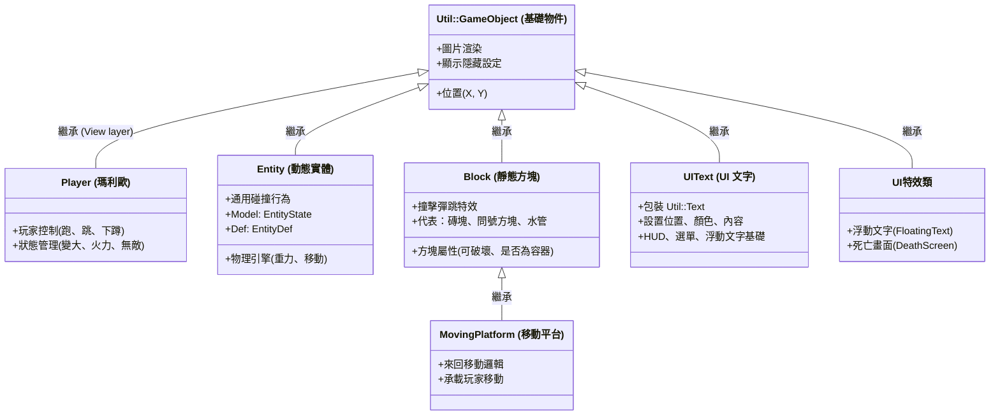

---

## 一-補：Phase 4 行為策略模式 (Strategy Pattern for Behaviors)

Phase 4 實作了**策略模式**，讓實體的行為邏輯獨立於實體類別本身。這使得敵人、道具、火球的 AI 都能動態切換。

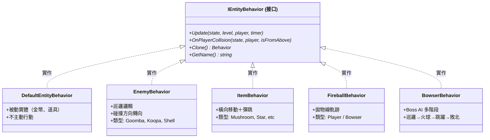

### 行為系統的優勢

- **策略模式**：實體行為獨立，易於新增敵人類型
- **複合性**：多個實體合營同一個行為類別
- **可測試性**：行為邏輯與渲染分離

---

## 一-次：Phase 4 敵人行為系統 (Enemy Behavior Strategy Pattern)

8-4 關卡和遊戲內所有敵人都透過 **Strategy Pattern** 實現不同的AI行為，而非透過Entity繼承層次。每個敵人類型都有對應的 Behavior 類別實現 `IEntityBehavior` 接口。

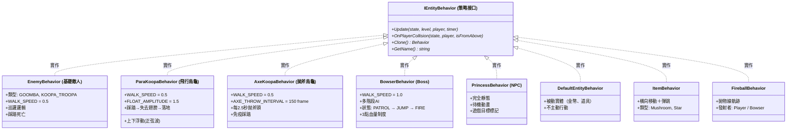

### 敵人行為架構設計

**策略模式的優勢：**

- ✅ **行為獨立**：敵人AI與Entity渲染分離
- ✅ **易於擴展**：新增敵人只需實作新 Behavior 類別
- ✅ **易於測試**：行為邏輯可單獨進行 Unit Test
- ✅ **代碼複用**：多個Entity可共用同一 Behavior 實例
- ✅ **動態切換**：敵人狀態可在運行時改變（如Koopa變殼）

**實現細節：**

| 敵人類型 | Behavior 類別 | 特性 | 位置 |
|---------|-------------|------|------|
| **Goomba** | `EnemyBehavior` (GOOMBA) | 簡單巡邏，踩死 | builtin |
| **Koopa** | `EnemyBehavior` (KOOPA_TROOPA) | 巡邏→變殼→可射出 | builtin |
| **ParaKoopa** | `ParaKoopaBehavior` | 飛行浮動，踩踏落地 | `include/Mario/Behaviors/ParaKoopaBehavior.hpp` |
| **AxeKoopa** | `AxeKoopaBehavior` | 定期拋斧，免疫踩踏 | `include/Mario/Behaviors/AxeKoopaBehavior.hpp` |
| **Bowser** | `BowserBehavior` | Boss多階段AI | `include/Mario/Behaviors/BowserBehavior.hpp` |
| **Princess** | `PrincessBehavior` | 靜態NPC，僅動畫 | `include/Mario/Behaviors/PrincessBehavior.hpp` |

---

## 一-貳：Floating Text 系統 (所有得分機制的視覺反饋)

遊戲中所有會增加分數的事件都配備了**浮動文字 (Floating Text)** 視覺反饋。每當玩家:

- 踩敵人、
- 收集道具、
- 拾取金幣實體、
- 或撞擊金幣方塊

...時，屏幕上都會彈出該事件的分數值，強化遊戲反饋感。

### 全局得分事件總表

| 事件 | 得分值 | 浮動文字 | 實裝位置 | 坐標來源 |
|------|--------|---------|--------|--------|
| **撞問號/金幣方塊** | 200 | "+200" | CollisionManager.cpp: 154 | 方塊中心 |
| **踩敵人** | scoreWorth (100~500) | "+{分數}" | App.cpp: 960 | 敵人中心 |
| **收集蘑菇** | scoreWorth | "+{分數}" | App.cpp: 1030 | 物品中心 |
| **收集火焰花** | scoreWorth | "+{分數}" | App.cpp: 1030 | 物品中心 |
| **收集星星** | scoreWorth | "+{分數}" | App.cpp: 1030 | 物品中心 |
| **收集1-UP** | (無分數) | "+1UP" | App.cpp: 1018 | 物品中心 |
| **拾取金幣實體** | 200 | "+200" | App.cpp: 1047 | 金幣中心 |

### FloatingText 座標系統 (PTSD 座標空間)

所有浮動文字在**屏幕空間 (Screen Space)** 工作，不隨遊戲邏輯座標系統移動。坐標轉換流程:

```
世界座標 (world coords)
    ↓  Camera::WorldToScreenX/Y()
屏幕座標 (screen pixels)
    ↓  PTSD 轉換 (pixel → rendering coords)
PTSD座標 (rendering space: -640~640, -360~360)
    ↓  UIManager::AddFloatingText()
屏幕顯示 (on-screen display)
```

### FloatingText 轉換公式

```cpp
// 取得實體世界座標
float worldX = entity.GetWorldX() + offset;
float worldY = entity.GetWorldY();

// 世界座標 → 屏幕座標 (相對於攝像機)
float screenPixelX = m_Camera.WorldToScreenX(worldX);
float screenPixelY = m_Camera.WorldToScreenY(worldY);

// 屏幕像素 → PTSD座標 (渲染系統統一座標)
float ptsdX = screenPixelX - 640.0f;      // 屏幕中心 X = 640
float ptsdY = 360.0f - screenPixelY;      // 屏幕中心 Y = 360 (上下反轉)

// 傳遞至 UIManager
m_UIManager->AddFloatingText(ptsdX, ptsdY, "+{分數}", 60);
```

### FloatingText 運動與渲染

| 屬性 | 值 | 說明 |
|------|-----|------|
| **持續時間** | 60 frames | 約 1 秒 (60 FPS) |
| **垂直運動** | y -= 1.0f/frame | 每幀向上移動 1 單位 (屏幕空間) |
| **字體** | mario.ttf | 遊戲專用像素字體 |
| **大小** | 16px | HUD 標準尺寸 |
| **顏色** | 白色 (255, 255, 255) | 高對比度顏色 |
| **座標系** | PTSD (屏幕空間) | 固定在屏幕位置，不隨攝像機移動 |
| **層級** | UI Layer | 渲染在遊戲物件之上 |

### CoinGet Block 直接獎勵設計

金幣方塊 (Block ID 5, 28) 採用**直接獎勵 (Direct Reward)** 機制，無需生成中間實體:

```
玩家頭撞擊方塊
    ↓
CollisionManager::CheckCeilingCollision()
    ↓
偵測 spawnEntity == "CoinGet"
    ↓
├─ GameStateManager::AddCoin()              [直接增加金幣]
├─ GameStateManager::AddScore(200)          [增加分數]
├─ AudioManager::PlaySFX(Coin)              [播放金幣音效]
└─ UIManager::AddFloatingText(ptsdX, ptsdY, "+200") [顯示浮動文字]
```

### 架構設計優勢

| 設計特點 | 效果 |
|--------|------|
| **統一座標轉換** | 所有浮動文字使用相同公式，確保位置正確 |
| **PTSD 座標系** | 與渲染引擎相符，無經過多層轉換 |
| **屏幕空間渲染** | 浮動文字始終在玩家眼前，不隱沒於背景 |
| **OOP 分離** | UIManager 負責顯示，GameStateManager 負責邏輯 |
| **可擴展設計** | 新加分機制可輕易添加浮動文字 |

---

## 一-貳之補：Audio Service 架構 (Audio System)

Phase 4 實作了完整的**音頻系統**，使用 SDL2_mixer 與**絕對路徑解析器**確保跨平臺音頻加載穩定性。

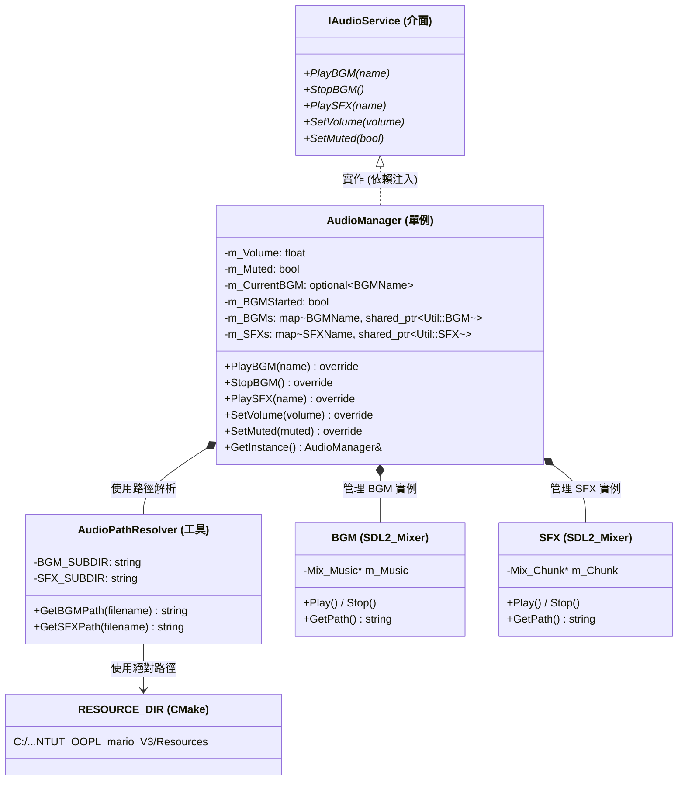

### 音頻系統設計特點

- **Singleton 模式**：全遊戲唯一的音頻管理器實例
- **懶加載 (Lazy Loading)**：使用 `std::map` 緩存音頻，僅在首次播放時加載
- **絕對路徑解析**：`AudioPathResolver` 使用 CMake 設定的 `RESOURCE_DIR` ，確保音頻檔案無論工作目錄為何都能被找到
- **重複播放防護**：`m_BGMStarted` 旗標防止 BGM 連續重啟
- **暫停-恢復**：當玩家按 ESC 進入暫停選單時自動停止 BGM，恢復遊戲時繼續播放

### 音頻檔案清單

| 類型 | 檔案名稱 | 路徑 | 格式 | 說明 |
|------|--------|------|------|------|
| BGM | 01-08 主題曲 | `Resources/Audio/BGM/` | WAV (44100 Hz) | 地面/地下/城堡主題 |
| BGM | Hurry Up | `Resources/Audio/BGM/` | WAV | 100秒倒計時警告 |
| SFX | Jump / Kick / Coin | `Resources/Audio/SFX/` | WAV | 遊戲動作音效 |
| SFX | Pause / Ready | `Resources/Audio/SFX/` | WAV | UI 交互音效 |

---

## 一-叁：Entity 與 Behavior 的關係 (Entity-Behavior Composition)

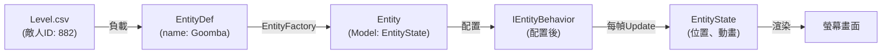

**OOP設計原則：**

- **Model**: `EntityState` + `EntityDef` (控制資料)
- **View**: `Entity` 的渲染 (圖片、位置)  
- **Control**: `IEntityBehavior` (AI邏輯 & 碰撞處理)
- **MVC分離**：行為邏輯獨立於渲染邏輯
    Entity <|-- Bowser : 繼承 (Boss)
    Entity <|-- Princess : 繼承 (NPC)
    Entity <|-- Fireball : 繼承 (Projectile)

```

### 敵人 AI 設計總結

| 敵人 | 簡單度 | 行為設計 | 8-4 ID | 說明 |
|------|--------|--------|--------|------|
| **Goomba** | ⭐ | 直線巡邏 + 牆體轉向 | 882 | 敵人AI基礎 |
| **Koopa** | ⭐⭐ | 巡邏 + 殼變身 + 射出 | 886 | 多狀態管理 |
| **ParaKoopa** | ⭐⭐ | 巡邏 + 正弦浮動 + 著陸轉換 | 875 | 三角函數動畫 |
| **AxeKoopa** | ⭐⭐ | 巡邏 + 定期拋斧 | 878 | 定時事件系統 |
| **Bowser** | ⭐⭐⭐ | 狀態機 (走/跳/火) + 模式轉換 | 847 | Boss級複雜度 |
| **Princess** | ⭐ | 無AI，靜態顯示 | 879 | 視覺元素 |
| **Fireball** | ⭐ | 拋物線軌跡 | - | 簡單物理 |

### 行為系統的優勢

- **策略模式**：實體行為獨立，易於新增敵人類型
- **複合性**：多個實體合營同一個行為類別
- **可測試性**：行為邏輯與渲染分離

### 已實作類別說明

| 類別 | 繼承自 | 角色 (MVC) | 說明 |
|------|--------|-----------|------|
| `Block` | `Util::GameObject` | View | Terrain tile with collision, animation, hit-bounce |
| `Player` | `Util::GameObject` | View | Mario rendering, sprite cache, direction flip |
| `Entity` | `Util::GameObject` | View | Enemy/power-up/coin rendering, direction flip |
| `PlayerState` | None (data) | Model | Position, velocity, power state, animation keys |
| `EntityState` | None (data) | Model | Entity position, velocity, squish/death state |
| `InputHandler` | None | Controller | Keyboard input -> PlayerState |
| `Level` | None | Model | CSV parsing, block grid, spawn point tracking |
| `EntityFactory` | None | Factory | Creates Entity instances from level spawn data |
| `LevelCompleteController` | None | Controller | Flagpole slide, walk-to-castle, pipe warp |
| `GameStateManager` | None | Service | Score, lives, coins, time, level progression |
| `Camera` | None | Service | Viewport scrolling following player |
| `PhysicsEngine` | None | Service | Gravity, jump parabola calculation |
| `CollisionManager` | None | Service | Player-Block collision detection & resolution |
| `GameConfig` | None | Config | Global constants (tile size, physics, Z-layers) |
| `Collider (AABB)` | None | Data | Axis-aligned bounding box |
| `EntityDef / BlockDef` | None | Data | CSV lookup data structures |
| `SpritePathResolver` | None | Utility | Sprite path name builder |
| `UIText` | `Util::GameObject` | View | Wraps Util::Text, renders HUD/menu text |
| `FloatingText` | None | Component | Manages floating score text with upward motion |
| **IEntityBehavior** | **None** | **Interface** | **Strategy pattern base for entity AI** |
| **DefaultEntityBehavior** | **IEntityBehavior** | **Strategy** | **Passive entities (coins, power-ups)** |
| **EnemyBehavior** | **IEntityBehavior** | **Strategy** | **Goomba & Koopa Troopa patrol AI** |
| **ItemBehavior** | **IEntityBehavior** | **Strategy** | **Power-up bouncing behavior** |
| **FireballBehavior** | **IEntityBehavior** | **Strategy** | **Projectile trajectory & collision** |
| **BowserBehavior** | **IEntityBehavior** | **Strategy** | **Boss AI (8-4 duel phases)** |
| `UIManager` | None | Manager | HUD/Menu rendering, floating text control, scene UI state |
| **AudioManager** | **IAudioService** | **Service** | **Singleton audio playback for BGM & SFX using SDL2_mixer** |
| **AudioPathResolver** | **None (Utility)** | **Utility** | **Resolves audio file paths using RESOURCE_DIR macro for absolute paths** |
| **IAudioService** | **None (Interface)** | **Interface** | **Abstract audio service interface for dependency injection** |
| **Goomba** | **Entity** | **Enemy** | **Simple walker, dies on jump (ID 882)** |
| **Koopa** | **Entity** | **Enemy** | **Walker + shell transformation (ID 886)** |
| **AxeKoopa** | **Entity** | **Enemy** | **Walks + throws axes every 2.5s (ID 878)** |
| **ParaKoopa** | **Entity** | **Enemy** | **Flying Koopa, floats up/down, lands as Koopa (ID 875)** |
| **Bowser** | **Entity** | **Boss** | **Multi-phase AI: walk → jump → fire breath (ID 847)** |
| **Princess** | **Entity** | **NPC** | **Static character, goal/reward (ID 879)** |
| **Flag** | **Entity** | **Static Object** | **Flagpole flag from EntityList.csv (ID 4), slides down with Mario in 1-1 ending** |
| **Fireball** | **Entity** | **Projectile** | **Projectile fired by Bowser & Player** |

---

## 二、遊戲大腦與管理器 (App & Managers)

`App` 類別是整個遊戲的「大腦」，負責在每一幀 (Frame) 去呼叫底下各自獨立的「管理器 (Managers)」，把繁雜的工作分派出去，保持程式碼乾淨。

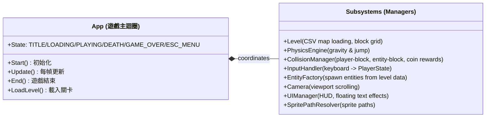

---

## 三、遊戲場景流程 (Scene Flow)

遊戲玩法的切換是由場景狀態機來控制的，每個階段都有專屬的邏輯處理器。

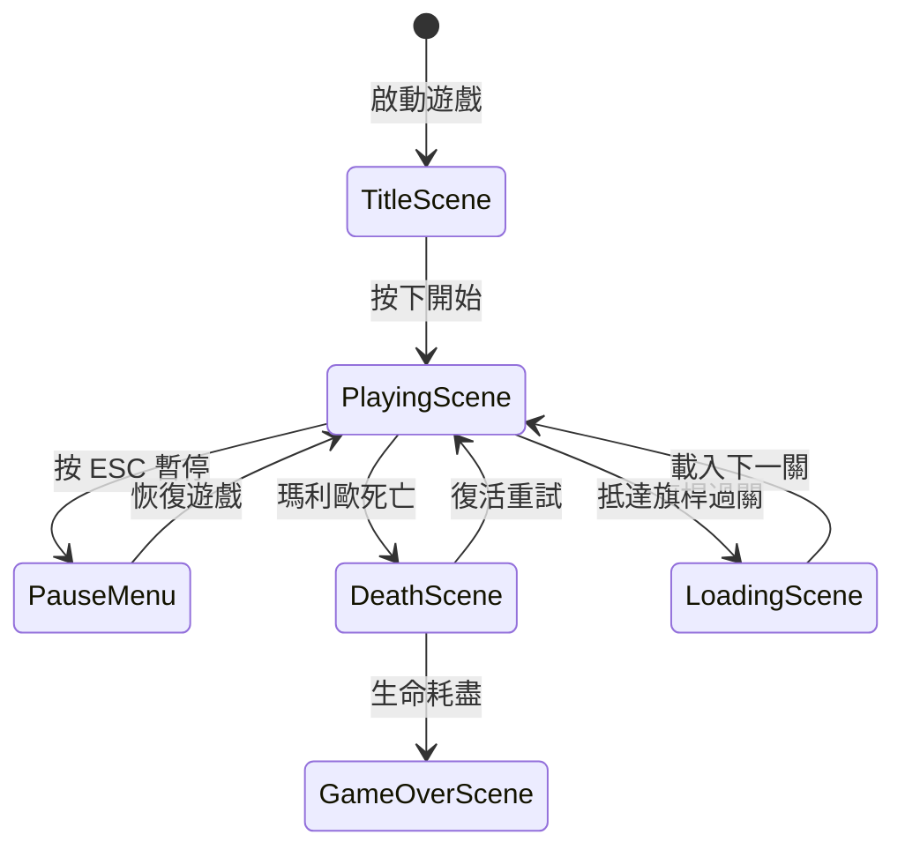

---

## 四、圖層渲染順序 (Z-Index)

為了保證畫面疊加正確，每個遊戲物件在產生時都會被賦予一個圖層高度 (Z-Index)，數字越大的畫在越上層。

| 圖層高度 (Z-Index) | 負責內容 | 說明 |
| :---: | :--- | :--- |
| **90+** | **系統介面層** | 暫停選單、死亡畫面覆蓋層、過關結算 |
| **10** | **特效層** | 吃到金幣或踩死敵人時噴出的「浮動分數文字」 |
| **5** | **動態物件層** | 敵人 (Goomba, Koopa)、道具 (蘑菇, 星星)、火球 |
| **0** | **玩家層** | 瑪利歐本人 |
| **-5** | **地形方塊層** | 地板、磚塊、問號方塊、水管 |
| **-10** | **背景層** | 藍天背景色、背景山脈與雲朵裝飾 |

---

## 五、專案程式碼目錄結構

專案資料夾按照**領域職責 (Domain-based)** 分類，對應 MVC 架構。分為 **5 大領域**：

```mermaid
graph TD
    Root["Mario/ 根目錄"]

    Root --> Core["🔵 Core<br/>底層引擎與工具"]
    Root --> Managers["🟢 Managers<br/>跨場景全域服務"]
    Root --> Entities["🟡 Entities<br/>遊戲物件 (Model + View)"]
    Root --> Controllers["🔴 Controllers<br/>遊戲流程協調"]
    Root --> Scenes["🟣 Scenes<br/>場景生命週期"]

    Core --> C1["AppCore / GameTheater"]
    Core --> C2["GameConfig / PhysicsConstants"]
    Core --> C3["PhysicsEngine / Camera"]
    Core --> C4["SpritePathResolver"]

    Managers --> M1["AudioManager / IAudioService"]
    Managers --> M2["GameStateManager / LevelManager"]
    Managers --> M3["CollisionManager / RenderManager"]
    Managers --> M4["SceneManager / UIManager"]
    Managers --> M5["DeathScreenManager / FloatingText"]

    Entities --> E1["Entity (View) ← EntityModel (Model)"]
    Entities --> E2["Player (View) ← PlayerState (Model)"]
    Entities --> E3["Block / BlockState / MovingPlatform"]
    Entities --> E4["EntityFactory / EntityDef"]
    Entities --> E5["Level / Collider / CollisionContext"]
    Entities --> E6["Blocks/ 方塊策略（已存在）"]
    Entities --> E7["Entities/ 敵人/道具/飛彈（已存在）"]

    Controllers --> CT1["PlayingSceneController"]
    Controllers --> CT2["EndingSequenceController"]
    Controllers --> CT3["PipeWarpController / InputHandler"]

    Scenes --> S1["ISceneHandler (介面)"]
    Scenes --> S2["TitleSceneHandler / LoadingSceneHandler"]
    Scenes --> S3["GameOverSceneHandler / DeathSceneHandler"]
    Scenes --> S4["ESCMenuSceneHandler / ESCMenuState"]
    Scenes --> S5["IGameState"]
```

---

### `include/Mario/` — 標頭檔

```text
include/Mario/
├── Core/
│   ├── AppCore.hpp
│   ├── GameTheater.hpp
│   ├── GameConfig.hpp
│   ├── PhysicsConstants.hpp
│   ├── PhysicsEngine.hpp
│   ├── Camera.hpp
│   ├── SpritePathResolver.hpp
│   └── AudioPathResolver.hpp        ← Audio file path resolution (RESOURCE_DIR)
│
├── Managers/
│   ├── AudioManager.hpp            ← Audio service (singleton, lazy loading)
│   ├── IAudioService.hpp           ← Audio interface (dependency injection)
│   ├── GameStateManager.hpp
│   ├── LevelManager.hpp
│   ├── CollisionManager.hpp
│   ├── RenderManager.hpp
│   ├── SceneManager.hpp
│   ├── UIManager.hpp
│   ├── DeathScreenManager.hpp
│   └── FloatingText.hpp
│
├── Entities/
│   ├── Entity.hpp          ← View 層 (繼承 EntityModel + Util::GameObject)
│   ├── EntityModel.hpp     ← Model 層（純邏輯、可單元測試）
│   ├── EntityDef.hpp
│   ├── EntityFactory.hpp
│   ├── Level.hpp
│   ├── MovingPlatform.hpp
│   ├── Block.hpp           ← View 層 (繼承 Util::GameObject)
│   ├── BlockState.hpp
│   ├── Collider.hpp
│   ├── CollisionContext.hpp
│   ├── Player.hpp          ← View 層 (委派給 PlayerState)
│   ├── PlayerState.hpp     ← Model 層（狀態機、可單元測試）
│   ├── Blocks/             ← 方塊碰撞策略（已存在）
│   └── Entities/           ← 敵人/道具/飛彈模型（已存在）
│
├── Controllers/
│   ├── PlayingSceneController.hpp
│   ├── EndingSequenceController.hpp
│   ├── PipeWarpController.hpp
│   └── InputHandler.hpp
│
└── Scenes/
    ├── ISceneHandler.hpp   ← 場景介面（OCP 擴充點）
    ├── IGameState.hpp
    ├── TitleSceneHandler.hpp
    ├── LoadingSceneHandler.hpp
    ├── GameOverSceneHandler.hpp
    ├── DeathSceneHandler.hpp
    ├── ESCMenuSceneHandler.hpp
    └── ESCMenuState.hpp
```

---

### `src/Mario/` — 實作檔

```text
src/Mario/
├── Core/
│   ├── AppCore.cpp
│   ├── GameTheater.cpp
│   ├── GameConfig.cpp
│   ├── PhysicsEngine.cpp
│   ├── Camera.cpp
│   ├── SpritePathResolver.cpp
│   └── AudioPathResolver.cpp       ← Audio path resolution implementation
│
├── Managers/
│   ├── AudioManager.cpp            ← Audio service implementation (BGM/SFX)
│   ├── GameStateManager.cpp
│   ├── LevelManager.cpp
│   ├── CollisionManager.cpp
│   ├── RenderManager.cpp
│   ├── SceneManager.cpp
│   ├── UIManager.cpp
│   ├── DeathScreenManager.cpp
│   └── FloatingText.cpp
│
├── Entities/
│   ├── Entity.cpp
│   ├── EntityModel.cpp
│   ├── EntityFactory.cpp
│   ├── Level.cpp
│   ├── MovingPlatform.cpp
│   ├── Block.cpp
│   ├── Player.cpp
│   ├── PlayerState.cpp
│   ├── Blocks/             ← 方塊策略實作
│   └── Entities/           ← 敵人/道具/飛彈實作
│
├── Controllers/
│   ├── PlayingSceneController.cpp
│   ├── EndingSequenceController.cpp
│   ├── PipeWarpController.cpp
│   └── InputHandler.cpp
│
└── Scenes/
    ├── TitleSceneHandler.cpp
    ├── LoadingSceneHandler.cpp
    ├── GameOverSceneHandler.cpp
    ├── DeathSceneHandler.cpp
    └── ESCMenuSceneHandler.cpp
```

---

**架構核心精神**：

- **Core**：最底層，不依賴任何其他 Mario 元件。
- **Managers**：跨場景的全域服務，只被 Controller 調用，不主動呼叫 Controller。
- **Entities**：同時含 Model（`EntityModel`, `PlayerState`）與 View（`Entity`, `Player`, `Block`），將邏輯計算與渲染分開。
- **Controllers**：協調 Model 與 View，決定每幀的遊戲流程（SRP）。
- **Scenes**：實作 `ISceneHandler` 介面，每個場景獨立管理生命週期（OCP）。

## 一、完整類別繼承圖（View 層 — 繼承 `Util::GameObject`）

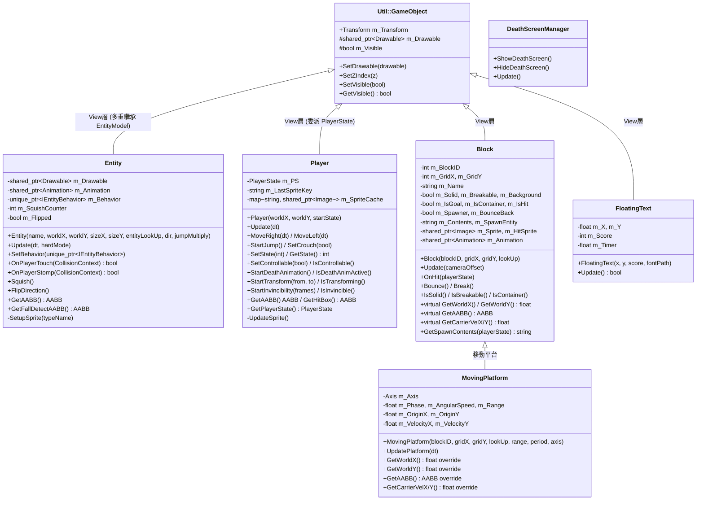

## 二、Model 層類別圖（純邏輯，可單元測試）

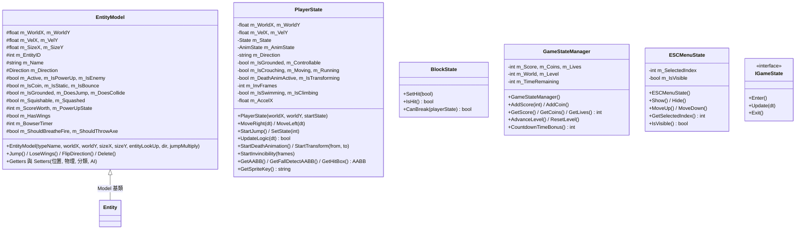

## 三、Controller 層類別圖

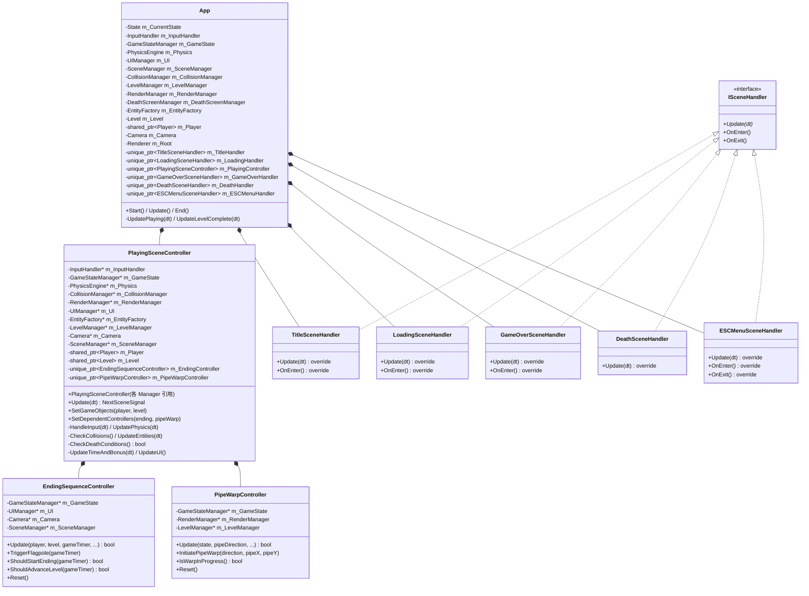

## 四、Strategy Pattern — 行為策略類別圖

```mermaid
classDiagram
    direction TB

    class IEntityBehavior {
        <<interface>>
        +Update(Entity, dt) bool
        +OnPlayerTouch(Entity, CollisionContext) bool
        +OnPlayerStomp(Entity, CollisionContext) bool
        +OnWallCollide(Entity, Block, CollisionContext)
    }

    class DefaultEntityBehavior {
        %% 使用 IEntityBehavior 預設實作
    }
    class GoombaBehavior {
        +OnPlayerStomp(Entity, CollisionContext) bool override
    }
    class KoopaBehavior {
        +OnPlayerStomp(Entity, CollisionContext) bool override
    }
    class KoopaShellBehavior {
        +OnPlayerTouch(Entity, CollisionContext) bool override
    }
    class BowserBehavior {
        +Update(Entity, dt) bool override
    }
    class ItemBehavior {
        +OnPlayerTouch(Entity, CollisionContext) bool override
    }
    class CoinBehavior {
        +OnPlayerTouch(Entity, CollisionContext) bool override
    }
    class CoinGetBehavior {
        +Update(Entity, dt) bool override
    }
    class FireballBehavior {
        +Update(Entity, dt) bool override
    }
    class BowserFireBehavior {
        +Update(Entity, dt) bool override
    }

    IEntityBehavior <|.. DefaultEntityBehavior
    IEntityBehavior <|.. GoombaBehavior
    IEntityBehavior <|.. KoopaBehavior
    IEntityBehavior <|.. KoopaShellBehavior
    IEntityBehavior <|.. BowserBehavior
    IEntityBehavior <|.. ItemBehavior
    IEntityBehavior <|.. CoinBehavior
    IEntityBehavior <|.. CoinGetBehavior
    IEntityBehavior <|.. FireballBehavior
    IEntityBehavior <|.. BowserFireBehavior
```

## 五、碰撞策略類別圖

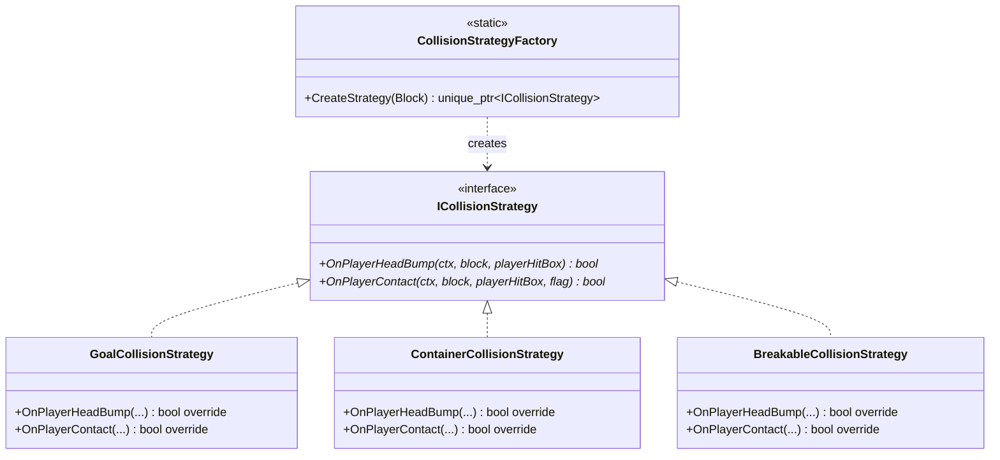

## 六、場景狀態管理（GameTheater — State Pattern）

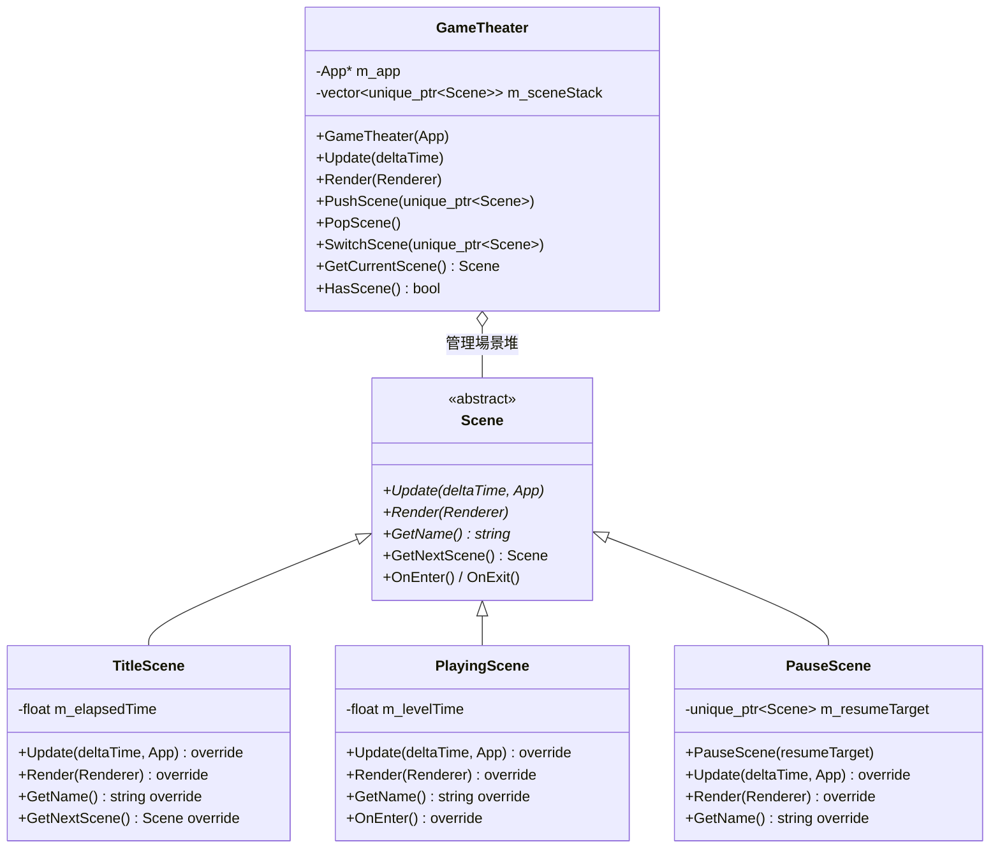

## 七、基礎設施與服務層


## 八、資料結構（Data Classes）


## 九、系統組件關係圖

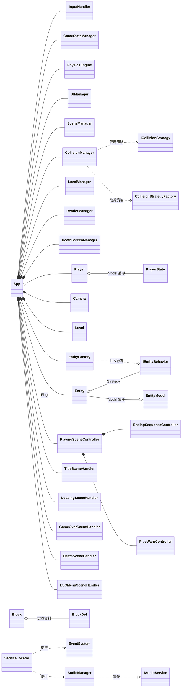

---

## 十、MVC 架構對應說明

### 10.1 Model 層（純邏輯，可單元測試）

| 類別 | 職責 |
|------|------|
| `EntityModel` | 實體物理狀態、分類標誌、AI 信號 |
| `PlayerState` | 玩家移動、跳躍、變身、無敵、碰撞箱、精靈鍵值 |
| `BlockState` | 方塊撞擊與內容物釋放邏輯 |
| `GameStateManager` | 分數、金幣、生命值、關卡進度、時間管理 |
| `ESCMenuState` | 暫停選單選項狀態 |
| `GameConfig` | 全域配置（物理常數、敵人表、關卡規則） |
| `PhysicsConstants` | 物理常量定義 |

### 10.2 View 層（繼承 `Util::GameObject`，負責渲染）

| 類別 | 職責 |
|------|------|
| `Player` | 玩家精靈渲染、動畫切換，委派邏輯給 `PlayerState` |
| `Entity` | 敵人/道具/投射物渲染，多重繼承 `EntityModel` + `GameObject` |
| `Block` | 方塊渲染、彈跳動畫、碰撞箱 |
| `MovingPlatform` | 正弦波振盪平台（繼承 `Block`） |
| `FloatingText` | 浮動分數文字特效 |
| `DeathScreenManager` | 死亡畫面覆蓋層 |
| `UIManager` | HUD 渲染（金幣、生命、分數、時間） |
| `Camera` | 攝影機跟隨與邊界限制 |

### 10.3 Controller 層（協調 Model 與 View）

| 類別 | 職責 |
|------|------|
| `App` | 主迴圈入口、場景協調、生命週期管理 |
| `PlayingSceneController` | 遊玩場景核心邏輯協調器 |
| `EndingSequenceController` | 通關結局流程（旗桿→城堡→下一關） |
| `PipeWarpController` | 水管傳送系統（地上↔地下切換） |
| `InputHandler` / `InputDispatcher` | 鍵盤輸入封裝與分派 |
| `CollisionManager` | 玩家↔方塊、玩家↔實體碰撞偵測 |
| `SceneManager` | 場景切換狀態機 |
| `ISceneHandler` 實作群 | 各場景獨立處理器（Title, Loading, Death, GameOver, ESC） |

### 10.4 基礎設施層

| 類別 | 職責 |
|------|------|
| `ServiceLocator` | 服務定位器（替代 Singleton，支援 DI） |
| `EventSystem` | 發布/訂閱事件系統 |
| `AudioManager` / `IAudioService` | 音效與背景音樂播放（DIP 抽象介面） |
| `EntityFactory` | 工廠模式，建立敵人/道具/投射物 |
| `SpritePathResolver` | 精靈圖路徑解析 |
| `RenderManager` | 統一管理可渲染物件 |
| `LevelManager` | 多關卡與地下室載入切換 |

---

## 十一、設計模式摘要

| 設計模式 | 應用位置 | 說明 |
|---------|---------|------|
| **Strategy** | `IEntityBehavior` | 敵人/道具行為可插拔替換（Goomba, Koopa, Bowser, Item...） |
| **Strategy** | `ICollisionStrategy` | 方塊碰撞邏輯可插拔替換（Goal, Container, Breakable） |
| **Strategy** | `ISceneHandler` | 場景處理器介面，新場景只需新增 handler |
| **Factory** | `EntityFactory` / `CollisionStrategyFactory` | 建立具體實體與碰撞策略 |
| **State** | `GameTheater` + `Scene` | 場景堆管理（Title→Playing→Pause→Death） |
| **Delegation** | `Player` → `PlayerState` | View 委派所有邏輯給 Model |
| **MVC** | 全專案 | Model（純邏輯）/ View（渲染）/ Controller（協調） |
| **Service Locator** | `ServiceLocator` | 替代 Singleton 的 DI 容器 |
| **Facade** | `App` / `AppCore` | 簡化子系統的統一入口 |
| **Coordinator** | `PlayingSceneController` | 協調遊玩場景的所有子系統 |
| **Template Method** | `ISceneHandler` | 場景生命週期模板（OnEnter → Update → OnExit） |
| **Observer** | `EventSystem` | 發布/訂閱事件（物件間鬆散耦合） |

---

## 十二 (新增): Phase 5 - 場景管理與管理器系統架構

### 12.1 Phase 5 新增模組概覽

Phase 5 實作了**完整的場景管理系統**與**全域管理器架構**，將遊戲流程從單一 `App` 狀態機轉變為模組化的場景堆棧系統。

#### 新增設計亮點

1. **策略模式場景處理** (`ISceneHandler`)
   - 每個場景獨立實作 `OnEnter()` / `Update()` / `OnExit()` 生命週期
   - 支援無限場景組合（可加入新場景無須修改 App）
   - 遵守開放封閉原則 (OCP)

2. **場景堆管理** (`SceneManager`)
   - 基於棧的場景管理，支援場景推入/彈出/切換
   - 自動呼叫 `OnEnter()` / `OnExit()` 鉤子
   - 支援場景轉換時的自動訊號處理

3. **服務定位器** (`ServiceLocator`)
   - 統一的依賴注入容器
   - 替代全域 Singleton 的更乾淨做法
   - 支援測試時模擬服務

4. **事件系統** (`EventSystem`)
   - 物件間的訊息傳遞解耦
   - 發布/訂閱模式
   - 支援多種事件類型

5. **音訊服務** (`IAudioService` + `AudioManager`)
   - 依賴反演原則 (DIP) 設計
   - BGM 與 SFX 分離管理
   - 便於單元測試（可注入 Mock 實作）

6. **UI 管理器** (`UIManager` + `FloatingText`)
   - 統一管理 HUD 渲染
   - 支援浮動文字特效
   - 場景轉換時自動清理

### 12.2 Phase 5 類別繼承關係

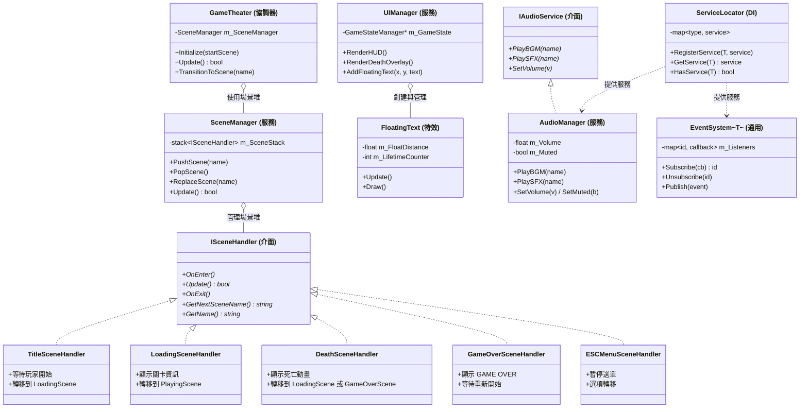

### 12.3 Phase 5 設計特色

#### 12.3.1 遊戲流程狀態機

```
[初始化] 
    ↓
[Title Scene] --按 Enter--> [Loading Scene] --自動--> [Playing Scene]
                                                           ↓
                                                    [ESC 暫停選單]
                                                           ↓
[Game Over Scene] <--生命耗盡-- [Death Scene] <--Mario 死亡-- [Playing Scene]
                                                           ↓
                                                    [Loading Scene] --自動--> [Playing Scene] (下一關)
```

#### 12.3.2 服務定位器模式優勢

- **DI 容器**：替代全域 Singleton，更便於測試
- **單責原則**：每個服務各司其職
- **易於擴充**：新增服務只需註冊，無須修改現有程式碼

#### 12.3.3 事件系統應用

```cpp
// 訂閱事件
EventSystem<PlayerDeadEvent> events;
events.Subscribe([](const PlayerDeadEvent& e) {
    std::cout << "Player died at: " << e.x << ", " << e.y << std::endl;
});

// 發佈事件
PlayerDeadEvent evt{mario.GetX(), mario.GetY()};
events.Publish(evt);
```

---

## 十三、層級控制 (Z-Index 渲染順序)

| Z-Index | 層級 | 內容 |
|---------|------|------|
| 90+ | UI 覆蓋層 | HUD、暫停選單、死亡畫面 |
| 10 | 前景層 | 浮動分數文字 |
| 5 | 實體層 | 敵人、道具、投射物 |
| 0 | 玩家層 | Player 精靈 |
| -5 | 方塊層 | 地面、磚塊、問號方塊 |
| -10 | 背景層 | 背景色、裝飾方塊 |

---

## 十三、專案目錄結構 (Modular Architecture)

```
NTUT_OOPL_mario_V2/
├── include/
│   ├── App.hpp                          # 主控制器
│   └── Mario/
│       ├── Behaviors/                   # Strategy 行為模式
│       │   ├── IEntityBehavior.hpp      #   介面
│       │   ├── DefaultEntityBehavior.hpp
│       │   ├── EnemyBehavior.hpp        #   Goomba / Koopa / KoopaShell
│       │   ├── BowserBehavior.hpp       #   Bowser AI
│       │   ├── ItemBehavior.hpp         #   Item / Coin / CoinGet
│       │   └── FireballBehavior.hpp     #   Fireball / BowserFire
│       ├── AppCore.hpp                  # 應用核心生命週期
│       ├── Block.hpp / BlockState.hpp   # 方塊 View + Model
│       ├── Camera.hpp                   # 攝影機
│       ├── Collider.hpp                 # AABB 碰撞箱
│       ├── CollisionContext.hpp         # 碰撞上下文
│       ├── CollisionManager.hpp         # 碰撞管理器
│       ├── CollisionStrategy.hpp        # 碰撞策略介面 + 實作
│       ├── CollisionStrategyFactory.hpp # 碰撞策略工廠
│       ├── DeathScreenManager.hpp       # 死亡畫面
│       ├── DeathSceneHandler.hpp        # 死亡場景 handler
│       ├── EndingSequenceController.hpp # 結局流程控制器
│       ├── Entity.hpp / EntityModel.hpp # 實體 View + Model
│       ├── EntityDef.hpp                # 實體定義結構
│       ├── EntityFactory.hpp            # 實體工廠
│       ├── ESCMenuState.hpp             # ESC 選單 Model
│       ├── ESCMenuSceneHandler.hpp      # ESC 選單場景 handler
│       ├── EventSystem.hpp              # 事件系統
│       ├── FloatingText.hpp             # 浮動文字
│       ├── GameConfig.hpp               # 全域配置
│       ├── GameOverSceneHandler.hpp     # GameOver 場景 handler
│       ├── GameStateManager.hpp         # 遊戲狀態管理 (Model)
│       ├── GameTheater.hpp              # 場景堆管理器 (State Pattern)
│       ├── IAudioService.hpp            # 音訊服務介面 (DIP)
│       ├── IGameState.hpp               # 遊戲狀態介面
│       ├── ISceneHandler.hpp            # 場景處理器介面 (Strategy)
│       ├── InputDispatcher.hpp          # 輸入分派
│       ├── InputHandler.hpp             # 輸入處理
│       ├── Level.hpp                    # 關卡資料與實體管理
│       ├── LevelManager.hpp             # 多關卡載入切換
│       ├── LoadingSceneHandler.hpp      # 載入場景 handler
│       ├── MovingPlatform.hpp           # 移動平台 (繼承 Block)
│       ├── PhysicsConstants.hpp         # 物理常量
│       ├── PhysicsCoordinator.hpp       # 物理協調器
│       ├── PhysicsEngine.hpp            # 物理引擎
│       ├── PipeWarpController.hpp       # 水管傳送控制器
│       ├── Player.hpp / PlayerState.hpp # 玩家 View + Model
│       ├── PlayingSceneController.hpp   # 遊玩場景控制器
│       ├── RenderManager.hpp            # 渲染管理器
│       ├── SceneManager.hpp             # 場景切換
│       ├── ServiceLocator.hpp           # 服務定位器 (DI)
│       ├── SpritePathResolver.hpp       # 精靈路徑解析
│       ├── TitleSceneHandler.hpp        # 標題場景 handler
│       ├── AudioManager.hpp             # 音訊管理器
│       ├── UIManager.hpp                # HUD 管理器
│       └── UIOrchestrator.hpp           # UI 協調器
├── src/
│   ├── main.cpp                         # 程式進入點
│   ├── App.cpp                          # 主控制器實作
│   └── Mario/
│       ├── Behaviors/                   # 行為策略實作
│       ├── *.cpp                        # 各類別對應實作檔
│       └── ...
├── test/
│   ├── ut_player.cpp                    # Player / PlayerState 測試
│   ├── ut_entity.cpp                    # Entity 測試
│   ├── ut_block.cpp                     # Block 測試
│   ├── ut_collider.cpp                  # AABB 碰撞測試
│   ├── ut_collision_integration.cpp     # 碰撞整合測試
│   ├── ut_event_system.cpp              # 事件系統測試
│   ├── ut_game_state.cpp                # GameState 測試
│   ├── ut_game_state_integration.cpp    # GameState 整合測試
│   ├── ut_input_handler.cpp             # InputHandler 測試
│   ├── ut_level.cpp / ut_level_loading.cpp # Level 測試
│   ├── ut_esc_menu.cpp                  # ESC 選單測試
│   ├── ut_managers.cpp                  # 管理器測試
│   ├── ut_moving_platform.cpp           # 移動平台測試
│   ├── ut_playing_scene_controller.cpp  # 遊玩場景控制器測試
│   ├── ut_ending_sequence_controller.cpp # 結局控制器測試
│   ├── ut_pipe_warp_controller.cpp      # 水管傳送測試
│   ├── ut_sprite_level_validation.cpp   # 精靈與關卡驗證
│   └── ut_misc.cpp                      # 雜項測試
└── files.cmake                          # CMake 檔案清單
```

---

## 十四、檔案清單 (File Manifest)

### include/ (48+ 個標頭檔)

| 檔案路徑 | 類別 | 架構層 |
|----------|------|--------|
| `App.hpp` | `App` | Controller |
| `Mario/AppCore.hpp` | `AppCore` | Controller |
| `Mario/Entity.hpp` | `Entity` | View |
| `Mario/EntityModel.hpp` | `EntityModel` | Model |
| `Mario/EntityDef.hpp` | `EntityDef` | Data |
| `Mario/EntityFactory.hpp` | `EntityFactory` | Infrastructure |
| `Mario/Player.hpp` | `Player` | View |
| `Mario/PlayerState.hpp` | `PlayerState` | Model |
| `Mario/Block.hpp` | `Block` | View |
| `Mario/BlockState.hpp` | `BlockState` | Model |
| `Mario/MovingPlatform.hpp` | `MovingPlatform` | View |
| `Mario/Camera.hpp` | `Camera` | View |
| `Mario/Collider.hpp` | `AABB` | Data |
| `Mario/CollisionContext.hpp` | `CollisionContext` | Data |
| `Mario/CollisionManager.hpp` | `CollisionManager` | Controller |
| `Mario/CollisionStrategy.hpp` | `ICollisionStrategy` + 3 實作 | Controller |
| `Mario/CollisionStrategyFactory.hpp` | `CollisionStrategyFactory` | Infrastructure |
| `Mario/PhysicsConstants.hpp` | 物理常量 | Data |
| `Mario/PhysicsEngine.hpp` | `PhysicsEngine` | Controller |
| `Mario/PhysicsCoordinator.hpp` | `PhysicsCoordinator` | Controller |
| `Mario/GameConfig.hpp` | `GameConfig` | Configuration |
| `Mario/GameStateManager.hpp` | `GameStateManager` | Model |
| `Mario/GameTheater.hpp` | `GameTheater` + `Scene` | Controller |
| `Mario/SceneManager.hpp` | `SceneManager` | Controller |
| `Mario/ISceneHandler.hpp` | `ISceneHandler` | Controller (Interface) |
| `Mario/TitleSceneHandler.hpp` | `TitleSceneHandler` | Controller |
| `Mario/LoadingSceneHandler.hpp` | `LoadingSceneHandler` | Controller |
| `Mario/GameOverSceneHandler.hpp` | `GameOverSceneHandler` | Controller |
| `Mario/DeathSceneHandler.hpp` | `DeathSceneHandler` | Controller |
| `Mario/ESCMenuSceneHandler.hpp` | `ESCMenuSceneHandler` | Controller |
| `Mario/PlayingSceneController.hpp` | `PlayingSceneController` | Controller |
| `Mario/EndingSequenceController.hpp` | `EndingSequenceController` | Controller |
| `Mario/PipeWarpController.hpp` | `PipeWarpController` | Controller |
| `Mario/ESCMenuState.hpp` | `ESCMenuState` | Model |
| `Mario/Level.hpp` | `Level` | Model |
| `Mario/LevelManager.hpp` | `LevelManager` | Controller |
| `Mario/InputHandler.hpp` | `InputHandler` | Controller |
| `Mario/InputDispatcher.hpp` | `InputDispatcher` | Controller |
| `Mario/EventSystem.hpp` | `EventSystem` | Infrastructure |
| `Mario/IAudioService.hpp` | `IAudioService` | Infrastructure (Interface) |
| `Mario/AudioManager.hpp` | `AudioManager` | Infrastructure |
| `Mario/ServiceLocator.hpp` | `ServiceLocator` | Infrastructure |
| `Mario/UIManager.hpp` | `UIManager` | View |
| `Mario/UIOrchestrator.hpp` | `UIOrchestrator` | Controller |
| `Mario/RenderManager.hpp` | `RenderManager` | View |
| `Mario/FloatingText.hpp` | `FloatingText` | View |
| `Mario/DeathScreenManager.hpp` | `DeathScreenManager` | View |
| `Mario/SpritePathResolver.hpp` | `SpritePathResolver` | Infrastructure |
| `Mario/IGameState.hpp` | `IGameState` | Model (Interface) |
| `Mario/Behaviors/IEntityBehavior.hpp` | `IEntityBehavior` | Strategy (Interface) |
| `Mario/Behaviors/DefaultEntityBehavior.hpp` | `DefaultEntityBehavior` | Strategy |
| `Mario/Behaviors/EnemyBehavior.hpp` | `Goomba/Koopa/KoopaShellBehavior` | Strategy |
| `Mario/Behaviors/BowserBehavior.hpp` | `BowserBehavior` | Strategy |
| `Mario/Behaviors/ItemBehavior.hpp` | `Item/Coin/CoinGetBehavior` | Strategy |
| `Mario/Behaviors/FireballBehavior.hpp` | `Fireball/BowserFireBehavior` | Strategy |

### src/ (43+ 個原始檔)

| 檔案路徑 | 對應類別 | 說明 |
|----------|---------|------|
| `main.cpp` | — | 程式進入點，驅動 `App::Start/Update/End` |
| `App.cpp` | `App` | 主迴圈、場景切換、初始化 |
| `Mario/AppCore.cpp` | `AppCore` | 應用核心生命週期 |
| `Mario/Entity.cpp` | `Entity` | 實體渲染、行為委派、碰撞 |
| `Mario/EntityModel.cpp` | `EntityModel` | 實體模型初始化、物理邏輯 |
| `Mario/EntityFactory.cpp` | `EntityFactory` | 實體工廠建立 |
| `Mario/Player.cpp` | `Player` | 玩家渲染、精靈快取 |
| `Mario/PlayerState.cpp` | `PlayerState` | 玩家邏輯（60+ 測試覆蓋） |
| `Mario/Block.cpp` | `Block` | 方塊渲染、彈跳動畫 |
| `Mario/BlockState.cpp` | `BlockState` | 方塊邏輯 |
| `Mario/MovingPlatform.cpp` | `MovingPlatform` | 正弦振盪平台 |
| `Mario/Camera.cpp` | `Camera` | 攝影機跟隨 |
| `Mario/CollisionManager.cpp` | `CollisionManager` | 所有碰撞偵測邏輯 |
| `Mario/CollisionStrategy.cpp` | 碰撞策略實作 | Goal, Container, Breakable |
| `Mario/CollisionStrategyFactory.cpp` | 碰撞策略工廠 | 根據方塊類型建立策略 |
| `Mario/PhysicsEngine.cpp` | `PhysicsEngine` | 重力、跳躍曲線 |
| `Mario/PhysicsCoordinator.cpp` | `PhysicsCoordinator` | 物理協調 |
| `Mario/GameConfig.cpp` | `GameConfig` | 配置初始化 |
| `Mario/GameStateManager.cpp` | `GameStateManager` | 遊戲狀態管理 |
| `Mario/GameTheater.cpp` | `GameTheater` | 場景堆管理 |
| `Mario/SceneManager.cpp` | `SceneManager` | 場景切換 |
| `Mario/PlayingSceneController.cpp` | `PlayingSceneController` | 遊玩場景控制器 |
| `Mario/EndingSequenceController.cpp` | `EndingSequenceController` | 結局控制器 |
| `Mario/PipeWarpController.cpp` | `PipeWarpController` | 水管傳送控制器 |
| `Mario/TitleSceneHandler.cpp` | `TitleSceneHandler` | 標題場景 |
| `Mario/LoadingSceneHandler.cpp` | `LoadingSceneHandler` | 載入場景 |
| `Mario/GameOverSceneHandler.cpp` | `GameOverSceneHandler` | GameOver 場景 |
| `Mario/DeathSceneHandler.cpp` | `DeathSceneHandler` | 死亡場景 |
| `Mario/ESCMenuSceneHandler.cpp` | `ESCMenuSceneHandler` | ESC 選單場景 |
| `Mario/ESCMenuState.cpp` | `ESCMenuState` | ESC 選單邏輯 |
| `Mario/Level.cpp` | `Level` | 關卡載入、實體管理 |
| `Mario/LevelManager.cpp` | `LevelManager` | 多關卡切換 |
| `Mario/InputHandler.cpp` | `InputHandler` | 輸入處理 |
| `Mario/InputDispatcher.cpp` | `InputDispatcher` | 輸入分派 |
| `Mario/EventSystem.cpp` | `EventSystem` | 事件發布/訂閱 |
| `Mario/AudioManager.cpp` | `AudioManager` | 音效播放 |
| `Mario/ServiceLocator.cpp` | `ServiceLocator` | 服務定位器 |
| `Mario/UIManager.cpp` | `UIManager` | HUD 渲染 |
| `Mario/UIOrchestrator.cpp` | `UIOrchestrator` | UI 協調 |
| `Mario/RenderManager.cpp` | `RenderManager` | 渲染管理 |
| `Mario/FloatingText.cpp` | `FloatingText` | 浮動文字 |
| `Mario/DeathScreenManager.cpp` | `DeathScreenManager` | 死亡畫面 |

### test/ (19 個測試檔)

| 檔案路徑 | 測試範圍 |
|----------|---------|
| `ut_player.cpp` | `Player` / `PlayerState` 移動、跳躍、變身、碰撞箱 |
| `ut_entity.cpp` | `Entity` / `EntityModel` 建立、行為、狀態 |
| `ut_block.cpp` | `Block` 屬性、彈跳、破壞 |
| `ut_collider.cpp` | `AABB` 碰撞偵測 |
| `ut_collision_integration.cpp` | 碰撞整合場景 |
| `ut_event_system.cpp` | 事件發布/訂閱 |
| `ut_game_state.cpp` | `GameStateManager` 分數/生命/關卡 |
| `ut_game_state_integration.cpp` | 遊戲狀態整合 |
| `ut_input_handler.cpp` | `InputHandler` 輸入對映 |
| `ut_level.cpp` | `Level` 載入 |
| `ut_level_loading.cpp` | 關卡解析驗證 |
| `ut_esc_menu.cpp` | `ESCMenuState` 選單邏輯 |
| `ut_managers.cpp` | 管理器整合 |
| `ut_moving_platform.cpp` | `MovingPlatform` 振盪物理 |
| `ut_playing_scene_controller.cpp` | 遊玩場景控制 |
| `ut_ending_sequence_controller.cpp` | 結局流程測試 |
| `ut_pipe_warp_controller.cpp` | 水管傳送測試 |
| `ut_sprite_level_validation.cpp` | 精靈路徑與關卡驗證 |
| `ut_misc.cpp` | 雜項邊界測試 |
