# Super Mario Bros. — PTSD C++ OOP 架構設計 (Constructure)

> **Last synced:** 2026-05-25 (Modular Reorganization: 40+ raw headers and source files grouped systematically into 6 logical subfolders: Core, Player, Level, Scenes, UI, and Services to eliminate file clutter under `include/Mario` and `src/Mario`; all project includes updated recursively via Python automation; `files.cmake` build registry fully synchronized. Form Strategy: `IPlayerForm` State Pattern with 5 concrete form strategies cleanly managing Mario's powerup dimension, abilities, and damage transitions. Standard Compatibility: Implemented non-inline virtual destructors `Player::~Player()` and `PlayerState::~PlayerState()` to resolve GCC/clang template `std::_Destroy` compilation errors for standard `std::unique_ptr` with incomplete forward declarations, achieving 100% clean compilation in all translation units.)
> **關卡:** 1-1 (Ground) → 1-2 (Underground) → 8-4 (Castle + Boss)

本專案將 C# 版本的 God Class (`Form1.cs`) 徹底解耦，轉換為符合現代 C++ 標準的  
**深度物件導向架構 (Deep OOP Architecture)**。  
設計上大量運用**繼承 (Inheritance)**、**多型 (Polymorphism)**、**介面 (Interfaces)**  
與六大**設計模式 (Design Patterns)**：State、Strategy、MVC、Factory、DIP、Service Locator。

---

## 目錄

1. [完整 UML 繼承圖](#1-完整-uml-繼承圖)
   - 1.1 PTSD GameObject 繼承樹
   - 1.2 ISceneHandler 繼承樹 (State Pattern)
   - 1.3 IEntityBehavior 繼承樹 (Strategy Pattern)
   - 1.4 死亡動畫策略繼承樹
   - 1.5 ICollisionHandler 繼承樹 (Strategy + Facade)
   - 1.6 IAudioService 繼承樹 (DIP)
   - 1.7 IUIPanel 繼承樹 (Strategy Pattern)
   - 1.8 App 全域架構圖
   - 1.9 MVC 完整關係圖
   - 1.10 ServiceLocator & EventSystem
   - 1.11 IInputHandler 繼承樹 (DIP)
   - 1.12 IPlayerForm 繼承樹 (State Pattern)
2. [所有檔案清單](#2-所有檔案清單)
   - 2.1 Include Headers
   - 2.2 Source Files
   - 2.3 Resources
   - 2.4 GameConfig 關鍵常數
   - 2.5 Python 工具腳本
3. [設計模式深度解析](#3-設計模式深度解析)
4. [Game Loop — 17 Phase 架構](#4-game-loop--17-phase-架構)
5. [App::State 狀態機轉移圖](#5-appstate-狀態機轉移圖)
6. [Refactoring 進度總覽](#6-refactoring-進度總覽)
7. [OOP 原則遵守確認](#7-oop-原則遵守確認)

---

## 1. 完整 UML 繼承圖

### 1.1 PTSD GameObject 繼承樹

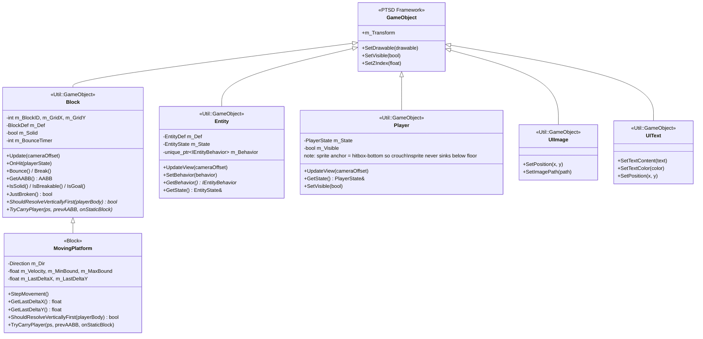

---

### 1.2 ISceneHandler 繼承樹 (State Pattern)

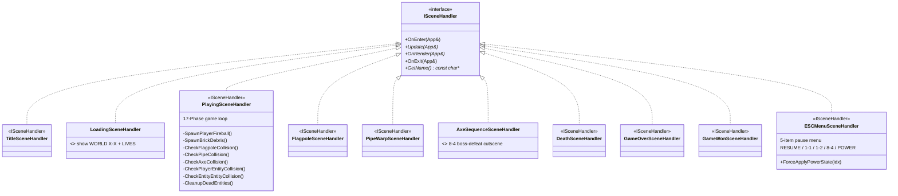

> `TitleSceneHandler`, `DeathSceneHandler`, `GameOverSceneHandler`, `GameWonSceneHandler` は `MenuSceneHandlers.hpp/.cpp` に合併。

---

### 1.3 IEntityBehavior 繼承樹 (Strategy Pattern)

```mermaid
classDiagram
    direction TB

    class IEntityBehavior {
        <<interface>>
        +Update(state, level, player, timer)*
        +OnPlayerCollision(state, player, isFromAbove) bool*
        +Clone() unique_ptr~IEntityBehavior~*
        +GetName() const char**
        +AlwaysUpdate() bool
        +OnSpawned(vx, vy)
        +OnFireballHit(state) bool
        +ConsumeSpawnRequest(type, x, y, dir) bool
        +IsImmuneToStomp() bool
    }

    class EnemyBehavior         { Goomba patrol + squish }
    class KoopaBehavior         { KoopaTroopa OR Shell -m_Type:KoopaType }
    class ParaKoopaBehavior     { Flying Koopa -m_FloatPhase:float }
    class AxeKoopaBehavior      { Axe-throwing Koopa +ConsumeSpawnRequest() }
    class BowserBehavior {
        5-Phase Boss AI + HP
        -m_Phase:BowserPhase
        -m_HealthPoints:int
        -m_PendingSpawns:vector~SpawnRequest~
        +AlwaysUpdate() true
        +IsImmuneToStomp() true
        +ConsumeSpawnRequest()
        -ResolveWallAndEdge(state, level)
    }
    class FireballBehavior      { Parabolic / horizontal +AlwaysUpdate() true }
    class ItemBehavior          { Mushroom/Star/FireFlower/1UP/Coin -m_ItemType:ItemType }
    class AxeBehavior           { Bridge axe kill-trigger (8-4) }
    class PrincessBehavior      { NPC goal marker (8-4) }
    class PiranhaPlantBehavior  { Pipe plant 4-Phase cycle -m_Phase }
    class PodobooBehavior       { Lava bubble — immortal; +IsImmuneToStomp() true }
    class DefaultEntityBehavior { Passive coin / flag }
    class ParticleDebris {
        Brick debris particles
        -m_InitialVelX, m_InitialVelY:float
        -m_LifetimeFrames:int
        +AlwaysUpdate() true
        +OnSpawned(vx, vy)
    }
    class CastleFireSpawnerBehavior {
        8-4 off-screen fire spawner
        -m_PendingSpawns:vector~SpawnRequest~
        +AlwaysUpdate() true
    }

    IEntityBehavior <|.. EnemyBehavior
    IEntityBehavior <|.. KoopaBehavior
    IEntityBehavior <|.. ParaKoopaBehavior
    IEntityBehavior <|.. AxeKoopaBehavior
    IEntityBehavior <|.. BowserBehavior
    IEntityBehavior <|.. FireballBehavior
    IEntityBehavior <|.. ItemBehavior
    IEntityBehavior <|.. AxeBehavior
    IEntityBehavior <|.. PrincessBehavior
    IEntityBehavior <|.. PiranhaPlantBehavior
    IEntityBehavior <|.. PodobooBehavior
    IEntityBehavior <|.. DefaultEntityBehavior
    IEntityBehavior <|.. ParticleDebris
    IEntityBehavior <|.. CastleFireSpawnerBehavior
```

> `KoopaBehavior`, `ParaKoopaBehavior`, `AxeKoopaBehavior` → `KoopaFamily.hpp/.cpp`  
> `AxeBehavior`, `PrincessBehavior` → `StaticEntityBehaviors.hpp/.cpp`

---

### 1.4 死亡動畫策略繼承樹

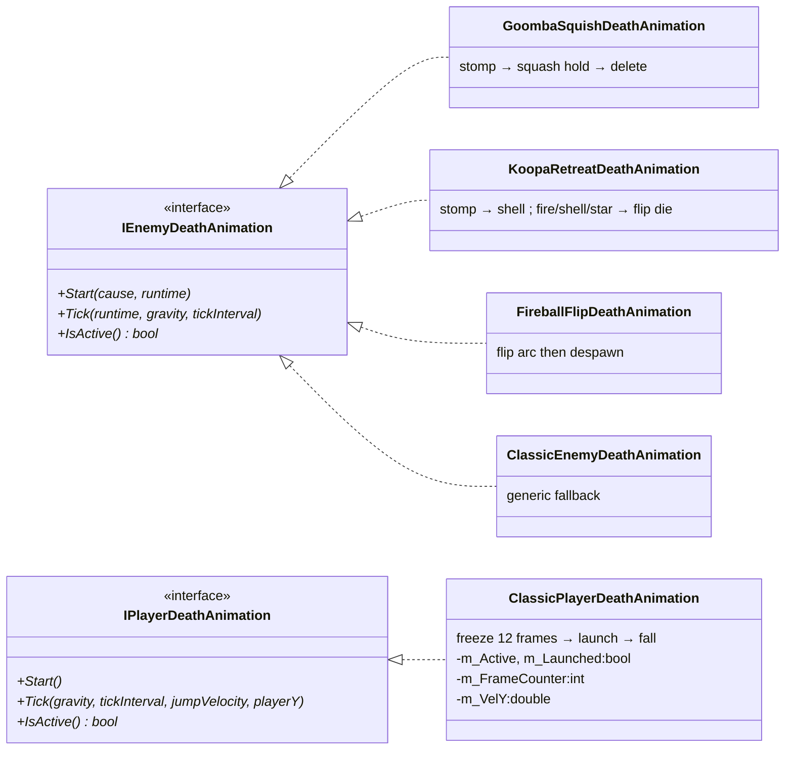

---

### 1.5 ICollisionHandler 繼承樹 (Strategy + Facade)

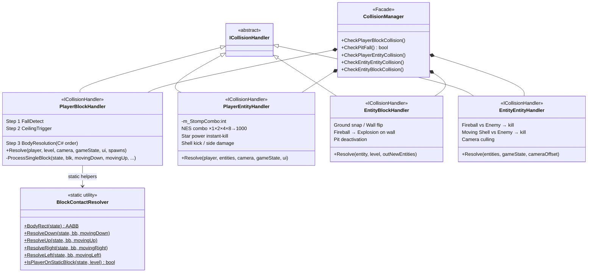

---

### 1.6 IAudioService 繼承樹 (DIP)

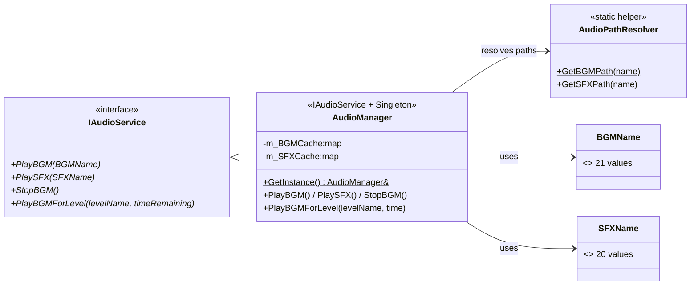

> `IAudioService.hpp`, `AudioPathResolver.hpp`, `AudioType.hpp` 它以單獨文件的形式存在。
> `AudioManager.hpp` 包含 `IAudioService` 定義並實作；`AudioPathResolver` 是純靜態輔助類別，提供從枚舉到路徑的映射。

---

### 1.7 IUIPanel 繼承樹 (Strategy Pattern)

每個遊戲畫面的 UI 小部件由對應的 `IUIPanel` 子類別封裝。
`UIManager` 僅持有 `unordered_map<State, IUIPanel*>` 並在 `Update()` 中查表分派，
不包含任何 `switch-case`。新增畫面：新增子類別 + 在 UIManager ctor 中 `Register()`，
**不需修改** `UIManager::Update()`（OCP）。

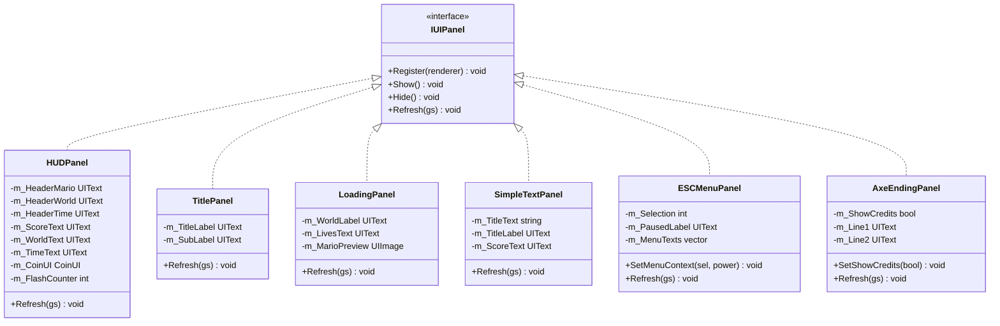

> `SimpleTextPanel` 被 `UIManager` 實例化兩次：`m_GameOverPanel("GAME OVER")` 與
> `m_GameWonPanel("WORLD CLEARED")`，展示 OOP 複用而不重複代碼。
> `HUDPanel` 在所有 `PLAYING` / `ESC_MENU` 狀態疊加顯示，不在 `m_PanelMap` 中。

---

### 1.8 App 全域架構圖

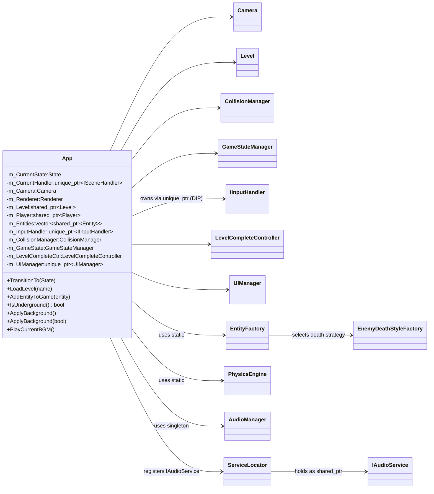

---

### 1.8 MVC 完整關係圖

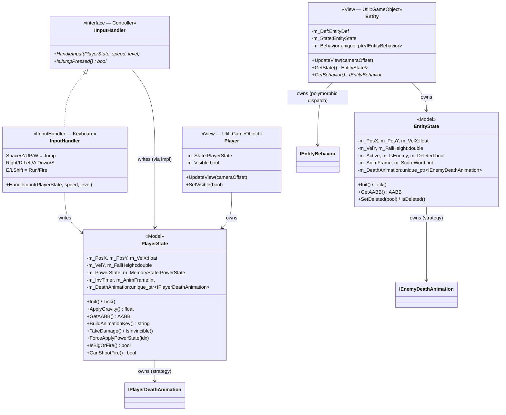

---

### 1.9 ServiceLocator & EventSystem

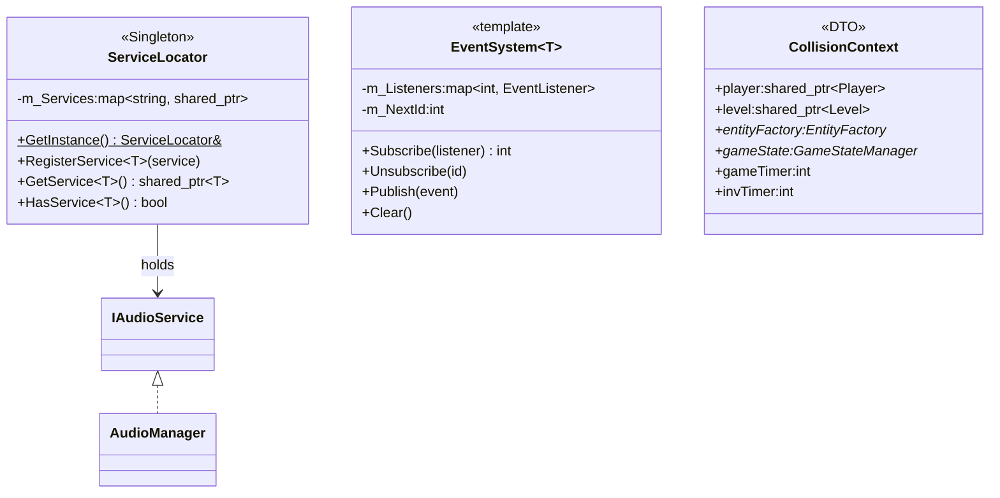

---

### 1.10 IInputHandler 繼承樹 (DIP)

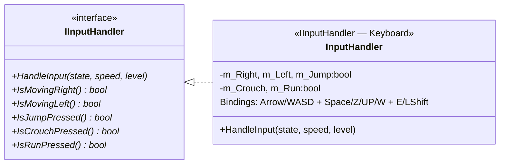

> `IInputHandler` follows the same DIP pattern as `IAudioService`:
> `App.hpp` depends only on the abstraction; the concrete `InputHandler` is
> injected in `App::Start()`. Future extensions (gamepad, AI input, replay)
> only require a new `IInputHandler` implementation — zero changes to App or
> PlayingSceneHandler.

---

### 1.11 IPlayerForm 繼承樹 (State Pattern)

為了將 Mario 的各種力量狀態 (Small, Big, Fire, Star) 與實體行為解耦，我們導入了狀態模式 (State Pattern)。
`PlayerState` 不再以臃腫的 switch-cases 或條件判斷處理狀態行為，而是持有多型的 `IPlayerForm` 策略指標。

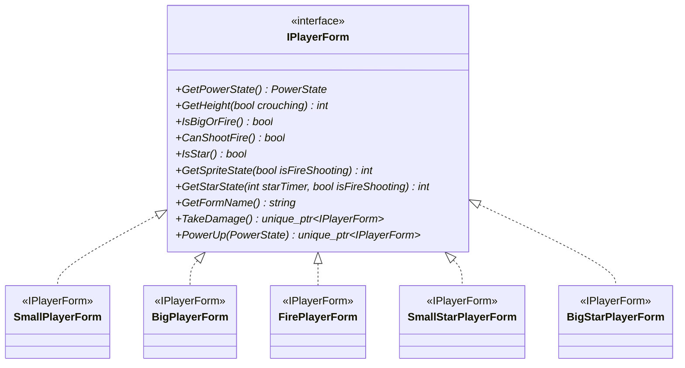

> `IPlayerForm` 透過多型虛擬函式封裝了各個型態的特定維度、攻擊判定以及受傷、升級時的型態轉換邏輯。
> 新增任何 Mario 型態 (如狸貓、冰花) 僅需新增對應的子類別，而無須修改任何現有的 state 判斷程式碼，完美遵循開閉原則 (OCP)。

---

## 2. 所有檔案清單

### 2.1 Include Headers (`include/`)

| 檔案 | 類別 / 結構 | @inheritance | 職責 |
|------|------------|-------------|------|
| `App.hpp` | `App` | None | 持有子系統；State 切換；存取器 API；`IsUnderground()` 合併 GameStateManager + Level 的地下判斷；`ApplyBackground()` 無參數重載 |
| `Mario/Core/GameConfig.hpp` | `GameConfig` | None (static consts) | 全域常數 + 座標轉換靜態 helpers |
| `Mario/Core/Collider.hpp` | `AABB` | None (data struct) | AABB 矩形 + Intersects() (strict inequality) |
| `Mario/Core/CollisionContext.hpp` | `CollisionContext` | None (data struct) | 碰撞解析資料傳遞物件 (DTO)，攜帶 Player/Level/EntityFactory/GameStateManager 參考 |
| `Mario/Core/Camera.hpp` | `Camera` | None | 橫向捲動 offset；8-4 Boss 鎖屏；world to screen 轉換 |
| `Mario/Core/PhysicsEngine.hpp` | `PhysicsEngine` | None (static) | ApplyGravity() + GetJumpHeight() |
| `Mario/Core/SpritePathResolver.hpp` | `SpritePathResolver` | None (static) | Sprite 路徑解析 Block/Player/Entity（具有 s_ResolvedPathCache 解決每幀磁碟 I/O） |
| `Mario/Level/EntityDef.hpp` | `EntityDef`, `BlockDef`, `EntityType` | None (data) | CSV 資料結構；EntityType 列舉；`renderTargetWidth` 渲染縮放欄位（EntityFactory 設定，OCP） |
| `Mario/Level/Block.hpp` | `Block` | `Util::GameObject` | 磚塊：碰撞/動畫/hit/bounce/break；靜態跨實例 Sprite Cache；`ShouldResolveVerticallyFirst()`/`TryCarryPlayer()` virtual 讓 MovingPlatform 覆寫 |
| `Mario/Level/MovingPlatform.hpp` | `MovingPlatform` | `Block` | 移動平台（1-2 垂直 / 8-4 水平）；override `ShouldResolveVerticallyFirst` 優先垂直 Snap；`TryCarryPlayer` 攜帶玩家 |
| `Mario/Level/Level.hpp` | `Level` | None | CSV 解析；高階 O(1) 扁平 Block 陣列；視口剔除與 visibility culling；SpawnPoint；`GetGoalBlocks()` 快取；`QueryBlocksInRange(out)` 零分配版；`IsUnderground()` 名稱判斷 |
| `Mario/Level/EntityState.hpp` | `EntityState` | None (Model) | Entity MVC Model：位置/速度/動畫/死亡策略 |
| `Mario/Level/EnemyDeathAnimation.hpp` | `IEnemyDeathAnimation`, `GoombaSquishDeathAnimation`, `KoopaRetreatDeathAnimation`, `FireballFlipDeathAnimation`, `ClassicEnemyDeathAnimation`, `EnemyDeathRuntime`, `EnemyDeathCause` | `IEnemyDeathAnimation <- {GoombaSquish, KoopaRetreat, FireballFlip, Classic}` | 敵人死亡動畫多策略（踩踏/龜殼/火球/通用） |
| `Mario/Level/EnemyDeathStyleFactory.hpp` | `EnemyDeathStyleFactory` | None (Factory) | 依 EntityType 注入對應敵人死亡策略 |
| `Mario/Level/Entity.hpp` | `Entity` | `Util::GameObject` | Entity View：渲染 + Strategy 行為；Z-index 自決策 |
| `Mario/Level/EntityFactory.hpp` | `EntityFactory` | None (Factory) | 唯一 Entity 建立入口；`SpawnProjectile()` 負責 **entity-spawned** 投射物（Bowser/AxeKoopa）；`SpawnFromPlayer()` 負責 **player-fired** 投射物，兩者均透過 `MakeProjectileDef()` 構建 def（SRP/OCP；PlayingSceneHandler 零 inline EntityDef） |
| `Mario/Player/PlayerState.hpp` | `PlayerState`, `PowerState` | None (Model) | Player MVC Model：物理/狀態/動畫key/死亡策略 |
| `Mario/Player/PlayerForm.hpp` | `IPlayerForm`, `SmallPlayerForm`, `BigPlayerForm`, `FirePlayerForm`, `SmallStarPlayerForm`, `BigStarPlayerForm` | `IPlayerForm <- {SmallPlayerForm, BigPlayerForm, FirePlayerForm, SmallStarPlayerForm, BigStarPlayerForm}` | 力量狀態多型策略（State Pattern）：尺寸、受傷退化、升級轉換 |
| `Mario/Player/PlayerDeathAnimation.hpp` | `IPlayerDeathAnimation`, `ClassicPlayerDeathAnimation` | `IPlayerDeathAnimation <- ClassicPlayerDeathAnimation` | 玩家死亡動畫策略（凍結/起跳/下墜） |
| `Mario/Player/Player.hpp` | `Player` | `Util::GameObject` | Player View：渲染 + m_Visible 守衛 |
| `Mario/Services/IInputHandler.hpp` | `IInputHandler` | None (interface) | Input abstraction (DIP); `HandleInput` + query accessors; enables keyboard, gamepad, AI/replay swap |
| `Mario/Services/InputHandler.hpp` | `InputHandler` | `IInputHandler -> InputHandler` | Keyboard controller: Arrow/WASD + Space/Z/UP/W jump + E/LShift fire |
| `Mario/CollisionManager.hpp` | `CollisionManager` | None (facade) | Collision 子系統協調者（Facade Pattern）；公開 API 不變；邏輯委派給 Collision/ 四個 Handler |
| `Mario/Collision/ICollisionHandler.hpp` | `ICollisionHandler` | None (abstract interface) | 所有碰撞 Handler 的標記基類；定義繼承樹頂點 |
| `Mario/Collision/BlockContactResolver.hpp` | `BlockContactResolver` | None (static utility) | 靜態 Down/Up/Right/Left AABB Snap helpers；BodyRect() 建立全寬碰撞體（C# GetRecPosition 等效）；`IsPlayerOnStaticBlock()` 判定玩家是否站在靜態方塊上 |
| `Mario/Collision/PlayerBlockHandler.hpp` | `PlayerBlockHandler` | `ICollisionHandler` | 玩家-方塊三步驟管線：FallDetect → CeilingTrigger → BodyResolution；ProcessSingleBlock 取代原 lambda |
| `Mario/Collision/PlayerEntityHandler.hpp` | `PlayerEntityHandler` | `ICollisionHandler` | 玩家-實體碰撞：踩踏 NES Combo / 傷害 / 道具收集；m_StompCombo 在此管理 |
| `Mario/Collision/EntityBlockHandler.hpp` | `EntityBlockHandler` | `ICollisionHandler` | 實體-方塊碰撞：地面 Snap / 牆壁翻向 / Fireball→Explosion / 落坑刪除 |
| `Mario/Collision/EntityEntityHandler.hpp` | `EntityEntityHandler` | `ICollisionHandler` | 實體-實體碰撞：火球 vs 敵人 / 移動龜殼 vs 敵人；viewport culling |
| `Mario/Level/LevelCompleteController.hpp` | `LevelCompleteController`, `EndingPhase` | None | 旗杆/水管/Bowser 結局序列 |
| `Mario/Level/GameStateManager.hpp` | `GameStateManager` | None (Service) | 分數/生命/金幣/時間/關卡進度 |
| `Mario/Scenes/ISceneHandler.hpp` | `ISceneHandler` | None (interface) | State Pattern 純虛介面（10 個實作） |
| `Mario/Scenes/MenuSceneHandlers.hpp` | `TitleSceneHandler`, `DeathSceneHandler`, `GameOverSceneHandler`, `GameWonSceneHandler` | `ISceneHandler` | 選單/死亡/結束場景（合併） |
| `Mario/Scenes/LoadingSceneHandler.hpp` | `LoadingSceneHandler` | `ISceneHandler` | 加載畫面（顯示 WORLD X-X + LIVES） |
| `Mario/Scenes/PlayingSceneHandler.hpp` | `PlayingSceneHandler` | `ISceneHandler` | 主遊戲迴圈（17-phase）；`m_DebrisQueryBuffer` 零分配磚塊查詢緩衝 |
| `Mario/Scenes/FlagpoleSceneHandler.hpp` | `FlagpoleSceneHandler` | `ISceneHandler` | 旗杆滑動序列 |
| `Mario/Scenes/PipeWarpSceneHandler.hpp` | `PipeWarpSceneHandler` | `ISceneHandler` | 水管傳送過場 |
| `Mario/Scenes/AxeSequenceSceneHandler.hpp` | `AxeSequenceSceneHandler` | `ISceneHandler` | 8-4 Bowser 擊敗序列 |
| `Mario/Scenes/ESCMenuSceneHandler.hpp` | `ESCMenuSceneHandler` | `ISceneHandler` | ESC 暫停選單；5 項選單（RESUME/1-1/1-2/8-4/**POWER**）；`OnEnter()` 從玩家當前 PowerState 初始化 `m_PowerStateIndex`；`GetPowerStateName(idx)` 靜態輔助；ENTER 鍵觸發 `ForceApplyPowerState()` |
| `Mario/Services/AudioType.hpp` | `BGMName` (21), `SFXName` (20) | None (enum header) | BGM / SFX 音效枚舉定義 |
| `Mario/Services/IAudioService.hpp` | `IAudioService` | None (interface) | 音效抽象介面（DIP）；`PlayBGM` / `PlaySFX` / `StopBGM` / `PlayBGMForLevel` |
| `Mario/Services/AudioPathResolver.hpp` | `AudioPathResolver` | None (static utility) | RESOURCE_DIR 路徑解析；`GetBGMPath(filename)` / `GetSFXPath(filename)` |
| `Mario/Services/AudioManager.hpp` | `AudioManager` | `IAudioService <- AudioManager` (Singleton) | 音效全系統實作；內部 BGM/SFX cache；`PlayBGMForLevel(levelName, time)` 集中 level→BGM 映射 |
| `Mario/Services/ServiceLocator.hpp` | `ServiceLocator` | None (Service Locator) | 服務定位器 Singleton；type-safe `RegisterService<T>` / `GetService<T>` |
| `Mario/Services/EventSystem.hpp` | `EventSystem<T>` | None (template) | 泛型 Pub/Sub 事件系統；`Subscribe` / `Unsubscribe` / `Publish` |
| `Mario/UI/UIPanel.hpp` | `IUIPanel` | None (interface) | Strategy 介面：`Register(renderer)` / `Show()` / `Hide()` / `Refresh(gs)`；新增畫面只需新增子類別，不需修改 `UIManager::Update()` (OCP) |
| `Mario/UI/UIPanel.hpp` | `HUDPanel` | `IUIPanel` | 遊戲中 HUD（分數/世界/時間/金幣）；封裝 `CoinUI`；時間 &lt; 100 閃爍動畫 |
| `Mario/UI/UIPanel.hpp` | `TitlePanel` | `IUIPanel` | 標題畫面："SUPER MARIO BROS" + "PRESS ENTER TO START" |
| `Mario/UI/UIPanel.hpp` | `LoadingPanel` | `IUIPanel` | 載入畫面："WORLD X-X" + 命數 + `MarioIdle.png` 預覽（建構子預載貼圖避免首幀空白） |
| `Mario/UI/UIPanel.hpp` | `SimpleTextPanel` | `IUIPanel` | 可重用文字面板；以標題字串為建構參數；`GameOverPanel` ("GAME OVER") 與 `GameWonPanel` ("WORLD CLEARED") 各建一實例 |
| `Mario/UI/UIPanel.hpp` | `ESCMenuPanel` | `IUIPanel` | 暫停選單；`SetMenuContext(int sel, string power)` 在 `Refresh()` 前注入選取索引與 POWER 名稱 |
| `Mario/UI/UIPanel.hpp` | `AxeEndingPanel` | `IUIPanel` | 8-4 結局字幕；`SetShowCredits(bool)` 控制 "THANK YOU MARIO!" 顯示 |
| `Mario/UI/UIManager.hpp` | `UIManager` | None | **薄型分派器**：持有所有 Panel 實體 + `unordered_map<State, IUIPanel*>`；`Update()` 呼叫 `HideAllScenePanels()` 後查表顯示當前 Panel；HUD 在所有遊戲進行狀態疊加顯示；`State` enum 保留供 scene handler 呼叫（不修改外部 API） |
| `Mario/UI/UIWidgets.hpp` | `UIImage`, `UIText` | `Util::GameObject <- UIImage/UIText` | 輕量 UI 元件（合併） |
| `Mario/UI/FloatingText.hpp` | `FloatingText` | None | 漂浮分數文字（60 幀淡出） |
| `Mario/UI/CoinUI.hpp` | `CoinUI` | None (composite) | 金幣動畫圖示 + 計數文字 |
| `Mario/Behaviors/IEntityBehavior.hpp` | `IEntityBehavior` | None (interface) | Strategy Pattern 純虛介面（14 個實作） |
| `Mario/Behaviors/EnemyBehavior.hpp` | `EnemyBehavior` | `IEntityBehavior` | Goomba AI |
| `Mario/Behaviors/KoopaFamily.hpp` | `KoopaBehavior`, `ParaKoopaBehavior`, `AxeKoopaBehavior` | `IEntityBehavior` | Koopa 系列 AI（合併）；`AxeKoopaBehavior` 使用 ConsumeSpawnRequest 生成斧頭（pending-flag 模式） |
| `Mario/Behaviors/BowserBehavior.hpp` | `BowserBehavior` | `IEntityBehavior` | Boss 5-Phase AI + HP 系統；使用 `vector<SpawnRequest>` 佇列支援同時丟斧頭與吐火球；支援 AlwaysUpdate 以實現開局起持續越屏噴火 |
| `Mario/Behaviors/CastleFireSpawnerBehavior.hpp` | `CastleFireSpawnerBehavior` | `IEntityBehavior` | 8-4 關卡專用隱形越屏噴火器 |
| `Mario/Behaviors/FireballBehavior.hpp` | `FireballBehavior` | `IEntityBehavior` | 拋物線/水平火球；支援 AlwaysUpdate 以實現敵方火球越屏平移 |
| `Mario/Behaviors/ItemBehavior.hpp` | `ItemBehavior` | `IEntityBehavior` | 道具與金幣行為；`ItemType` 枚舉確保各道具與金幣行為獨立，支援金幣閃爍/旋轉動畫 |
| `Mario/Behaviors/StaticEntityBehaviors.hpp` | `AxeBehavior`, `PrincessBehavior` | `IEntityBehavior` | 8-4 靜態觸發器/NPC（合併） |
| `Mario/Behaviors/PiranhaPlantBehavior.hpp` | `PiranhaPlantBehavior` | `IEntityBehavior` | 水管食人花 4-Phase；管口安全半徑 1.5×TILE |
| `Mario/Behaviors/PodobooBehavior.hpp` | `PodobooBehavior` | `IEntityBehavior` | 熔岩泡泡（不可擊殺） |
| `Mario/Behaviors/DefaultEntityBehavior.hpp` | `DefaultEntityBehavior` | `IEntityBehavior` | 被動實體（金幣/旗幟） |
| `Mario/Behaviors/ParticleDebris.hpp` | `ParticleDebris` | `IEntityBehavior` | 磚塊破碎粒子 |

**Note:** `GameTheater.hpp`、`SceneManager.hpp` 及其 `.cpp` 是已被 State Pattern 取代的孤兒檔案，已從磁碟**永久刪除**。

### 2.2 Source Files (`src/`)

| 檔案 | 行數 (約) | 備註 |
|------|---------|------|
| `App.cpp` | 276 | TransitionTo + LoadLevel + accessor impls；移除 Z-index 覆寫 (Bug #18) |
| `Mario/Core/Camera.cpp` | 52 | 8-4 Boss 鎖屏邏輯 (Bug #17) |
| `Mario/Core/PhysicsEngine.cpp` | 47 | |
| `Mario/Core/SpritePathResolver.cpp` | 428 | 全 unordered_map 靜態表與 s_ResolvedPathCache 解決每幀磁碟 I/O；補齊城堡/出生點 mappings (Bug #13, #14) |
| `Mario/Level/Block.cpp` | 362 | 靜態 s_BlockSpriteCache；像素對齊渲染 (Bug #12, #23) |
| `Mario/Level/MovingPlatform.cpp` | 114 | WorldToScreen 使用統一轉換 helper (Bug #24) |
| `Mario/Level/Level.cpp` | 487 | CSV 解析與 O(1) 扁平 2D 陣列 Block 索引；UpdateBlocks 視口 visibility culling 降低 draw calls |
| `Mario/Player/PlayerState.cpp` | 354 | 死亡策略；蹲下高度動態調整 (Bug #20)；階梯式退化 (Bug #25)；`ForceApplyPowerState(idx)` 作弊器；`IsBigOrFire()` DRY helper (2026-05-24)；定義非內聯解構子 `~PlayerState()` 以解決前置宣告不完整類型編譯錯誤 (2026-05-25) |
| `Mario/Player/PlayerForm.cpp` | 303 | IPlayerForm 及 5 種力量型態子類別多型行為實作 |
| `Mario/Player/PlayerDeathAnimation.cpp` | 35 | ClassicPlayerDeathAnimation 策略實作 |
| `Mario/Player/Player.cpp` | 166 | 死亡精靈鎖定 (Bug #19)；閃爍 PTSD 基類直呼叫 (Bug #5)；像素對齊 (Bug #12)；**crouch sprite anchored to hitbox bottom, fixes floor sinking** (2026-05-24)；定義非內聯虛擬解構子 `~Player()` 以解決前置宣告不完整類型編譯錯誤 (2026-05-25) |
| `Mario/Services/InputHandler.cpp` | 122 | 全寬 uncrouch guard (Bug #20) |
| `Mario/Level/EntityState.cpp` | 220 | 死亡策略整合 |
| `Mario/Level/EnemyDeathAnimation.cpp` | 162 | 四種死亡策略實作 |
| `Mario/Level/EnemyDeathStyleFactory.cpp` | 30 | 依 EntityType 選策略 |
| `Mario/Level/Entity.cpp` | 217 | 靜態 s_EntitySpriteCache；Z-index 自決策（PiranhaPlant, COIN）(Bug #18, #29) |
| `Mario/Level/EntityFactory.cpp` | 418 | AXE->AxeBehavior (Bug #8)；COIN/STAR/FIRE_FLOWER/ONE_UP ItemType 精確注入 (Bug #28)；**`MakeProjectileDef()` centralises all projectile EntityDef construction** (2026-05-24) |
| `Mario/CollisionManager.cpp` | 65 | **Facade only** — 5 個 CheckXxx 方法各自委派給對應 Handler；全部邏輯已移至 Collision/ 子系統 |
| `Mario/Collision/BlockContactResolver.cpp` | 114 | 靜態 Down/Up/Right/Left 解析方法；BodyRect helper（原 file-scope static 函數） |
| `Mario/Collision/PlayerBlockHandler.cpp` | 315 | 三步驟管線 + ProcessSingleBlock（取代原 lambda）+ TriggerBlockHit（原私有方法）|
| `Mario/Collision/PlayerEntityHandler.cpp` | 289 | HandleEnemyCollision + HandleItemCollision；m_StompCombo NES Combo 計數 |
| `Mario/Collision/EntityBlockHandler.cpp` | 134 | CheckGround + CheckWalls（Fireball→Explosion spawn）|
| `Mario/Collision/EntityEntityHandler.cpp` | 104 | Fireball vs Enemy + Moving Shell vs Enemy；IsMovingShell() static helper |
| `Mario/Level/LevelCompleteController.cpp` | 451 | 旗杆 Y 修正 (Bug #15)；8-4 通關重力釋放 (Bug #27) |
| `Mario/Level/GameStateManager.cpp` | 104 | |
| `Mario/Scenes/MenuSceneHandlers.cpp` | 128 | 死亡場景接管生命扣除與動畫 (Bug #19)；GameWon 黑底 (Bug #26) |
| `Mario/Scenes/LoadingSceneHandler.cpp` | 47 | 強制黑色背景 (Bug #16) |
| `Mario/Scenes/PlayingSceneHandler.cpp` | 539 | X-only 旗杆 fallback (Bug #4)；pipe 展開 box (Bug #21)；viewport entity culling (Bug #23) |
| `Mario/Scenes/FlagpoleSceneHandler.cpp` | 43 | Camera lockoff 傳入 (Bug #17) |
| `Mario/Scenes/PipeWarpSceneHandler.cpp` | 66 | |
| `Mario/Scenes/AxeSequenceSceneHandler.cpp` | 77 | Camera lockoff 解除 (Bug #17) |
| `Mario/Scenes/ESCMenuSceneHandler.cpp` | 129 | 5-item menu logic; case 4 cycles power cheat + calls ForceApplyPowerState() |
| `Mario/UI/UIManager.cpp` | 514 | InitLoadingScreen 預載 (Bug #16)；FPS+版權文字 (Bug #22)；座標 helper (Bug #24) |
| `Mario/Services/AudioManager.cpp` | 238 | AudioPathResolver 實作 |
| `Mario/Services/AudioPathResolver.cpp` | 8 | BGM/SFX 路徑映射 |
| `Mario/UI/CoinUI.cpp` | 85 | |
| `Mario/UI/FloatingText.cpp` | 44 | |
| `Mario/Behaviors/EnemyBehavior.cpp` | 74 | |
| `Mario/Behaviors/KoopaFamily.cpp` | 241 | |
| `Mario/Behaviors/BowserBehavior.cpp` | 364 | 丟斧頭（定時/快速）與吐火球 AI 佇列生成；HP 系統 |
| `Mario/Behaviors/CastleFireSpawnerBehavior.cpp` | 81 | 隱形定時向左發射火球 |
| `Mario/Behaviors/FireballBehavior.cpp` | 86 | |
| `Mario/Behaviors/ItemBehavior.cpp` | 85 | ItemType 精確分流 (Bug #28) |
| `Mario/Behaviors/StaticEntityBehaviors.cpp` | 65 | |
| `Mario/Behaviors/PiranhaPlantBehavior.cpp` | 148 | 居中修正 + 安全半徑 (Bug #18) |
| `Mario/Behaviors/PodobooBehavior.cpp` | 107 | |
| `Mario/Behaviors/DefaultEntityBehavior.cpp` | 51 | |
| `Mario/Behaviors/ParticleDebris.cpp` | 52 | |

**Total: 48 source files, 8641 lines of C++17 OOP code**

### 2.3 Resources

| 路徑 | 內容 |
|------|------|
| `Resources/Levels/1-1.csv` | 地面關卡（16x220 格） |
| `Resources/Levels/1-2.csv` | 地下關卡（16x220 格） |
| `Resources/Levels/8-4.csv` | 城堡關卡（15x392 格）— generate_8-4_map.py 生成；ID 961 (MovingPlatformH) 放置於 row=12 cols=70,163,176,189（水平移動平台，±4 tiles 範圍） |
| `Resources/LookUpSheet/IDList.csv` | Block 定義表 ID to name/solid/breakable/...；ID 893 與 904 均為 `Lava`（solid=0, background=1），可穿越不碰撞，Mario 掉入後落出畫面觸發 pit-fall 死亡 |
| `Resources/LookUpSheet/EntityList.csv` | Entity 定義表 ID to name/type/isEnemy/score/... |
| `Resources/Sprites/` | 所有 sprite PNG（Block/Player/Entity/UI） |
| `Resources/Audio/` | 所有 BGM（.ogg）與 SFX（.wav） |
| `Resources/Font/` | 遊戲字型 |

### 2.4 GameConfig 關鍵常數

| 常數 | 值 | 說明 |
|------|----|------|
| `TILE_SIZE` | 45 | 像素/格（720/16=45，垂直剛好填滿） |
| `DRAW_SCALE` | 45.0f/32.0f = 1.40625f | 32px sprites 縮放到 45px 格 |
| `SCALE_FACTOR` | 2.8125f | 45/16 |
| `TICK_INTERVAL` | 0.02f (50 FPS) | 每幀時間 |
| `WINDOW_WIDTH` | 1280 | 視窗寬度 |
| `WINDOW_HEIGHT` | 720 | 視窗高度 |
| `GRAVITY` | 13.7953f | 重力常數（與 JUMP_VELOCITY 對稱，確保拋物線對稱） |
| `JUMP_VELOCITY` | 13.7953f | 跳躍初速 |
| `JUMP_HIGH_VELOCITY` | 27.59f | 長按跳躍初速 |
| `JUMP_LOW_VELOCITY` | 8.4375f | 短按跳躍初速 |
| `BASE_SPEED` | 7.35f | 基礎移速（tiles/sec） |
| `SCALED_SPEED` | BASE_SPEED × TILE_SIZE × TICK_INTERVAL ≈ 6.615f | 每幀像素速度 |
| `RUN_MULTIPLIER` | 1.25f | 奔跑加速係數 |
| `INTERSECT_STRICTNESS` | 0.75f | 牆壁碰撞嚴格度 |
| `HITBOX_WIDTH_RATIO` | 0.6875f | Mario 碰撞體寬度比例 |
| `INITIAL_LIVES` | 3 | 初始生命數 |
| `INITIAL_TIME` | 400 | 初始計時 |
| `Z_BACKGROUND` | -10.0f | 背景層（山丘/草叢） |
| `Z_BLOCK` | -5.0f | 實體方塊層 |
| `Z_ENTITY` | 1.0f | 一般實體層 |
| `Z_PLAYER` | 2.0f | 玩家層 |
| `Z_EFFECT` | 10.0f | 特效層（粒子等） |
| `Z_UI` | 90.0f | UI 最頂層 |

#### 2.4.1 座標轉換 Helpers（`GameConfig` 靜態函數）

| 函數 | 公式 | 用途 |
|------|------|------|
| `WorldToPTSDX(worldX, camOffset)` | `worldX - camOffset - WINDOW_WIDTH/2` | 世界中心 X → PTSD 螢幕 X |
| `WorldToPTSDY(worldY)` | `WINDOW_HEIGHT/2 - worldY - TILE_SIZE/2` | 世界中心 Y → PTSD 螢幕 Y |
| `TopLeftToPTSDX(left, w, cam)` | `WorldToPTSDX(left + w*0.5, cam)` | 左邊 + 寬度 → PTSD X（統一入口，避免散落 +w/2）|
| `TopLeftToPTSDY(top, h)` | `WorldToPTSDY(top + h*0.5)` | 上邊 + 高度 → PTSD Y（同上）|
| `ScreenXToPTSD(screenX)` | `screenX - WINDOW_WIDTH/2` | 螢幕 X → PTSD X |
| `ScreenYToPTSD(screenY)` | `WINDOW_HEIGHT/2 - screenY` | 螢幕 Y → PTSD Y |

> **規範：** 所有渲染物件（Player, Entity, Block, MovingPlatform）必須透過
> `TopLeftToPTSDX/Y` 計算螢幕位置，禁止在 callsite 手動寫 `+width/2`。
> 唯一例外是 Player 的 Y 軸（蹲下 crouch 需特殊底部對齊邏輯）。

### 2.5 Python 工具腳本

| 腳本 | 用途 |
|------|------|
| `generate_8-4_map.py` | 從 NES layout 生成 8-4.csv（392×15 迷宮 + Boss 房） |
| `make_84_level.py` | 組合完整 8-4 關卡 CSV |
| `generate_sprites.py` | 批次裁切 Sprite sheet |
| `extract_8-4_sprites.py` | 提取 8-4 專用 sprites |
| `compose_8-4_enemy_sprites.py` | 合成 8-4 敵人 sprite 資源 |
| `copy_8-4_sprites.py` | 將裁好的 8-4 sprite 複製至 Resources |
| `analyze_8-4_ids.py` | 分析 8-4.csv 所有 Block ID 出現次數 |
| `check_csv.py` | 驗證 CSV 格式正確性 |
| `check_idlist.py` | 驗證 IDList.csv 所有 ID 定義完整 |
| `update_8-4_textures.py` | 更新 8-4 方塊紋理映射 |
| `update_idlist_8-4.py` | 同步更新 IDList.csv 的 8-4 區段 |
| `generate_idlist_8-4.py` | 生成 IDList.csv 的 8-4 偏移區段 |
| `find_lava_segments.py` | 定位 8-4 熔岩段落 ID |
| `mark_piranha_pipes.py` | 標記食人花水管位置 |
| `mark_podoboo_spawners.py` | 標記熔岩泡泡生成點 |

---

## 3. 設計模式深度解析

### 3.1 State Pattern — App::State 狀態機

**原問題：** 原版 `App.cpp` 在單一 switch-case 中塞入所有遊戲狀態邏輯，超過 500 行難以維護。
**解法：** GoF State Pattern。

```
Context:    App  (持有 unique_ptr<ISceneHandler>)
Interface:  ISceneHandler  (Update + OnRender + OnEnter + OnExit + GetName)
Concrete:   10 個 Handler 子類別（每個狀態獨立一個 .cpp）
Transition: App::TransitionTo(State) → OnExit → CreateSceneHandler() → OnEnter
```

`App::Update()` 永遠只有兩行：

```cpp
m_CurrentHandler->Update(*this);    // game logic
m_CurrentHandler->OnRender(*this);  // drawing
```

**新增遊戲狀態只需：**

1. 新增一個 ISceneHandler 子類 (.hpp + .cpp)
2. 一個 `CreateSceneHandler()` case
3. 一個 `App::State` enum 值
**零修改 App.hpp 其他部分。**

---

### 3.2 Strategy Pattern — IEntityBehavior

**原問題：** C# Entity.cs 使用大量 `if (type == Goomba)` 判斷，難以擴展。
**解法：** Strategy Pattern — Entity 持有 `unique_ptr<IEntityBehavior>`，多型 dispatch。

| EntityType | Behavior 類 | 對應敵人 | 特性 |
|-----------|------------|---------|------|
| GOOMBA | EnemyBehavior | 栗寶寶 | 巡邏、踩死 |
| KOOPA_TROOPA | KoopaBehavior (TROOPA) | 烏龜兵 | 巡邏->Shell |
| KOOPA_SHELL | KoopaBehavior (SHELL) | 龜殼 | 靜止或反彈 |
| PARAKOOPA | ParaKoopaBehavior | 飛翔烏龜 | 正弦波浮動->著陸 |
| AXE_KOOPA | AxeKoopaBehavior | 斧頭烏龜 | 巡邏 + 定期拋斧 (ConsumeSpawnRequest) |
| BOWSER | BowserBehavior | Boss 庫巴 | 5-Phase AI + HP |
| (castle fire) | CastleFireSpawnerBehavior | 8-4 隱形噴火器 | AlwaysUpdate；越屏持續向左射出火球 |
| FIRE | FireballBehavior | 玩家火球 | 拋物線軌跡 |
| MUSHROOM/STAR/FIRE_FLOWER/ONE_UP/COIN | ItemBehavior | 道具與金幣 | 彈跳+收集 / 旋轉閃爍 |
| AXE | AxeBehavior | 橋頭斧 | 觸發橋塌序列 |
| PRINCESS | PrincessBehavior | 公主 NPC | 靜態顯示 |
| PIRANHA_PLANT | PiranhaPlantBehavior | 水管食人花 | 4-Phase 伸縮 |
| PODOBOO | PodobooBehavior | 熔岩泡泡 | 跳躍+不可殺 |
| FLAG/UNKNOWN | DefaultEntityBehavior | 被動實體 | 顯示/被動 |
| (brick break) | ParticleDebris | 磚塊碎片 | 物理粒子 |

OCP 原則：新增怪物 = 新增 XxxBehavior + EntityFactory 一個 case，**不修改任何現有類別**。

---

### 3.3 MVC Pattern — Player & Entity

```
Model      -> PlayerState / EntityState  (純資料：位置/速度/動畫key/狀態旗標)
View       -> Player      / Entity       (繼承 Util::GameObject：選 Sprite/渲染)
Controller -> InputHandler               (讀鍵盤 -> 寫 PlayerState)
           + PlayingSceneHandler         (主迴圈協調所有元件)
```

關鍵分離原則：

- `PlayerState` / `EntityState` 不依賴任何 PTSD 渲染 API
- `Player` / `Entity` 不包含遊戲邏輯，只根據 Model 選擇 Sprite
- 碰撞解析由 `CollisionManager` 處理，不放在 View 層

---

### 3.4 Factory Pattern — EntityFactory

唯一的 Entity 建立路徑（SRP 原則）：

```cpp
// 一般 Entity 建立
EntityFactory::SpawnEntity(def, x, y, dir, fromBlock, levelName)
  // 1. 複製 def → 根據 EntityType / levelName 設定 renderTargetWidth
  // 2. new Entity(localDef, x, y, ...)  [Entity 不再持有 levelName 做縮放判斷]
  // 3. switch(entityType) -> make_unique<XxxBehavior>()
  // 4. entity.SetBehavior(behavior)
  // 5. return shared_ptr<Entity>

// 投射物 EntityDef 建立（取代 PlayingSceneHandler 80-line inline 段）
// 所有 Fireball / Axe 投射物的 EntityDef config 集中在此，符合 OCP：
// 新增投射物類型 = 只改這一個 switch，不動 PlayingSceneHandler
EntityFactory::MakeProjectileDef(spawnType, isEnemy, level)
  // → 查 EntityList.csv → 補 fallback def → 回傳完整設定的 EntityDef
  // 初速度 / Axe 拋物線計算仍在 PlayingSceneHandler（與玩家位置有關）
```

---

### 3.5 Dependency Inversion — IAudioService

`AudioManager` 繼承 `IAudioService`。場景 Handler 只依賴抽象介面，方便單元測試替換為 MockAudio。
`ServiceLocator` 以類型安全的 `RegisterService<T>` / `GetService<T>` 模板 API 進一步解耦服務的提供者與消費者。

---

### 3.6 Service Locator — ServiceLocator

`ServiceLocator` 是全域單例，提供集中式服務注冊與查找，補充 DIP 的依賴注入：

```cpp
ServiceLocator::GetInstance().RegisterService<IAudioService>(audioMgr);
auto audio = ServiceLocator::GetInstance().GetService<IAudioService>();
```

無需傳遞指標即可在任何子系統存取共享服務，同時保持對介面的依賴而非具體實作。

---

### 3.7 Publish/Subscribe — EventSystem\<T\>

泛型事件系統，提供鬆耦合的組件間通信：

```cpp
EventSystem<PlayerDeadEvent> events;
int id = events.Subscribe([](const PlayerDeadEvent& e){ /* ... */ });
events.Publish(PlayerDeadEvent{ .cause = DeathCause::PIT });
events.Unsubscribe(id);
```

目前作為架構擴充預留鉤子，未來可取代部分 `TransitionTo()` 硬編碼呼叫。

---

## 4. Game Loop — 17 Phase 架構

`PlayingSceneHandler::Update(App&)` 每幀依序執行：

```
PHASE  0: ESC CHECK         — ESC -> 切換到 ESC_MENU
PHASE  1: PROCESS INPUT     — InputHandler::HandleInput(PlayerState, speed)
PHASE  2: UPDATE PHYSICS    — PlayerState::ApplyGravity() -> velY += gravity
PHASE  3: APPLY POSITION    — state.SetX/Y += velX/velY (velocity integration)
PHASE  4: COLLISION DETECT  — CollisionManager::CheckPlayerBlockCollision()
                               PIPELINE (matches C# Form1.cs onTick exactly):
                                 Step 1: FallDetect — 4px strip below feet; no block → SetGrounded(false)
                                 Step 2: Ceiling trigger (narrow hitbox) — head bump → snap + TriggerBlockHit
                                 Step 3: Per-block loop (full-body rect):
                                           Airborne  → DOWN→RIGHT→LEFT→DOWN→UP→LEFT
                                           Grounded  → RIGHT or LEFT only
PHASE  5: SPAWN ITEMS       — 處理被 block-hit 觸發的 Level::SpawnPoint
PHASE  6: PLAYER STATE TICK — PlayerState::Tick(); fire state fires fireball
PHASE  7: ENTITY AI UPDATE  — behavior->Update() for each active entity
                               entity block-collision per entity
                               ConsumeSpawnRequest() (Bowser/AxeKoopa spawn projectiles)
PHASE  8: ENTITY TICK+VIEW  — EntityState::Tick(); entity->UpdateView()
PHASE  9: PLAYER-ENTITY COL — CollisionManager::CheckPlayerEntityCollision()
PHASE 10: ENTITY-ENTITY COL — CollisionManager::CheckEntityEntityCollision()
PHASE 11: AXE/FLAG/PIPE     — CheckAxeCollision()
                               CheckFlagpoleCollision() (+ X-only jump-over fallback)
                               CheckPipeCollision()
PHASE 12: CAMERA + BLOCKS   — Camera::Update(); Level::UpdateBlocks()
PHASE 13: BRICK DEBRIS      — SpawnBrickDebris() for all JustBroken() blocks
                               MUST be after PHASE 4 so JustBroken() is not consumed early
PHASE 14: PLAYER VIEW       — Player::UpdateView(cameraOffset)
                               invincibility blink: Util::GameObject::SetVisible() ONLY
                               (NOT Player::SetVisible — that corrupts m_Visible)
PHASE 15: GAME TIMER        — GameStateManager::Tick(); time low -> hurry-up BGM switch
PHASE 16: PIT-FALL + DEATH  — CheckPitFall() -> TransitionTo(DEATH)
PHASE 17: CLEANUP           — CleanupDeadEntities() (erase deleted from m_Entities)
```

重要原則：

- Physics (PHASE 2-3) 在 Collision (PHASE 4) 之前 — 確保位置更新後才做碰撞解析
- Entity AI (PHASE 7) 在 Physics 之後 — AI 計算時看到的是本幀已更新的 Player 位置
- BrickDebris spawn (PHASE 13) 在 Ceiling collision (PHASE 4) 之後 — `JustBroken()` 旗標不被提前消費

### 特殊機制實作備註

| 機制 | 實作位置 | 關鍵細節 |
|------|---------|--------|
| 移動平台載人 | `PlayingSceneHandler.cpp` | 每幀讀 `plat->GetLastDeltaX/Y()`；Y gap < 2px 且 X overlap 即同步 Mario 座標 |
| 無敵星星殺敵 | `CollisionManager.cpp` | `ps.GetStarTimer() > 0` 時直接刪敵、計分、顯示浮動文字 |
| 連續踩踏分數 | `CollisionManager.cpp` | `m_StompCombo`；落地重置；分數序列 100→200→400→800→1000 |
| 食人花安全半徑 | `PiranhaPlantBehavior.cpp` | Mario 進入 `MARIO_SAFE_RADIUS = 45px` 時植物立即開始縮回 |
| 磚塊粒子初速 | `ParticleDebris.cpp` | 左上(-3,-6)、右上(+3,-6)、左下(-3,-4)、右下(+3,-4)；後續由 PhysicsEngine 累積重力 |

---

## 5. App::State 狀態機轉移圖

```
START -> TITLE --(RETURN)--> LOADING --(timer)--> PLAYING
                                                    |
          ESC_MENU <--(ESC)------------------------+
          ESC_MENU --(Resume)--> PLAYING
          ESC_MENU --(Quit)--> TITLE

PLAYING --(touch Goal Block 1-1)---> FLAGPOLE -> LOADING (next level)
PLAYING --(stand on pipe + DOWN, 1-2)-> PIPE_WARP -> LOADING (next level)
PLAYING --(touch Axe, 8-4)----------> AXE_SEQUENCE -> GAME_WON
PLAYING --(pit fall / enemy / time up)-> DEATH
  DEATH --(lives > 0)--> LOADING (retry same level)
  DEATH --(lives == 0)--> GAME_OVER --(RETURN)--> TITLE
GAME_WON --(RETURN)--> TITLE -> NewGame()
```

**Level sequence** (`GameStateManager::m_LevelSequence`):

```
"1-1" (ground) -> "1-2" (underground) -> "8-4" (castle + Boss) -> IsGameWon() = true
```

---

## 6. Refactoring 進度總覽

| Phase | 狀態 | 主要內容 |
|-------|------|---------|
| PHASE 1 | ✅ DONE | App.cpp 解耦；State Pattern 骨架建立 |
| PHASE 2 | ✅ DONE | 架構文件；ISceneHandler 10 個子類 |
| PHASE 3 | ✅ DONE | Runtime crash 修復；CollisionManager 獨立 |
| PHASE 4 | ✅ DONE | 旗杆/水管/死亡/GameOver 序列 |
| PHASE 5 | ✅ DONE | 計時器警告 UI；FloatingText 淡出；ESC 選單 |
| PHASE 6 | ✅ DONE | Boss 戰 5-Phase AI；Game Won 狀態 |
| PHASE 7 | ✅ DONE | 全部 14 個 IEntityBehavior 實作 |
| PHASE 8 | ✅ DONE | ParaKoopaBehavior；8-4 地圖重新生成 |
| PHASE 9 | ✅ DONE | AudioManager 整合；BGM/SFX 全面測試 |
| FINAL | ✅ DONE | 1-1 → 1-2 → 8-4 完整流程驗證 |
| BUG SESSION 1 | ✅ DONE | Bug #1–9：碰撞/粒子/旗幟/水管/Bowser 修復 |
| COLLISION REWRITE | ✅ DONE | CheckPlayerBlockCollision 全面 C# 移植；FallDetect full-body AABB；per-block 迴圈 |
| PIPE FIX | ✅ DONE | CheckPipeCollision: full-body AABB +1px；下管/右管條件 C# 精確翻譯 (Bug #10) |
| BUG SESSION 2 | ✅ DONE | Bug #11–14：Sticky Wall/邊緣 / 渲染縫隙 / 出生點視覺 / 城堡材質 |
| BUG SESSION 3 | ✅ DONE | Bug #15–18：旗杆序列 / 載入畫面 / 8-4 鏡頭鎖屏 / PiranhaPlant |
| BUG SESSION 4 | ✅ DONE | Bug #19–22：死亡動畫策略 / 蹲下碰撞 / 右管傳送 / FPS 顯示 |
| BUG SESSION 5 | ✅ DONE | Bug #23–26：效能優化 Viewport Culling / 座標系統統一 / 退化音效 / 8-4 通關清理 |
| BUG SESSION 6 | ✅ DONE | Bug #27–29：8-4 通關重力 / UnderCoin 金幣 / 金幣 Z-index |
| ARCHITECTURE+ | ✅ DONE | EventSystem\<T\> / CollisionContext DTO / AudioType 枚舉獨立 / ServiceLocator 加入 |
| OOP REFACTOR | ✅ DONE | `AlwaysUpdate()` + `OnSpawned()` 消除 string-find hack + dynamic_cast；`ConsumeSpawnRequest(EntityType&)` 型別安全；`GetGoalBlocks()` 快取；`QueryBlocksInRange(out)` 零分配；`AddEntityToGame` 統一實體生命週期 |
| CROUCH FIX | ✅ DONE | `CollisionManager` grounded 路徑：VelX==0（蹲下）時仍由中心比較推出重疊；修復 `SetCrouching(true)` posY shift 造成卡在方塊的問題 |
| OCP REFACTOR | ✅ DONE | `EntityDef::renderTargetWidth`：EntityFactory 設定縮放覆蓋，Entity.cpp 不再比較 level-name 字串；`EntityFactory::SpawnProjectile()` 取代 PlayingSceneHandler 80-line inline 投射物建立；`SpawnBrickDebris` 改用 `QueryBlocksInRange(m_DebrisQueryBuffer)` 零分配 |
| SRP FIREBALL | ✅ DONE | `EntityFactory::SpawnFromPlayer()` 新增：player-fired 投射物建立路徑從 `PlayingSceneHandler::SpawnPlayerFireball` 移至 Factory；使用 `MakeProjectileDef` 作為唯一 def 來源，消除所有 inline EntityDef 手動構建；`PlayingSceneHandler` 降至純位置計算 (3 行邏輯) |
| SPAGHETTI FIX | ✅ DONE | `Entity.cpp` 消除 `m_LevelName=="8-4"` 與 `GetName()=="..."` 字串比較：改以 `EntityDef::renderTargetWidth`（EntityFactory 注入）驅動縮放；Z-index 改用 `EntityType` 枚舉而非 name 字串 |
| STAR FIRE | ✅ DONE | `PlayerState::CanShootFire()` 新增：封裝「FIRE 狀態 OR（星星狀態且 MemoryState==FIRE）」；`SetFireShooting()` 改用 `CanShootFire()` — 消除直接比對 enum 的 hardcode；`ForceApplyPowerState()` 改用 `IsBigOrFire()` — 消除重複 inline 大小判斷；`Player::UpdateView()` 射擊時回退 FIRE 精靈（star 調色盤無射擊幀） |
| FORM REFACTOR | ✅ DONE | 導入多型 `IPlayerForm` (State Pattern) 封裝 Mario 的力量型態狀態機，消除 `PlayerState` 與 `Player` 中的所有硬編碼 enum 條件分支 |

---

## 7. OOP 原則遵守確認

| 原則 | 實現方式 | 狀態 |
|------|---------|------|
| 所有實體繼承 Util::GameObject | Player, Entity, Block, UIImage, UIText 全部繼承 | ✅ DONE |
| 沒有 God Class | App 只持有子系統 + TransitionTo()；邏輯分散到各 Handler/Manager | ✅ DONE |
| MVC 架構 | PlayerState(M) ← Player(V) ← InputHandler(C) | ✅ DONE |
| State Pattern | 10 個 ISceneHandler 子類；App::Update() 只有兩行；導入 `IPlayerForm` 多型管理力量型態 | ✅ DONE |
| Strategy Pattern | 14 個 `IEntityBehavior` + 4 個 `IEnemyDeathAnimation` + 1 個 `IPlayerDeathAnimation` + 5 個 `IPlayerForm` 力量狀態策略 | ✅ DONE |
| Factory Pattern | EntityFactory 唯一入口；EnemyDeathStyleFactory 策略選擇；符合 SRP | ✅ DONE |
| DIP | IAudioService 介面；AudioManager 實作；ServiceLocator 輔助注入 | ✅ DONE |
| OCP 原則 | 新增怪物/狀態不修改現有類別 | ✅ DONE |
| DRY 原則 | GameConfig 統一座標轉換 helpers；靜態 Sprite Cache；unordered_map 路徑表 | ✅ DONE |
| 不修改 CMakeLists.txt | 所有新增透過 files.cmake | ✅ DONE |
| 代碼注釋全英文 | 所有 .hpp/.cpp 注釋均為英文 | ✅ DONE |
