# Super Mario Bros. — PTSD C++ OOP 架構設計 (Constructure)

> **Last synced:** 2026-05-29
> **關卡:** 1-1 (Ground) → 1-2 (Underground) → 8-4 (Castle + Boss)

本專案將 C# 版本的 God Class (`Form1.cs`) 徹底解耦，轉換為符合現代 C++ 標準的  
**深度物件導向架構 (Deep OOP Architecture)**。  
設計上大量運用**繼承 (Inheritance)**、**多型 (Polymorphism)**、**介面 (Interfaces)**  
與六大**設計模式 (Design Patterns)**：State、Strategy、MVC、Factory、DIP、Service Locator。

---

## 📖 閱讀指南 — 由淺入深

本文件依「先看懂，再深入」的順序編排：

| 章節 | 難度 | 內容 |
|------|------|------|
| §1 UML 繼承圖 | ⭐ 入門 | 「誰繼承誰」一目了然的 Mermaid 圖 |
| §2 設計模式簡介 | ⭐⭐ 基礎 | 每個 Pattern 3 句話說清楚 |
| §3 遊戲主迴圈 | ⭐⭐⭐ 中級 | 17-Phase 每幀執行順序 |
| §4 狀態機轉移圖 | ⭐⭐⭐ 中級 | App 狀態流程與關卡順序 |
| §5 設計模式深度解析 | ⭐⭐⭐⭐ 進階 | 每個 Pattern 的完整動機與解法 |
| §6 深度互動 UML 圖 | ⭐⭐⭐⭐⭐ 專家 | 跨系統序列圖、生命週期、AI 狀態機 |
| 附錄 A 檔案清單 | 📋 參考 | 所有 .hpp/.cpp 一覽表與行數 |
| 附錄 B OOP 原則確認 | 📋 參考 | 設計原則遵守確認表 |
| 附錄 C Refactoring 進度 | 📋 參考 | 歷史重構階段記錄 |

> **建議閱讀順序：** §1 → §2 → §3 → §4 → 視需求跳到 §5/§6 或附錄

---

## 目錄

1. [完整 UML 繼承圖](#1-完整-uml-繼承圖)
   - 1.1 PTSD GameObject 繼承樹
   - 1.2 ISceneHandler 繼承樹 (State Pattern)
   - 1.3 IEntityBehavior 繼承樹 (Strategy Pattern)
   - 1.4 死亡動畫策略繼承樹
   - 1.5 ICollisionHandler 繼承樹 (Strategy + Facade)
   - 1.6 IAudioService 繼承樹 (DIP)
   - 1.7 IUIPanel 繼承樹 (Strategy Pattern)
   - 1.8 App 全域架構圖
   - 1.9 MVC 完整關係圖
   - 1.10 ServiceLocator & EventSystem & ILevelService
   - 1.11 IInputHandler 繼承樹 (DIP)
   - 1.12 IPlayerForm 繼承樹 (State Pattern)
2. [設計模式簡介 — 3 句話版](#2-設計模式簡介--3-句話版)
   - 2.1 Pattern 對照表
3. [遊戲主迴圈 — 17 Phase 架構](#3-遊戲主迴圈--17-phase-架構)
   - 3.1 17-Phase 執行流程
   - 3.2 特殊機制實作備註
4. [App::State 狀態機轉移圖](#4-appstate-狀態機轉移圖)
5. [設計模式深度解析](#5-設計模式深度解析)
   - 5.1 State Pattern — App::State 狀態機
   - 5.2 Strategy Pattern — IEntityBehavior
   - 5.3 MVC Pattern — Player & Entity
   - 5.4 Factory Pattern — EntityFactory
   - 5.5 Dependency Inversion — IAudioService
   - 5.6 Service Locator — ServiceLocator
   - 5.7 Publish/Subscribe — EventSystem\<T\>
   - 5.8 Strategy + Facade — 碰撞解析子系統
   - 5.9 Strategy — 敵人死亡動畫策略
   - 5.10 Strategy — 道具多型策略
   - 5.11 DIP / Service Locator — 關卡管理服務 (LevelManager)
   - 5.12 State Pattern — 零向下轉型狀態傳參
   - 5.13 State Pattern — IPlayerForm 力量型態
   - 5.14 MVC 完整運作序列圖
   - 5.15 外掛模式 (Cheat Mode) 深度設計
6. [深度行為與互動 UML 圖](#6-深度行為與互動-uml-圖)
   - 6.1 系統分層架構鳥瞰圖 (Layered Architecture)
   - 6.2 完整全系統依賴關係圖 (Full Dependency Map)
   - 6.3 PowerState 力量型態狀態機 (IPlayerForm Transitions)
   - 6.4 Entity 完整生命週期圖 (Entity Lifecycle)
   - 6.5 BowserBehavior 5-Phase AI 狀態圖
   - 6.6 關卡載入序列圖 (Level Loading Sequence)
   - 6.7 磚塊命中 Template Method 序列圖 (Block::OnHit)
   - 6.8 每幀碰撞解析 Pipeline 序列圖 (Collision Pipeline)
7. [附錄 A — 所有檔案清單](#7-附錄-a--所有檔案清單)
   - A.1 Include Headers
   - A.2 Source Files
   - A.3 Resources
   - A.4 GameConfig 關鍵常數
   - A.5 Python 工具腳本
8. [附錄 B — OOP 原則遵守確認](#8-附錄-b--oop-原則遵守確認)
9. [附錄 C — Refactoring 進度總覽](#9-附錄-c--refactoring-進度總覽)

---

## 1. 完整 UML 繼承圖

### 1.1 PTSD GameObject 繼承樹

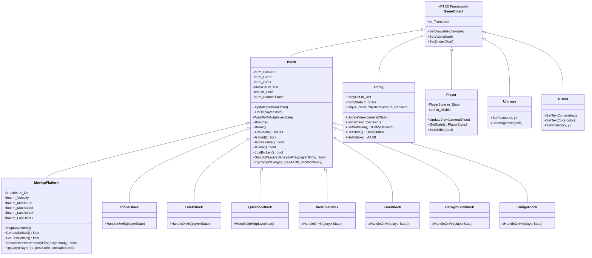

---

### 1.2 ISceneHandler 繼承樹 (State Pattern)

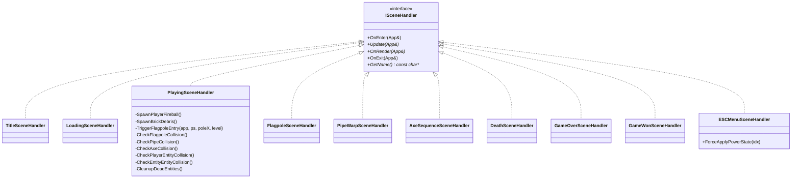

> **各場景職責簡述：**
> - `TitleSceneHandler`: 標題畫面，等待玩家按下 Enter 開始。
> - `LoadingSceneHandler`: 黑色過場畫面，預載紋理並顯示世界關卡數與剩餘命數。
> - `PlayingSceneHandler`: 主遊戲進行狀態，處理核心 17-Phase 的每幀物理、AI 與碰撞分派。
> - `FlagpoleSceneHandler`: 自動下滑旗桿並向右走入城堡的通關過場。
> - `PipeWarpSceneHandler`: 進入水管向下或向右平移的傳送過場。
> - `AxeSequenceSceneHandler`: 8-4 Boss 擊敗後庫巴墜落與橋樑塌陷序列。
> - `ESCMenuSceneHandler`: 暫停選單，支持關卡跳轉與變身作弊功能。

---

### 1.3 IEntityBehavior 繼承樹 (Strategy Pattern)

```mermaid
classDiagram
    direction TB

    class IEntityBehavior {
        <<interface>>
        +Update(state, level, player, timer)*
        +OnPlayerCollision(state, player, isFromAbove) bool*
        +Clone() unique_ptr~IEntityBehavior~*
        +GetName() const char**
        +AlwaysUpdate() bool
        +OnSpawned(vx, vy)
        +OnFireballHit(state) bool
        +ConsumeSpawnRequest(type, x, y, dir) bool
        +IsImmuneToStomp() bool
        +IsEnemyProjectile() bool
        +IsImmuneToStarPower() bool
        +IsPlayerFireball() bool
        +IsShell() bool
        +ExplodesOnWall() bool
        +GetVisualYOffset(levelName) float
        +GetHitbox(state) AABB
        +IsAxe() bool
        +IsPrincess() bool
        +IsBowser() bool
        +IsFlag() bool
        +IsEnemySpawner() bool
    }

    class GoombaBehavior
    class KoopaBehavior {
        -m_Type: KoopaType
    }
    class ParaKoopaBehavior {
        -m_FloatPhase: float
    }
    class AxeKoopaBehavior
    class BowserBehavior {
        -m_Phase: BowserPhase
        -m_HealthPoints: int
        -m_PendingSpawns: vector~SpawnRequest~
        +AlwaysUpdate() bool
        +IsImmuneToStomp() bool
        +IsBowser() bool
        +IsEnemySpawner() bool
        +ConsumeSpawnRequest() bool
        -ResolveWallAndEdge(state, level)
    }
    class FireballBehavior
    class MushroomBehavior
    class FireFlowerBehavior
    class StarBehavior
    class OneUpBehavior
    class CoinBehavior
    class AxeBehavior
    class PrincessBehavior
    class FlagBehavior
    class AxeProjectileBehavior
    class PiranhaPlantBehavior {
        -m_Phase: PiranhaPlantPhase
    }
    class PodobooBehavior
    class DefaultEntityBehavior
    class ParticleDebris {
        -m_InitialVelX: float
        -m_InitialVelY: float
        -m_LifetimeFrames: int
        +AlwaysUpdate() bool
        +OnSpawned(vx, vy)
    }
    class CastleFireSpawnerBehavior {
        -m_PendingSpawns: vector~SpawnRequest~
        +AlwaysUpdate() bool
    }

    IEntityBehavior <|.. GoombaBehavior
    IEntityBehavior <|.. KoopaBehavior
    IEntityBehavior <|.. ParaKoopaBehavior
    IEntityBehavior <|.. AxeKoopaBehavior
    IEntityBehavior <|.. BowserBehavior
    IEntityBehavior <|.. FireballBehavior
    IEntityBehavior <|.. MushroomBehavior
    IEntityBehavior <|.. FireFlowerBehavior
    IEntityBehavior <|.. StarBehavior
    IEntityBehavior <|.. OneUpBehavior
    IEntityBehavior <|.. CoinBehavior
    IEntityBehavior <|.. AxeBehavior
    IEntityBehavior <|.. PrincessBehavior
    IEntityBehavior <|.. FlagBehavior
    IEntityBehavior <|.. AxeProjectileBehavior
    IEntityBehavior <|.. PiranhaPlantBehavior
    IEntityBehavior <|.. PodobooBehavior
    IEntityBehavior <|.. DefaultEntityBehavior
    IEntityBehavior <|.. ParticleDebris
    IEntityBehavior <|.. CastleFireSpawnerBehavior
```

---

### 1.4 死亡動畫策略繼承樹

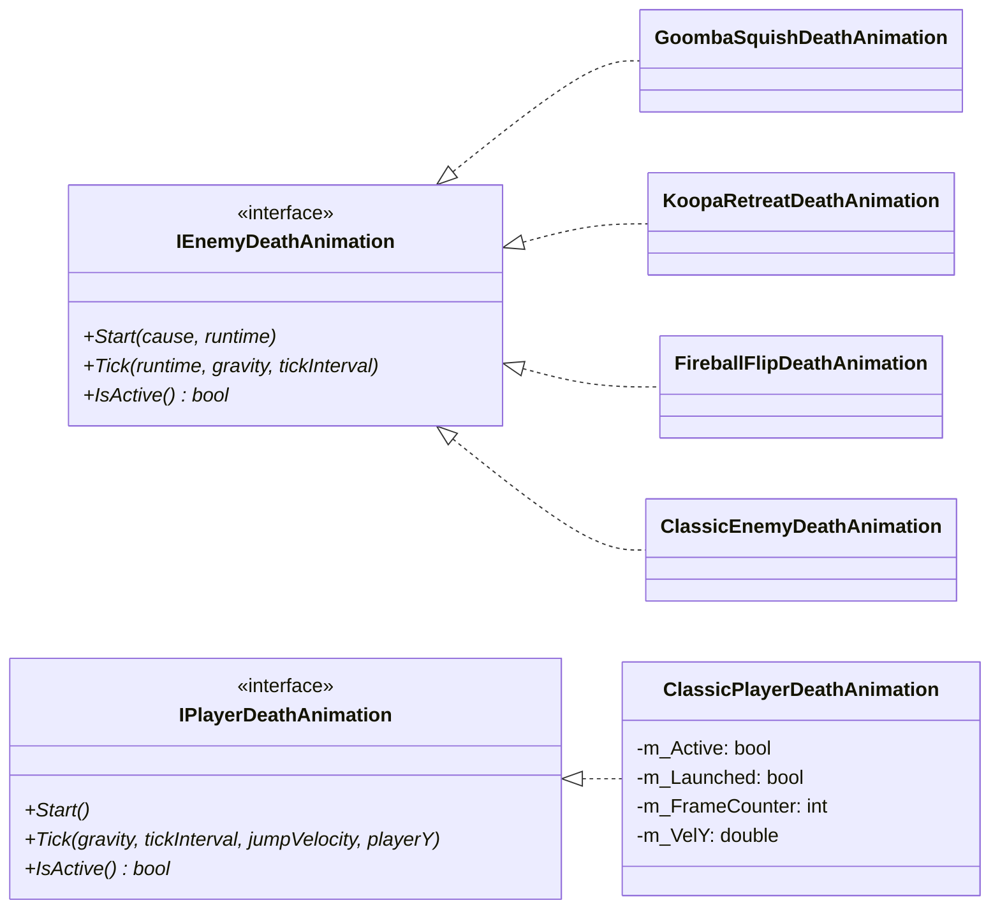

---

### 1.5 ICollisionHandler 繼承樹 (Strategy + Facade)

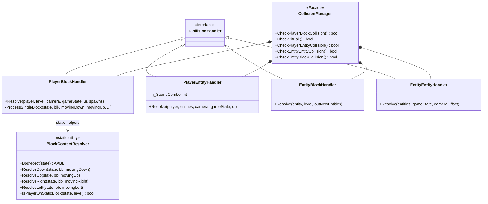

---

### 1.6 IAudioService 繼承樹 (DIP)

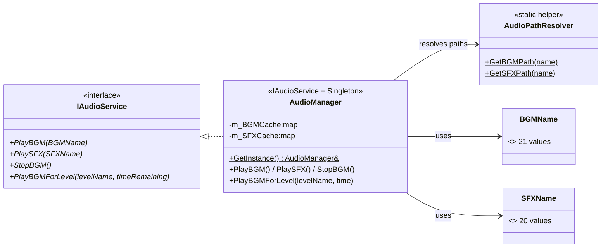

---

### 1.7 IUIPanel 繼承樹 (Strategy Pattern)

每個遊戲畫面的 UI 小部件由對應的 `IUIPanel` 子類別封裝。

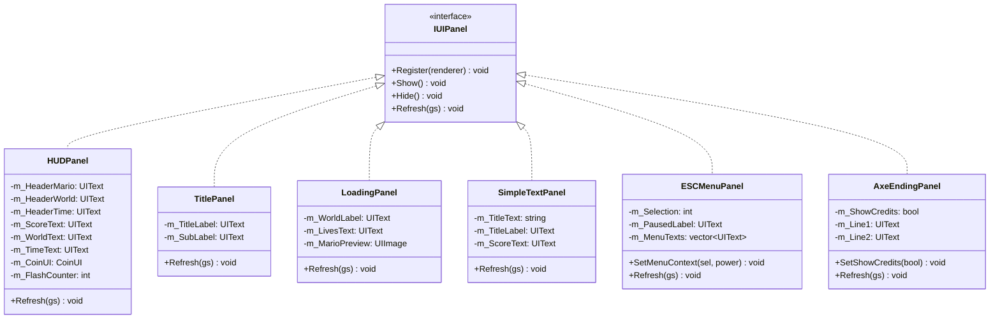

---

### 1.8 App 全域架構圖

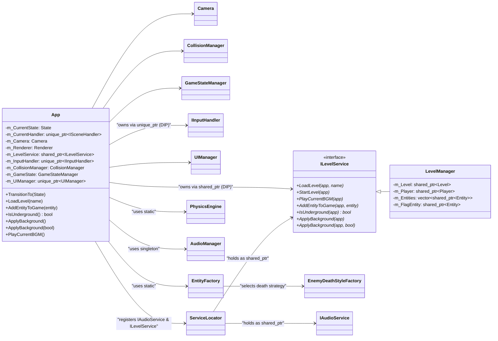

---

### 1.9 MVC 完整關係圖

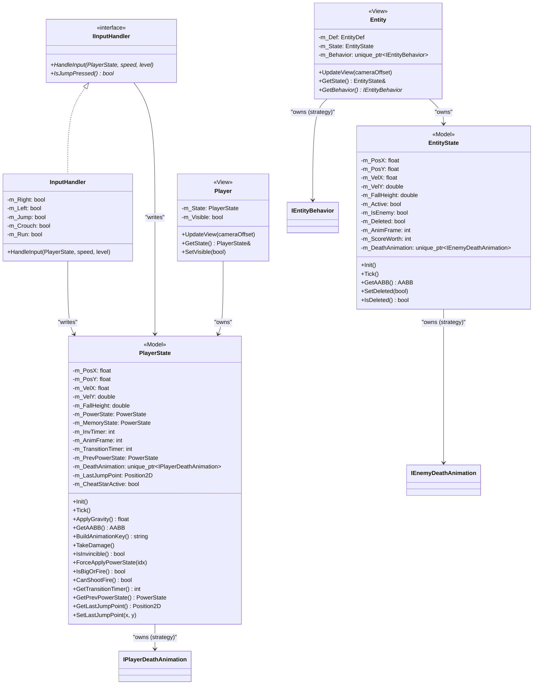

---

### 1.10 ServiceLocator & EventSystem

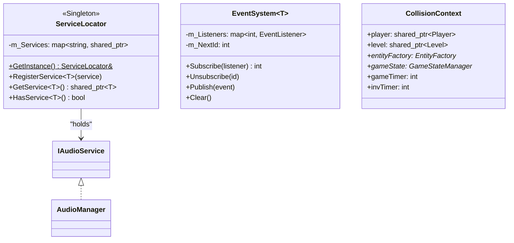

---

### 1.11 IInputHandler 繼承樹 (DIP)

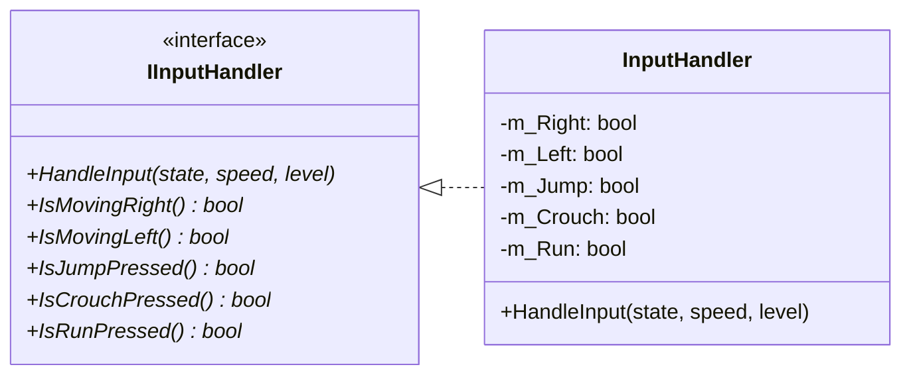

---

### 1.12 IPlayerForm 繼承樹 (State Pattern)

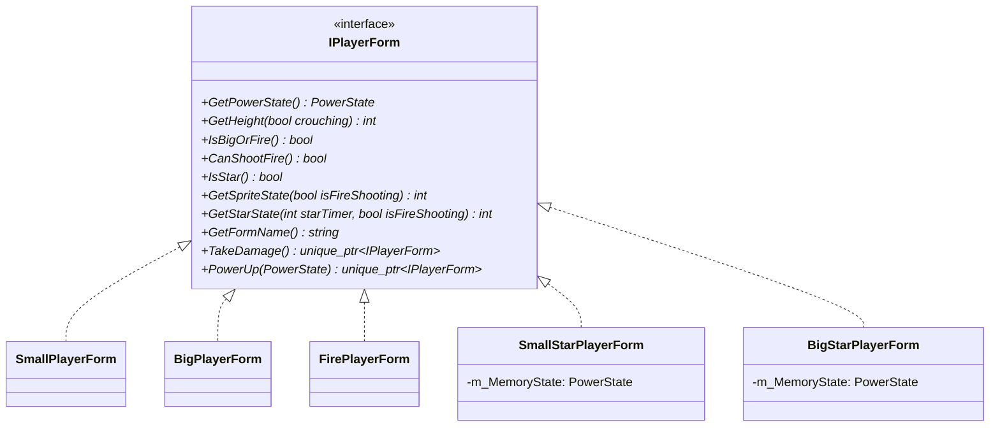

---

## 2. 設計模式簡介 — 3 句話版

### 2.1 Pattern 對照表

| Pattern | 解決的問題 | 本專案的角色 | 新增需要改哪裡 |
|---------|-----------|------------|---------------|
| **State** (狀態) | `App.cpp` 曾是一個 800 行 switch 怪物 | `ISceneHandler` — 每個畫面一個子類，`App::Update()` 剩兩行 | 新增畫面：加一個 .hpp/.cpp + 一個 enum + 一個 case |
| **Strategy** (策略) | C# Entity 用 `if (type==Goomba)` 滿天飛 | `IEntityBehavior` — Goomba/Koopa/Bowser… 各一個 class | 新增敵人：加 XxxBehavior + Factory 一個 case |
| **MVC** | 渲染邏輯和遊戲邏輯混在一起 | Model=State, View=GameObject, Controller=InputHandler | — |
| **Factory** | 到處散落 `new Entity(...)` 很難維護 | `EntityFactory` 是唯一建立 Entity 的地方 | 新增實體種類：只改 Factory |
| **DIP** (依賴反轉) | 呼叫者依賴具體 class → 難測試 | `IAudioService`, `IInputHandler`, `ILevelService` 介面隔離 | 換實作：只換注入點 |
| **Service Locator** | 跨模組傳遞指標很麻煩 | `ServiceLocator::GetService<T>()` 全域取服務 | 新增服務：Register 一次 |
| **Facade** (外觀) | `CollisionManager.cpp` 曾是 800 行義大利麵 | 四個 Handler 各管一種碰撞；`CollisionManager` 只負責分派 | — |
| **Template Method** | Block 子類碰撞邏輯大同小異 | `Block::OnHit()` 固定流程 → `virtual HandleOnHit()` 留給子類 | 新增方塊：override HandleOnHit |

---

## 3. 遊戲主迴圈 — 17 Phase 架構

### 3.1 17-Phase 執行流程

`PlayingSceneHandler::Update(App&)` 每幀依序執行：

```
PHASE  0: ESC CHECK         — ESC -> 切換到 ESC_MENU
PHASE  1: PROCESS INPUT     — InputHandler::HandleInput(PlayerState, speed)
PHASE  2: UPDATE PHYSICS    — PlayerState::ApplyGravity() -> velY += gravity
PHASE  3: APPLY POSITION    — state.SetX/Y += velX/velY (velocity integration)
PHASE  4: COLLISION DETECT  — CollisionManager::CheckPlayerBlockCollision()
                               PIPELINE (matches C# Form1.cs onTick exactly):
                                 Step 1: FallDetect — 4px strip below feet; no block → SetGrounded(false)
                                 Step 2: Ceiling trigger (narrow hitbox) — head bump → snap + TriggerBlockHit
                                 Step 3: Per-block loop (full-body rect):
                                           Airborne  → DOWN→RIGHT→LEFT→DOWN→UP→LEFT
                                           Grounded  → RIGHT or LEFT only
PHASE  5: SPAWN ITEMS       — 處理被 block-hit 觸發的 Level::SpawnPoint
PHASE  6: PLAYER STATE TICK — PlayerState::Tick(); fire state fires fireball
PHASE  7: ENTITY AI UPDATE  — behavior->Update() for each active entity
                               entity block-collision per entity
                               ConsumeSpawnRequest() (Bowser/AxeKoopa spawn projectiles)
PHASE  8: ENTITY TICK+VIEW  — EntityState::Tick(); entity->UpdateView()
PHASE  9: PLAYER-ENTITY COL — CollisionManager::CheckPlayerEntityCollision()
PHASE 10: ENTITY-ENTITY COL — CollisionManager::CheckEntityEntityCollision()
PHASE 11: AXE/FLAG/PIPE     — CheckAxeCollision()
                               CheckFlagpoleCollision() (+ X-only jump-over fallback)
                               CheckPipeCollision()
PHASE 12: CAMERA + BLOCKS   — Camera::Update(); Level::UpdateBlocks()
PHASE 13: BRICK DEBRIS      — SpawnBrickDebris() for all JustBroken() blocks
                               MUST be after PHASE 4 so JustBroken() is not consumed early
PHASE 14: PLAYER VIEW       — Player::UpdateView(cameraOffset)
                               invincibility blink: Util::GameObject::SetVisible() ONLY
                               (NOT Player::SetVisible — that corrupts m_Visible)
PHASE 15: GAME TIMER        — GameStateManager::Tick(); time low -> hurry-up BGM switch
PHASE 16: PIT-FALL + DEATH  — CheckPitFall() -> TransitionTo(DEATH)
PHASE 17: CLEANUP           — CleanupDeadEntities() (erase deleted from m_Entities)
```

**重要原則：**
- Physics (PHASE 2-3) 在 Collision (PHASE 4) 之前 — 確保位置更新後才做碰撞解析。
- Entity AI (PHASE 7) 在 Physics 之後 — AI 計算時看到的是本幀已更新的 Player 位置。
- BrickDebris spawn (PHASE 13) 在 Ceiling collision (PHASE 4) 之後 — `JustBroken()` 旗標不被提前消費。

### 3.2 特殊機制實作備註

| 機制 | 實作位置 | 關鍵細節 |
|------|---------|--------|
| 移動平台載人 | `PlayingSceneHandler.cpp` | 每幀讀 `plat->GetLastDeltaX/Y()`；Y gap < 2px 且 X overlap 即同步 Mario 座標。 |
| 無敵星星殺敵 | `CollisionManager.cpp` | `ps.GetStarTimer() > 0` 時直接刪敵、計分、顯示浮動文字。 |
| 連續踩踏分數 | `CollisionManager.cpp` | `m_StompCombo`；落地重置；分數序列 100→200→400→800→1000。 |
| 食人花安全半徑 | `PiranhaPlantBehavior.cpp` | Mario 進入 `MARIO_SAFE_RADIUS = 112.5px` (2.5×TILE) 時，植物在 EMERGING 或 VISIBLE 階段會立即開始縮回（防偷襲機制）。 |
| 磚塊粒子初速 | `ParticleDebris.cpp` | 左上(-3,-6)、右上(+3,-6)、左下(-3,-4)、右下(+3,-4)；後續由 PhysicsEngine 累積重力。 |

---

## 4. App::State 狀態機轉移圖

```mermaid
stateDiagram-v2
    direction LR
    [*] --> START
    START --> TITLE : App::Start()
    TITLE --> LOADING : PRESS ENTER (Select World)
    LOADING --> PLAYING : LEVEL_TRANSITION_DELAY (3.0s) timer expires
    PLAYING --> ESC_MENU : PRESS ESC (Pause Game)
    ESC_MENU --> PLAYING : SELECT RESUME / PRESS ESC
    ESC_MENU --> TITLE : SELECT QUIT
    PLAYING --> FLAGPOLE : Collide with flagpole column (1-1 / 1-2)
    FLAGPOLE --> LOADING : Castle entering animation finishes
    PLAYING --> PIPE_WARP : Stand on Pipe + press DOWN or RIGHT (1-2)
    PIPE_WARP --> LOADING : Descend/rightwalk sequence completes
    PLAYING --> AXE_SEQUENCE : Collide with bridge Axe (8-4)
    AXE_SEQUENCE --> GAME_WON : Bowser defeat sequence completes
    PLAYING --> DEATH : Mario dies (damage, pit fall, time up)
    DEATH --> LOADING : Lives > 0 -> Retry same level
    DEATH --> GAME_OVER : Lives == 0
    GAME_OVER --> TITLE : PRESS ENTER
    GAME_WON --> TITLE : PRESS ENTER
```

**Level sequence** (`GameStateManager::m_LevelSequence`):
```
"1-1" (ground) -> "1-2" (underground) -> "8-4" (castle + Boss) -> IsGameWon() = true
```

---

## 5. 設計模式深度解析

### 5.1 State Pattern — App::State 狀態機

**原問題：** 原版 `App.cpp` 在單一 switch-case 中塞入所有遊戲狀態邏輯，超過 500 行難以維護。  
**解法：** GoF State Pattern。

```
Context:    App  (持有 std::unique_ptr<ISceneHandler> m_CurrentHandler)
Interface:  ISceneHandler  (Update + OnRender + OnEnter + OnExit + GetName)
Concrete:   10 個 Handler 子類別（每個狀態獨立一個 .cpp）
Transition: App::TransitionTo(State) → OnExit → CreateSceneHandler() → OnEnter
```

`App::Update()` 永遠只有兩行：
```cpp
m_CurrentHandler->Update(*this);    // game logic
m_CurrentHandler->OnRender(*this);  // drawing
```

**新增遊戲狀態只需：**
1. 新增一個 ISceneHandler 子類 (.hpp + .cpp)
2. 一個 `CreateSceneHandler()` case
3. 一個 `App::State` enum 值  
**零修改 App.hpp 其他部分。**

---

### 5.2 Strategy Pattern — IEntityBehavior

**原問題：** C# Entity.cs 使用大量 `if (type == Goomba)` 判斷，難以擴展。  
**解法：** Strategy Pattern — Entity 持有 `unique_ptr<IEntityBehavior>`，多型 dispatch。

| EntityType | Behavior 類 | 對應敵人 | 特性 |
|-----------|------------|---------|------|
| GOOMBA | GoombaBehavior | 栗寶寶 | Standard C# patrol (walk + wall flip + squish on stomp) |
| KOOPA_TROOPA | KoopaBehavior (TROOPA) | 烏龜兵 | 巡邏->Shell |
| KOOPA_SHELL | KoopaBehavior (SHELL) | 龜殼 | 靜止或反彈 |
| PARAKOOPA | ParaKoopaBehavior | 飛翔烏龜 | 正弦波浮動->著陸 |
| AXE_KOOPA | AxeKoopaBehavior | 斧頭烏龜 | 巡邏 + 定期拋斧 (ConsumeSpawnRequest) |
| BOWSER | BowserBehavior | Boss 庫巴 | 5-Phase AI + HP |
| (castle fire) | CastleFireSpawnerBehavior | 8-4 隱形噴火器 | AlwaysUpdate；越屏持續向左射出火球 |
| FIRE | FireballBehavior | 玩家火球 | 拋物線軌跡 |
| MUSHROOM | MushroomBehavior | 紅色香菇 | 成長為大瑪莉 |
| FIRE_FLOWER | FireFlowerBehavior | 火之花 | 成長為火瑪莉 |
| STAR | StarBehavior | 無敵星星 | 彈跳移動，無敵狀態 |
| ONE_UP | OneUpBehavior | 綠色香菇 | 增加生命計數 |
| COIN | CoinBehavior | 金幣 | 增加金幣與分數 |
| AXE | AxeBehavior | 橋頭斧 | 觸發橋塌序列 |
| PRINCESS | PrincessBehavior | 公主 NPC | 靜態顯示 |
| PIRANHA_PLANT | PiranhaPlantBehavior | 水管食人花 | 4-Phase 伸縮 |
| PODOBOO | PodobooBehavior | 熔岩泡泡 | 跳躍+不可殺 |
| FLAG/UNKNOWN | DefaultEntityBehavior | 被動實體 | 顯示/被動 |
| (brick break) | ParticleDebris | 磚塊碎片 | 物理粒子 |

---

### 5.3 MVC Pattern — Player & Entity

```
Model      -> PlayerState / EntityState  (純資料：位置/速度/動畫key/狀態旗標)
View       -> Player      / Entity       (繼承 Util::GameObject：選 Sprite/渲染)
Controller -> InputHandler               (讀鍵盤 -> 寫 PlayerState)
           + PlayingSceneHandler         (主迴圈協調所有元件)
```

關鍵分離原則：
- `PlayerState` / `EntityState` 不依賴 any PTSD 渲染 API。
- `Player` / `Entity` 不包含遊戲邏輯，只根據 Model 選擇 Sprite。
- 碰撞解析由 `CollisionManager` 處理，不放在 View 層。

---

### 5.4 Factory Pattern — EntityFactory

唯一的 Entity 建立入口（SRP 原則）：

```cpp
// 一般 Entity 建立
EntityFactory::SpawnEntity(def, x, y, dir, fromBlock, levelName)
  // 1. 複製 def → 根據 EntityType / levelName 設定 renderTargetWidth
  // 2. new Entity(localDef, x, y, ...)
  // 3. switch(entityType) -> make_unique<XxxBehavior>()
  // 4. entity.SetBehavior(behavior)
  // 5. return shared_ptr<Entity>

// 投射物 EntityDef 建立
EntityFactory::MakeProjectileDef(spawnType, isEnemy, level)
  // → 查 EntityList.csv → 補 fallback def → 回傳完整設定的 EntityDef
```

---

### 5.5 Dependency Inversion — IAudioService

`AudioManager` 繼承 `IAudioService`。場景 Handler 只依賴抽象介面，方便單元測試替換為 MockAudio。  
`ServiceLocator` 以類型安全的 `RegisterService<T>` / `GetService<T>` 模板 API 進一步解耦服務的提供者與消費者。

---

### 5.6 Service Locator — ServiceLocator

`ServiceLocator` 是全域單例，提供集中式服務注冊與查找，補充 DIP 的依賴注入：

```cpp
ServiceLocator::GetInstance().RegisterService<IAudioService>(audioMgr);
auto audio = ServiceLocator::GetInstance().GetService<IAudioService>();
```

---

### 5.7 Publish/Subscribe — EventSystem\<T\>

泛型事件系統，提供鬆耦合的組件間通信：

```cpp
EventSystem<PlayerDeadEvent> events;
int id = events.Subscribe([](const PlayerDeadEvent& e){ /* ... */ });
events.Publish(PlayerDeadEvent{ .cause = DeathCause::PIT });
events.Unsubscribe(id);
```

---

### 5.8 Strategy + Facade — 碰撞解析子系統

**原問題：** `CollisionManager.cpp` 曾是一個高達 800 行的巨大「義大利麵」類別，在單一檔案內混合處理了玩家-方塊、玩家-敵人、實體-方塊、實體-實體等 4 種截然不同的碰撞邏輯，內部充斥著大量的狀態標記，完全違反了 SRP。

**解法：** 導入 **Facade（外觀模式）** 與 **Strategy（策略模式）**。

- `CollisionManager` 本身被重構為一個極其簡潔的 **Facade（外觀門面）**，它不包含任何具體的碰撞計算邏輯，而是將職責徹底委派給 4 個特化的策略處理器（均繼承自 `ICollisionHandler` 標記基類）。
- **四個特化處理器：**
  1. `PlayerBlockHandler`：處理玩家與方塊的碰撞（採用 C# 經典的三步驟物理 Snap 管線）。
  2. `PlayerEntityHandler`：處理玩家與各類敵方/道具實體的碰撞（Stomp Combo 踩踏、星星無敵殺敵、硬幣收集等）。
  3. `EntityBlockHandler`：處理所有敵人與場景方塊的碰撞（地面 Snap、面牆反向、落坑刪除）。
  4. `EntityEntityHandler`：處理實體與實體間的碰撞（玩家火球擊殺敵人、移動龜殼擊殺敵人），並透過 thread-local 快取與視口剔除將碰撞迴圈由 $O(N^2)$ 優化至 $O(M^2)$。

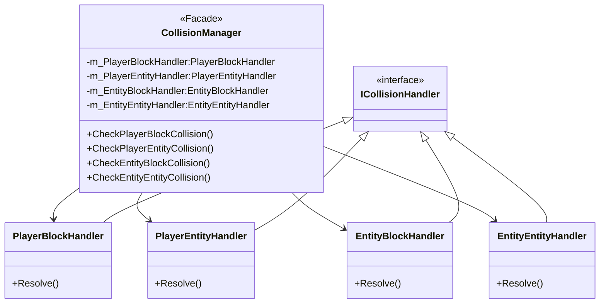

---

### 5.9 Strategy — 敵人死亡動畫策略

**原問題：** 遊戲中敵人的死亡演出形式各異（栗寶寶被踩扁、烏龜被踩縮回殼中、火球擊中翻轉墜下、星星撞飛），原版實作在 `EntityState` 中以硬編碼的分支來控制，違反了 OCP（開閉原則）。

**解法：** 導入 **Strategy Pattern（策略模式）** 與 **Abstract Factory（抽象工廠）**。

- 定義抽象策略介面 `IEnemyDeathAnimation`，其包含 `Update()`、`GetSpriteKey()` 與 `IsFinished()`。
- 將不同的死亡演出封裝為獨立的策略類別：
  - `GoombaSquishDeathAnimation`：栗寶寶被踩扁的動畫。
  - `KoopaRetreatDeathAnimation`：烏龜被踩踏後縮入龜殼的動畫。
  - `FireballFlipDeathAnimation`：被火球或無敵星星擊中時翻轉下墜的動畫。
  - `ClassicEnemyDeathAnimation`：通用下墜動畫。
- 引入 **`EnemyDeathStyleFactory`**，負責根據 `EntityType` 與 `EnemyDeathCause` 動態建立並注入對應的死亡動畫策略。

---

### 5.10 Strategy — 道具多型策略

**原問題：** 遊戲中的各種道具（香菇、花、星星、1UP、硬幣）原先使用一個臃腫的 `ItemBehavior` 類別，在 `Update()` 內部使用 `if-else` 判斷 `ItemType` 來實施不同的位移邏輯，造成代碼臃腫且極難擴展。

**解法：** 導入 **Strategy Pattern（策略模式）**。

- 將 `ItemBehavior` 徹底拆分為 5 個獨立且高度聚焦的策略類別，全部繼承自 `IEntityBehavior`：
  - `MushroomBehavior`：香菇行為（從方塊升起，向右平移，受重力下墜，碰牆反向）。
  - `FireFlowerBehavior`：火之花行為（靜態升起，等待玩家收集）。
  - `StarBehavior`：星星行為（落地時跳躍起伏，持續前進）。
  - `OneUpBehavior`：1UP 綠香菇行為（與紅香菇位移邏輯一致，但觸發增加生命）。
  - `CoinBehavior`：金幣行為（靜態旋轉，無重力或水平運動）。
- 移除所有道具 `ItemType` 的硬編碼分支。新增道具類型只需新增對應的策略類別，現有代碼**完全不需要修改任何一行程式碼**！

---

### 5.11 DIP / Service Locator — 關卡管理服務 (LevelManager)

**原問題：** 主控制器 `App` 曾是一個典型的 **God Class（上帝類別）**。它直接擁有了 `Player`、`Level`、`Entities`、計時器、以及 OpenGL 清理與背景渲染邏輯。這導致 `App` 本身行數飆升，且其他 Handler 或子系統必須大量依賴 `App` 的內部成員。

**解法：** 導入 **Dependency Inversion Principle (DIP)** 與 **Service Locator Pattern（服務定位器模式）**。

- **介面隔離**：我們建立了一個全新的抽象介面 `ILevelService`，聲明了關卡加載、啟動、BGM播放、背景設置等一切與關卡及遊戲世界狀態有關的 API。
- **具體實作**：實作 `LevelManager` 繼承自 `ILevelService`。將 `m_Level`、`m_Player`、`m_Entities`、`m_FlagEntity` 等所有數據成員從 `App` 中剝離，**徹底歸入 `LevelManager` 進行管理**。
- **服務定位**：在 `App::Start()` 時，我們實例化 `LevelManager`，並將其註冊至 `ServiceLocator` 中，供全域解耦使用。
- **成果**：`App.cpp` 大幅度減肥至僅有約 170 行，成為一個乾淨純粹的最高層級狀態機協調器！

---

### 5.12 State Pattern — 零向下轉型狀態傳參 (Zero Down-Casting State Handshake)

**原問題：** 在 `PlayingSceneHandler` 中，當觸發拉下旗桿切換至 `FLAGPOLE` 狀態，或走入水管切換至 `PIPE_WARP` 狀態時，目標狀態需要接收特定的座標和實體參數。原先的作法是在轉場後使用 `dynamic_cast` 將場景指針向下轉型，再呼叫 `Setup` 配置方法。這是一個嚴重的**向下轉型類型壞味道（Down-casting Smell）**，破壞了狀態機的封裝性。

**解法：** 導入 **Self-Configuring（狀態自適應）** 與 **State Context DTO（狀態傳遞數據物件）**。

1. **旗桿狀態自適應（Self-Configuring Flagpole）**：
   - 移除 `SetupFlagpole` 介面。讓 `FlagpoleSceneHandler` 在 `OnEnter()` 觸發時，主動向 `ILevelService` 查詢當前的 `GetFlagEntity()`，並自 Level 的 `GetGoalBlocks()` 快取中動態發現第一個目標方塊的 X 座標來完成自動定位。
2. **水管傳送上下文 DTO（Warp Context DTO）**：
   - 在 `GameStateManager` 中加入專用的輕量級 Warp 數據欄位（傳送方向、入口 X、入口 Y 座標）。
   - `PlayingSceneHandler` 在轉場前呼叫 `app.GetGameState().SetWarpInfo("Down", x, y)` 將傳送 context 存入全局的 GameState 中，然後直接呼叫 `app.TransitionTo(App::State::PIPE_WARP)`。
   - `PipeWarpSceneHandler` 在其 `OnEnter()` 生命週期勾子中，主動自 `GameState` 讀取參數並完成初始化。

- **成果：** 整個 C++ 專案中**完全清除了所有的 `dynamic_cast` 與向下轉型呼叫**，達成了 100% textbook-pure 的狀態模式多型切換！

---

### 5.13 State Pattern — IPlayerForm 力量型態

**原問題：** Mario 具有多種力量型態（Small, Big, Fire, SmallStar, BigStar）。如果將尺寸判定、是否可碎磚、是否能射火球、受傷退化以及吃道具升級的邏輯全部硬編碼在 `PlayerState` 和 `Player` 中，會使程式碼充斥著大量的 `if-else` 或 `switch` 判斷，導致極難擴充（例如新增冰花型態或狸貓型態需要大範圍修改代碼）。

**解法：** 導入 **State Pattern（狀態模式）**。

- `PlayerState` 不再儲存單純的狀態 enum，而是將與型態相關的所有行為委派給一個多型的介面 `std::unique_ptr<IPlayerForm> m_Form`。
- `IPlayerForm` 提供了統一的虛擬方法介面：
  - `GetHeight(crouching)`: 根據是否蹲下與當前型態動態回傳 Hitbox 高度（如 Small 為 45px，Big/Fire 為 90px，蹲下為 45px）。
  - `IsBigOrFire()`: 決定是否具備撞碎 `BrickBlock` 的能力。
  - `CanShootFire()`: 決定是否能在攻擊鍵按下時射出火球（僅 `FirePlayerForm` 及其 underlying form 為 Fire 的無敵星星狀態為 true）。
  - `TakeDamage()`: 封裝受傷退化邏輯（如 Fire ➔ Big ➔ Small ➔ Death/nullptr），回傳下一個狀態的多型指標。
  - `PowerUp(newState)`: 封裝吃道具升級的轉移矩陣（如 Small + Flower ➔ Fire，Small + Star ➔ SmallStar，Big + Star ➔ BigStar 等）。
- **無敵星星 MemoryState 機制：**
  - 當 Mario 獲得無敵星星變身為 `SmallStarPlayerForm` 或 `BigStarPlayerForm` 時，會內部持有一個 `m_MemoryState` 欄位以記錄變身前的基礎力量型態（如 Small, Big, 或 Fire）。
  - 在星星狀態下，`CanShootFire()` 透過 `m_MemoryState` 進行多型判定；當無敵時間結束，狀態機與力量策略會自動依據 `m_MemoryState` 退回原本的狀態。
- **成果：** 完美符合開閉原則（OCP）。新增任何力量型態僅需擴充 `IPlayerForm` 的子類別，核心物理引擎、輸入處理與渲染主流程完全**不需要修改任何一行程式碼**。

---

### 5.14 MVC 完整運作序列圖

下圖呈現了本專案在每幀（Per Frame）遊戲主迴圈中，**Model (M) — View (V) — Controller (C)** 與各個解耦服務（LevelManager、InputHandler、CollisionManager、AudioManager）之間的時序交互關係。這保證了代碼各司其職，毫無義大利麵式的混亂耦合：

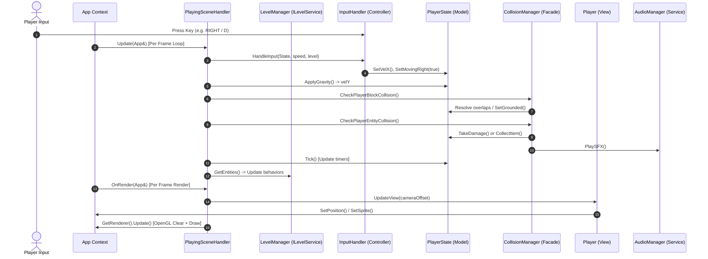

---

### 5.15 外掛模式 (Cheat Mode) 深度設計

外掛模式（Cheat Mode）的加入為專案提供了絕佳的 OOP 擴充展示。在避免「上帝類別（God Class）污染」與「義大利麵條耦合」的原則下，本專案將外掛模式的狀態完全封裝於 MVC 結構中，並高度重用了現有的設計模式。

#### 1. 服務定位器解耦 (Service Locator & DIP)
- 外掛開關狀態 `m_CheatModeActive` 被儲存於全域 `GameStateManager` 服務中。
- `App::Start()` 時，`m_GameState` 被註冊到型態安全的 `ServiceLocator`。
- `PlayerState` 與 `UIManager` 不再需要向 `App` 進行深層反向依賴，而是直接從 `ServiceLocator` 取得 `GameStateManager` 服務，完美符合 **DIP（依賴反轉原則）**。

#### 2. 多型狀態/策略的高度重用 (Strategy & State Reusability)
- **無限無敵星星狀態** 並非透過在主角類別中硬編碼「若外掛開啟則無敵」的 `if-else` 分支來實現，而是直接操作現有的 `IPlayerForm` 策略模式！
- 在 `PlayerState::Tick()` 中，若偵測到外掛已開啟：
  1. 主角會自動調用 `StartStar()` 動態將自身的 Strategy 轉換為 `SmallStarPlayerForm` 或 `BigStarPlayerForm`。
  2. **動態動畫色彩循環**：為了避免星星計時器固定於 500 導致無敵色彩 `(m_StarTimer / 10) % 4` 固定、使 Mario 看起來像是一張沒有動態閃爍效果的靜態圖片，Tick 邏輯在無敵外掛啟動時會允許 `m_StarTimer` 每幀自然遞減，並僅在計時器小於 100 時將其充能重置回 500。這使 `starState` 每 10 幀切換一次，呈現出極為生動且無限循環的經典無敵星星動態色彩效果。
  3. 這使得無敵星星的物理免疫、無碰撞受傷、踩踏即死判定等功能**完全由現有的多型子類別自主運作**。
- **火焰火球遠程攻擊 (Fire Mario Ability)**：`PlayerState::CanShootFire()` 進行了多型功能擴展，當外掛模式開啟時一律回傳 `true`。這使得馬力歐不論處於何種力量型態（小馬力歐或大馬力歐），都可以在無敵星星狀態下無限發射火球，直接具備火焰馬力歐（Fire Mario）的遠程火球擊殺能力，大幅提升了外掛模式的遊戲打擊體驗！
- **無縫還原**：當玩家關閉外掛時，`PlayerState` 會自動清除 `m_StarTimer`，狀態機會極為安全地調用 `CreatePlayerForm(m_MemoryState)` 回退到玩家原本的形態（例如 `FIRE` 或 `BIG`），並自動還原背景音樂，程式結構清晰明瞭。

#### 3. 虛空救援與安全點追蹤 (Void Rescuing & Jump Point Tracking)
- **跳躍點追蹤**：當玩家正常進行遊戲並按下跳躍時（進入 `PlayerState::SetJumping`），Model 層會自動在原地記錄當前的坐標為 `m_LastJumpPoint`。
- **虛空攔截與傳送**：當玩家掉入深淵或岩漿時，`PlayingSceneHandler::Update()` 會透過 `CollisionManager::CheckPitFall()` 進行偵測：
  - **外掛關閉**：觸發常規的 `ps.StartDeathAnimation()` 死亡流程。
  - **外掛開啟**：不觸發死亡，而是從 `ps.GetLastJumpPoint()` 獲取上一個起跳坐標，直接進行 Y 軸微調傳送，重置其各方向速度，播放 Warp 音效，並賦予 `60` 幀的無敵保護時間。

#### 4. UI 擴充 (UI Panels Expansion)
- `ESCMenuPanel`（Strategy）在 `Refresh(gs)` 中直接查詢 `gs.IsCheatModeActive()`，並將選單項從 5 個擴充至 6 個，以供玩家使用 UP/DOWN 導航並利用 RETURN 來自由切換外掛開關。
- `UIManager` 中新增 `m_CheatModeText`，當偵測到外掛開啟時，會在螢幕底部中央位置繪製高質感的金色 `"CHEAT MODE ENABLED"` 英文通知，保證玩家視覺體驗的高級感。

---

### 5.16 未來 OOP 擴充性前瞻設計 — 暫停選單 Command 模式解耦

**現狀分析：**
目前在 `ESCMenuSceneHandler::Update` 中，選單動作（Resume、關卡切換、力量作弊、外掛開關）是透過一個硬編碼的 `switch(sel)` 進行分支處理。這在項目小巧時非常直白，但若未來要新增更多調試功能（例如：開啟重力倍率、一鍵清除畫面上所有敵人、倍速遊戲等），需要修改 `ESCMenuSceneHandler` 的 `MENU_ITEM_COUNT` 與 `switch-case` 核心邏輯，不符合開閉原則（OCP）。

**前瞻 OOP 設計：**
可以導入 **Command Pattern（命令模式）** 或 **Action Strategy（動作策略）**：
1. **定義抽象命令介面 `IESCMenuItem`**：
   ```cpp
   class IESCMenuItem {
      public:
       virtual ~IESCMenuItem() = default;
       virtual std::string GetDisplayText(const GameStateManager& gs) = 0;
       virtual void Execute(App& app) = 0;
   };
   ```
2. **實作具體命令類別**：
   - `ResumeMenuItem`: `Execute(app)` 調用 `app.TransitionTo(PLAYING)`。
   - `LevelWarpMenuItem`: 構造時傳入 world, level，`Execute` 時跳轉至該關卡。
   - `PowerCheatMenuItem`: 循環玩家型態。
   - `CheatToggleMenuItem`: 開關 `GameStateManager` 中的外掛狀態。
3. **動態載入選單項**：
   - `ESCMenuSceneHandler` 內部持有一個 `std::vector<std::unique_ptr<IESCMenuItem>> m_Items`。
   - 這樣一來，`Update()` 只需要無腦執行 `m_Items[sel]->Execute(app)`，而 `Refresh()` 也只需迴圈調用 `GetDisplayText()`！
   - 新增、修改或調整選單項目時，核心類別完全不需要任何修改，實現選單項的 100% 動態擴充與完美解耦。

---

## 6. 深度行為與互動 UML 圖

本節補充第 1 節繼承樹之外，更側重**跨系統互動、生命週期、動態行為**的 Mermaid 圖表，完整呈現本專案的 OOP 深度設計。

---

### 6.1 系統分層架構鳥瞰圖 (Layered Architecture)

本圖以「分層」視角呈現整個系統，清楚標示各層的職責與依賴方向（由上至下，不允許反向依賴）。

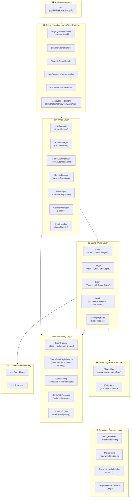

---

### 6.2 完整全系統依賴關係圖 (Full Dependency Map)

本圖聚焦**所有權 (owns) 與使用 (uses) 關係**，不含繼承線，清楚呈現 God Class 消滅後的責任分散。

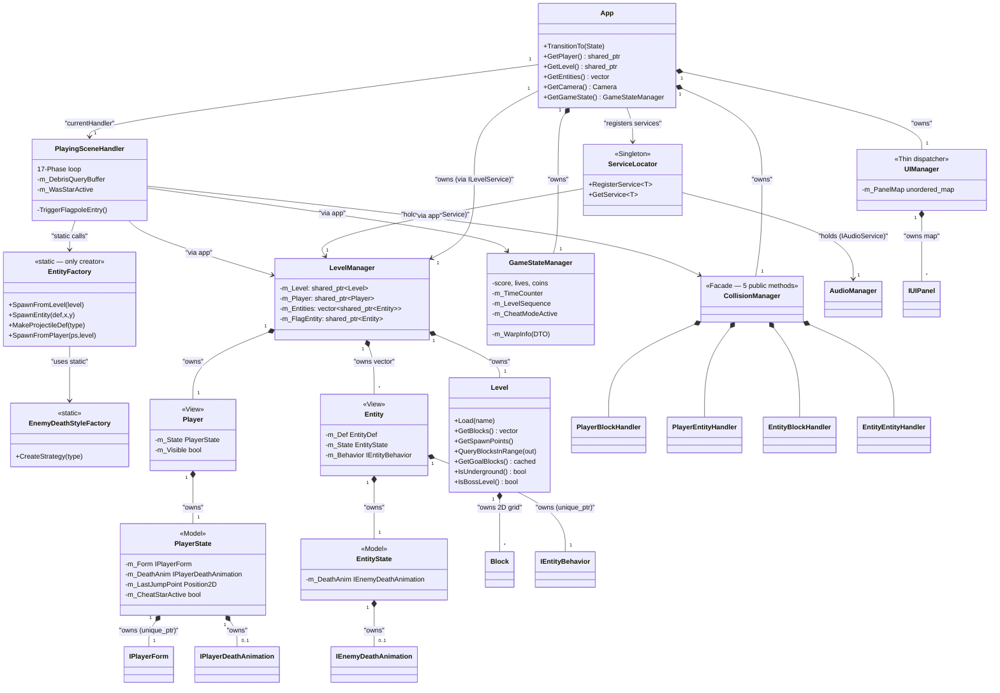

---

### 6.3 PowerState 力量型態狀態機 (IPlayerForm Transitions)

`PlayerState` 持有 `unique_ptr<IPlayerForm>`，每次升級/受傷時透過 `IPlayerForm::PowerUp()` / `IPlayerForm::TakeDamage()` 以多型回傳新的形態物件，**零 if-else / switch-case**，完全符合 OCP。

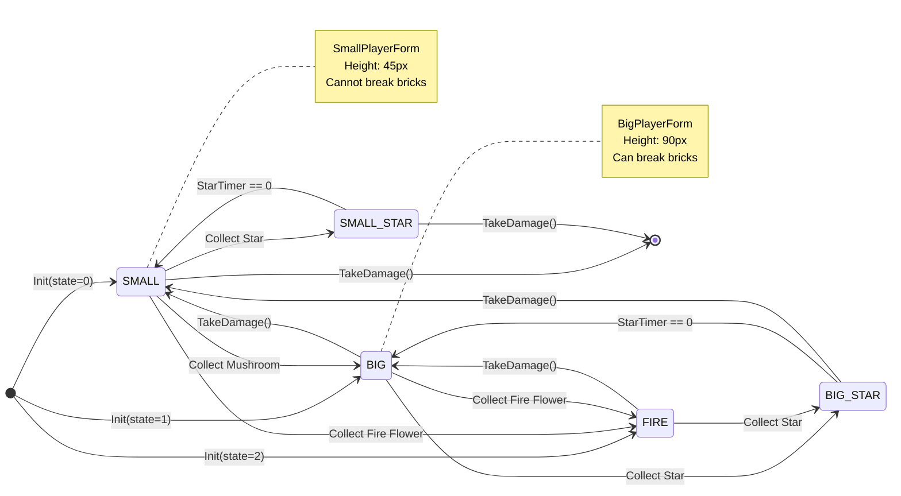

---

### 6.4 Entity 完整生命週期圖 (Entity Lifecycle)

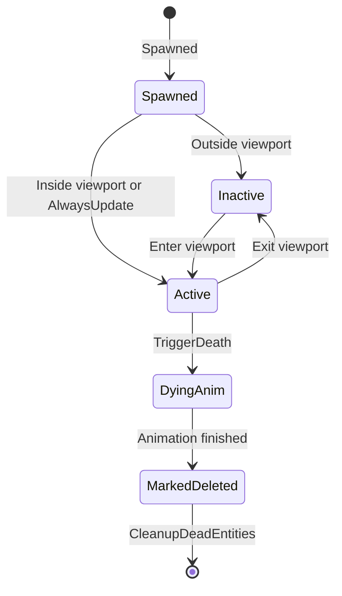

---

### 6.5 BowserBehavior 5-Phase AI 狀態圖

Bowser 的 5 個 `BowserPhase` 透過 `EntityState` 由 `BowserBehavior::Update()` 每幀驅動，命中判定透過 `OnFireballHit()` 觸發，HP 耗盡後進入 `DEFEATED`，再由 `AxeSequenceSceneHandler` 接管。

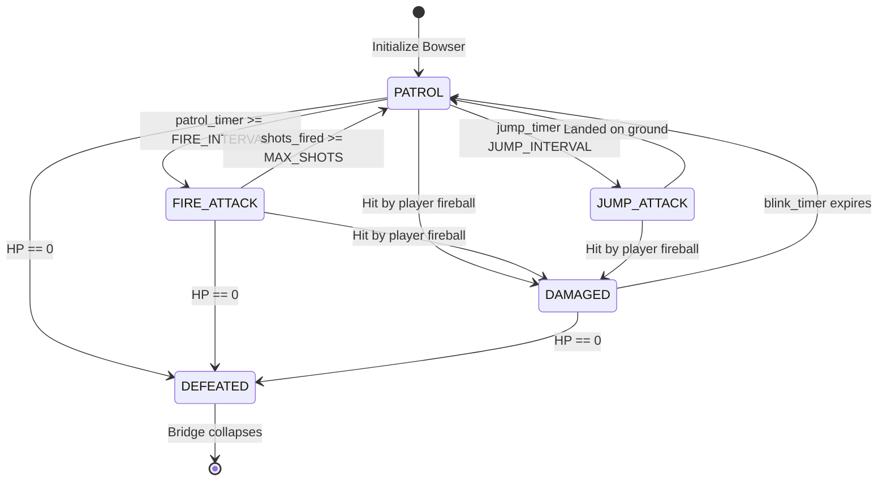

---

### 6.6 關卡載入序列圖 (Level Loading Sequence)

```mermaid
sequenceDiagram
    autonumber
    actor User as User
    participant App as App Context
    participant GSM as GameStateManager
    participant LM as LevelManager
    participant Lv as Level
    participant EF as EntityFactory
    participant AM as AudioManager
    participant UM as UIManager
    participant LSH as LoadingSceneHandler

    User->>App: PRESS ENTER
    App->>App: TransitionTo(LOADING)
    App->>LSH: OnEnter()
    LSH->>UM: ShowPanel(LOADING)
    LSH->>GSM: GetLevelName()

    App->>LM: LoadLevel(levelName)
    LM->>LM: Reset Camera
    LM->>Lv: Load CSV map
    Lv-->>LM: map parsed
    LM->>LM: Create Player
    LM->>EF: SpawnEntities()
    EF-->>LM: entities vector
    LM-->>App: done

    LSH->>LSH: Wait 3.0s
    LSH->>App: TransitionTo(PLAYING)
    App->>LM: StartLevel()
    App->>AM: PlayBGM()
    App->>UM: ShowPanel(HUD)
```

---

### 6.7 磚塊命中 Template Method 序列圖 (Block::OnHit)

`Block::OnHit()` 是一個典型的 **Template Method Pattern**：基類固定呼叫順序（載入貼圖 ➔ 啟動彈跳），再以 `virtual HandleOnHit()` 延遲到子類別實作差異化邏輯。

```mermaid
sequenceDiagram
    autonumber
    participant PBH as PlayerBlockHandler
    participant B as Block Base
    participant Sub as Block Subclass
    participant Lv as Level

    PBH->>B: OnHit(playerState)
    B->>B: LoadSprite()
    B->>B: StartBounce()
    B->>Sub: HandleOnHit(playerState)

    alt QuestionBlock
        Sub->>Sub: SetUsedSprite()
        Sub->>Lv: SpawnItem()
    else BrickBlock (Big/Fire Mario)
        Sub->>Sub: BreakBlock()
        Sub-->>PBH: block broken
    else BrickBlock (Small Mario)
        Sub->>Sub: BounceOnly()
    end
    B-->>PBH: return
```

---

### 6.8 每幀碰撞解析 Pipeline 序列圖 (Collision Pipeline)

本圖呈現 `PlayingSceneHandler::Update()` 中 PHASE 4 ～ PHASE 10 的完整碰撞解析流程，對應 C# `Form1.cs::onTick()` 的精確移植順序。

```mermaid
sequenceDiagram
    autonumber
    participant PSH as PlayingSceneHandler
    participant CM as CollisionManager
    participant PBH as PlayerBlockHandler
    participant BCR as BlockContactResolver
    participant PEH as PlayerEntityHandler
    participant EBH as EntityBlockHandler
    participant EEH as EntityEntityHandler
    participant PS as PlayerState
    participant ES as EntityState

    Note over PSH,CM: PHASE 4 - Player Block Collision
    PSH->>CM: CheckPlayerBlockCollision()
    CM->>PBH: Resolve()
    PBH->>BCR: BodyRect()
    PBH->>PBH: Step 1: FallDetect
    PBH->>PBH: Step 2: CeilingTrigger
    PBH->>PBH: Step 3: BodyResolution
    PBH-->>CM: Position Snapped

    Note over PSH,CM: PHASE 7 - Entity Block Collision
    PSH->>CM: CheckEntityBlockCollision()
    CM->>EBH: Resolve()
    EBH->>ES: Ground snap & Wall flip

    Note over PSH,CM: PHASE 9 - Player Entity Collision
    PSH->>CM: CheckPlayerEntityCollision()
    CM->>PEH: Resolve()
    alt stomp
        PEH->>ES: TriggerDeath(STOMPED)
        PEH->>PS: StompBounce()
    else hit
        PEH->>PS: TakeDamage()
    end

    Note over PSH,CM: PHASE 10 - Entity Entity Collision
    PSH->>CM: CheckEntityEntityCollision()
    CM->>EEH: Resolve()
```

---

## 7. 附錄 A — 所有檔案清單

### A.1 Include Headers (`include/`)

| 檔案 | 類別 / 結構 | @inheritance | 職責 |
|------|------------|-------------|------|
| `App.hpp` | `App` | None | 持有子系統；State 切換；存取器 API；`IsUnderground()` 合併 GameStateManager + Level 的地下判斷；`ApplyBackground()` 無參數重載。 |
| `Mario/Core/GameConfig.hpp` | `GameConfig` | None (static consts) | 全域常數 + 座標轉換靜態 helpers。 |
| `Mario/Core/Collider.hpp` | `AABB` | None (data struct) | AABB 矩形 + Intersects() (strict inequality)。 |
| `Mario/Core/CollisionContext.hpp` | `CollisionContext` | None (data struct) | 碰撞解析資料 DTO，攜帶 Player/Level/EntityFactory/GameStateManager 參考。 |
| `Mario/Core/Camera.hpp` | `Camera` | None | 橫向捲動 offset；8-4 Boss 鎖屏；world to screen 轉換。 |
| `Mario/Core/PhysicsEngine.hpp` | `PhysicsEngine` | None (static) | ApplyGravity() + GetJumpHeight()。 |
| `Mario/Core/SpritePathResolver.hpp` | `SpritePathResolver` | None (static) | Sprite 路徑解析 Block/Player/Entity（具有 s_ResolvedPathCache 解決每幀磁碟 I/O）。 |
| `Mario/Level/EntityDef.hpp` | `EntityDef`, `BlockDef`, `EntityType` | None (data) | CSV 資料結構；EntityType 列舉；渲染維度屬性欄位均由 EntityFactory 設定，完全消除 Entity 內的 EntityType 比較 (OCP/DIP)。 |
| `Mario/Level/Block.hpp` | `Block`, `StoneBlock`, `BrickBlock`, `QuestionBlock`, `InvisibleBlock`, `GoalBlock`, `BackgroundBlock`, `BridgeBlock` | `Util::GameObject` | 磚塊基類及 7 種多型子類別；處理 hit 彈跳/破碎/物品生成邏輯。 |
| `Mario/Level/MovingPlatform.hpp` | `MovingPlatform` | `Block` | 移動平台；override `ShouldResolveVerticallyFirst` 優先垂直 Snap；`TryCarryPlayer` 攜帶玩家。 |
| `Mario/Level/Level.hpp` | `Level` | None | CSV 解析；高階 O(1) 扁平 Block 陣列；視口剔除與 visibility culling；SpawnPoint；`GetGoalBlocks()` 快取；`IsBossLevel()` 集中 8-4 識別。 |
| `Mario/Level/EntityState.hpp` | `EntityState` | None (Model) | Entity MVC Model：位置/速度/動畫/死亡策略。 |
| `Mario/Level/EnemyDeathAnimation.hpp` | `IEnemyDeathAnimation`, `GoombaSquishDeathAnimation`, `KoopaRetreatDeathAnimation`, `FireballFlipDeathAnimation`, `ClassicEnemyDeathAnimation` | `IEnemyDeathAnimation` | 敵人死亡動畫多策略（踩踏/龜殼/火球/通用）。 |
| `Mario/Level/EnemyDeathStyleFactory.hpp` | `EnemyDeathStyleFactory` | None (Factory) | 依 EntityType 注入對應敵人死亡策略。 |
| `Mario/Level/Entity.hpp` | `Entity` | `Util::GameObject` | Entity View：渲染 + Strategy 行為；`InitializeSizeOnce` 私有方法（SRP）。 |
| `Mario/Level/EntityFactory.hpp` | `EntityFactory` | None (Factory) | 唯一 Entity 建立入口；`SpawnProjectile()` 負責建立投射物；`SpawnFromPlayer()` 負責建立玩家火球。 |
| `Mario/Player/PlayerState.hpp` | `PlayerState`, `PowerState` | None (Model) | Player MVC Model：物理/狀態/動畫key/死亡策略。 |
| `Mario/Player/PlayerForm.hpp` | `IPlayerForm`, `SmallPlayerForm`, `BigPlayerForm`, `FirePlayerForm`, `SmallStarPlayerForm`, `BigStarPlayerForm` | `IPlayerForm` | 力量狀態多型策略（State Pattern）：尺寸、受傷退化、升級轉換。 |
| `Mario/Player/PlayerDeathAnimation.hpp` | `IPlayerDeathAnimation`, `ClassicPlayerDeathAnimation` | `IPlayerDeathAnimation` | 玩家死亡動畫策略（凍結/起跳/下墜）。 |
| `Mario/Player/Player.hpp` | `Player` | `Util::GameObject` | Player View：渲染 + m_Visible 守衛。 |
| `Mario/Services/IInputHandler.hpp` | `IInputHandler` | None (interface) | Input abstraction (DIP)；`HandleInput` 鍵盤介面。 |
| `Mario/Services/InputHandler.hpp` | `InputHandler` | `IInputHandler` | 鍵盤控制器：Arrow/WASD + Space/Z/UP/W 跳躍 + E/LShift 加速/射擊。 |
| `Mario/CollisionManager.hpp` | `CollisionManager` | None (facade) | Collision 子系統協調者（Facade Pattern）。 |
| `Mario/Collision/ICollisionHandler.hpp` | `ICollisionHandler` | None (interface) | 所有碰撞 Handler 的標記基類。 |
| `Mario/Collision/BlockContactResolver.hpp` | `BlockContactResolver` | None (static utility) | 靜態 Down/Up/Right/Left AABB Snap helpers；INTERSECT_STRICTNESS (0.35f) 地面邊緣調優。 |
| `Mario/Collision/PlayerBlockHandler.hpp` | `PlayerBlockHandler` | `ICollisionHandler` | 玩家-方塊三步驟物理管線：FallDetect ➔ CeilingTrigger ➔ BodyResolution。 |
| `Mario/Collision/PlayerEntityHandler.hpp` | `PlayerEntityHandler` | `ICollisionHandler` | 玩家-實體碰撞：踩踏 NES Combo / 傷害 / 道具收集。 |
| `Mario/Collision/EntityBlockHandler.hpp` | `EntityBlockHandler` | `ICollisionHandler` | 實體-方塊碰撞：地面 Snap / 牆壁翻向 / Fireball爆炸 / 落坑刪除。 |
| `Mario/Collision/EntityEntityHandler.hpp` | `EntityEntityHandler` | `ICollisionHandler` | 實體-實體碰撞：火球 vs 敵人 / 移動龜殼 vs 敵人；快取過濾。 |
| `Mario/Level/GameStateManager.hpp` | `GameStateManager` | None (Service) | 分數/生命/金幣/時間/關卡進度與 Warp 傳送 Context。 |
| `Mario/Scenes/ISceneHandler.hpp` | `ISceneHandler` | None (interface) | State Pattern 純虛介面（10 個實作）。 |
| `Mario/Scenes/MenuSceneHandlers.hpp` | `TitleSceneHandler`, `DeathSceneHandler`, `GameOverSceneHandler`, `GameWonSceneHandler` | `ISceneHandler` | 選單/死亡/結束場景（合併實作）。 |
| `Mario/Scenes/LoadingSceneHandler.hpp` | `LoadingSceneHandler` | `ISceneHandler` | 加載畫面（顯示 WORLD X-X + LIVES）。 |
| `Mario/Scenes/PlayingSceneHandler.hpp` | `PlayingSceneHandler` | `ISceneHandler` | 主遊戲進行狀態 17-Phase 主迴圈與碰撞分派，旗桿觸發 DRY helper，消除 dynamic_cast。 |
| `Mario/Scenes/FlagpoleSceneHandler.hpp` | `FlagpoleSceneHandler` | `ISceneHandler` | 旗桿滑下與城堡進入動畫過場邏輯。 |
| `Mario/Scenes/PipeWarpSceneHandler.hpp` | `PipeWarpSceneHandler` | `ISceneHandler` | 水管傳送過場動畫邏輯。 |
| `Mario/Scenes/AxeSequenceSceneHandler.hpp` | `AxeSequenceSceneHandler` | `ISceneHandler` | 8-4 Bowser 擊敗序列與橋樑塌陷序列。 |
| `Mario/Scenes/ESCMenuSceneHandler.hpp` | `ESCMenuSceneHandler` | `ISceneHandler` | ESC 暫停選單（RESUME/1-1/1-2/8-4/POWER作弊變身切換）。 |
| `Mario/Services/AudioType.hpp` | `BGMName`, `SFXName` | None (enum) | BGM / SFX 音效枚舉定義。 |
| `Mario/Services/IAudioService.hpp` | `IAudioService` | None (interface) | 音效抽象介面（DIP）。 |
| `Mario/Services/AudioPathResolver.hpp` | `AudioPathResolver` | None (static) | RESOURCE_DIR 路徑解析映射。 |
| `Mario/Services/AudioManager.hpp` | `AudioManager` | `IAudioService` | 音效全系統實作（Singleton）；內部 BGM/SFX 緩衝快取。 |
| `Mario/Services/ILevelService.hpp` | `ILevelService` | None (interface) | 關卡服務抽象介面（DIP）。 |
| `Mario/Services/LevelManager.hpp` | `LevelManager` | `ILevelService` | 關卡服務實作：LoadLevel, StartLevel, BGM 播放, 背景設置。 |
| `Mario/Services/ServiceLocator.hpp` | `ServiceLocator` | None (Locator) | 服務定位器 Singleton；型別安全全域服務存取。 |
| `Mario/Services/EventSystem.hpp` | `EventSystem<T>` | None (template) | 泛型 Pub/Sub 事件系統。 |
| `Mario/UI/UIPanel.hpp` | `IUIPanel`, `HUDPanel`, `TitlePanel`, `LoadingPanel`, `SimpleTextPanel`, `ESCMenuPanel`, `AxeEndingPanel` | `IUIPanel` | Strategy 介面 UI 小部件群（合併實作，OCP）。 |
| `Mario/UI/UIManager.hpp` | `UIManager` | None | 薄型 UI 分派器；持有所有 Panel 實體。 |
| `Mario/UI/UIWidgets.hpp` | `UIImage`, `UIText` | `Util::GameObject` | 輕量化 UI 貼圖與文字元件。 |
| `Mario/UI/FloatingText.hpp` | `FloatingText` | None | 漂浮分數文字（60 幀淡出）。 |
| `Mario/UI/CoinUI.hpp` | `CoinUI` | None (composite) | 金幣動畫圖示 + 計數文字。 |
| `Mario/Behaviors/IEntityBehavior.hpp` | `IEntityBehavior` | None (interface) | Strategy Pattern 純虛介面；多型方法群解耦所有硬編碼。 |
| `Mario/Behaviors/GoombaBehavior.hpp` | `GoombaBehavior` | `IEntityBehavior` | Goomba 巡邏與踩踏扁平化 AI。 |
| `Mario/Behaviors/KoopaFamily.hpp` | `KoopaBehavior`, `ParaKoopaBehavior`, `AxeKoopaBehavior` | `IEntityBehavior` | Koopa 系列 AI（合併實作）。 |
| `Mario/Behaviors/BowserBehavior.hpp` | `BowserBehavior` | `IEntityBehavior` | Bowser 5-Phase AI 狀態機與 HP 擊殺系統。 |
| `Mario/Behaviors/CastleFireSpawnerBehavior.hpp` | `CastleFireSpawnerBehavior` | `IEntityBehavior` | 8-4 關卡越屏隱形定時發射噴火器。 |
| `Mario/Behaviors/FireballBehavior.hpp` | `FireballBehavior` | `IEntityBehavior` | 拋物線彈跳火球 / 水平越屏火球策略。 |
| `Mario/Behaviors/ItemBehaviors.hpp` | `MushroomBehavior`, `FireFlowerBehavior`, `StarBehavior`, `OneUpBehavior`, `CoinBehavior` | `IEntityBehavior` | 五大升級與收集道具策略多型實作。 |
| `Mario/Behaviors/StaticEntityBehaviors.hpp` | `AxeBehavior`, `PrincessBehavior`, `FlagBehavior`, `AxeProjectileBehavior` | `IEntityBehavior` | 8-4 靜態觸發器/NPC/旗桿旗幟/投擲斧頭投影行為（合併）。 |
| `Mario/Behaviors/PiranhaPlantBehavior.hpp` | `PiranhaPlantBehavior` | `IEntityBehavior` | 水管食人花 4-Phase AI 伸縮管口策略。 |
| `Mario/Behaviors/PodobooBehavior.hpp` | `PodobooBehavior` | `IEntityBehavior` | 岩漿向上跳躍泡泡（無重力無視方塊，不可踩）。 |
| `Mario/Behaviors/DefaultEntityBehavior.hpp` | `DefaultEntityBehavior` | `IEntityBehavior` | 預設靜態裝飾策略。 |
| `Mario/Behaviors/ParticleDebris.hpp` | `ParticleDebris` | `IEntityBehavior` | 磚塊破碎粒子模擬策略。 |

---

### A.2 Source Files (`src/`)

以下為 project 中 48 個 C++17 實作源檔案的實際行數與職責校對：

| 檔案 | 行數 | 職責與關鍵細節說明 |
|------|-----|-------------------|
| `App.cpp` | 172 | TransitionTo + delegation to ILevelService + accessor impls；移除 Z-index 覆寫。 |
| `Mario/Core/Camera.cpp` | 52 | 8-4 Boss 鎖屏與相機橫向跟隨邏輯。 |
| `Mario/Core/PhysicsEngine.cpp` | 47 | ApplyGravity() 與 Jump 物理計算。 |
| `Mario/Core/SpritePathResolver.cpp` | 434 | 全靜態 mapping 表與 s_ResolvedPathCache 快取，避免磁碟每幀重複 I/O 開銷。 |
| `Mario/Level/Block.cpp` | 423 | s_BlockSpriteCache 快取；實作 7 個 Block 子類別 HandleOnHit 多型。 |
| `Mario/Level/MovingPlatform.cpp` | 114 | 移動平台（垂直/水平）移動物理與 Snap 載人邏輯。 |
| `Mario/Level/Level.cpp` | 586 | CSV 載入與二維 Block 扁平陣列 O(1) 索引；視口 culling column 效率優化；純資料驅動食人花重疊過濾（零硬編碼）。 |
| `Mario/Player/PlayerState.cpp` | 374 | Player MVC Model；蹲下高度動態調整；自定義非內聯解構子。 |
| `Mario/Player/PlayerForm.cpp` | 303 | IPlayerForm 及 5 種力量型態子類別多型升級與傷害退化轉換實作。 |
| `Mario/Player/PlayerDeathAnimation.cpp` | 35 | ClassicPlayerDeathAnimation 死亡策略動畫（凍結➔起跳➔下墜）。 |
| `Mario/Player/Player.cpp` | 180 | Player View；像素對齊；crouch sprite anchored to hitbox bottom（修正下陷問題）。 |
| `Mario/Services/InputHandler.cpp` | 122 | 鍵盤按鍵狀態擷取與防卡判定。 |
| `Mario/Level/EntityState.cpp` | 206 | Entity MVC Model；死亡動畫策略整合；GetHitbox 零硬編碼 AABB 運算。 |
| `Mario/Level/EnemyDeathAnimation.cpp` | 162 | 四種死亡動畫策略（Squish壓扁/Retreat龜殼/Flip擊飛/Classic通用）具體實作。 |
| `Mario/Level/EnemyDeathStyleFactory.cpp` | 30 | 依 EntityType 與 Cause 動態建立死亡動畫策略。 |
| `Mario/Level/Entity.cpp` | 232 | Entity View；s_EntitySpriteCache 快取；Z-index 與維度由 EntityDef 資料驅動（OCP）。 |
| `Mario/Level/EntityFactory.cpp` | 436 | 唯一 Entity 建立入口；設定 renderTargetWidth；SpawnProjectile 與 SpawnFromPlayer 投射物工廠。 |
| `Mario/CollisionManager.cpp` | 65 | **Facade門面**：公開 API 將碰撞分派給 Collision/ 目錄下的 4 個 Strategy Handler。 |
| `Mario/Collision/BlockContactResolver.cpp` | 116 | 靜態 Snap helpers（Down/Up/Right/Left）與 BodyRect 全高碰撞體建立。 |
| `Mario/Collision/PlayerBlockHandler.cpp` | 315 | 玩家-方塊三步驟物理管線：FallDetect ➔ CeilingTrigger ➔ BodyResolution。 |
| `Mario/Collision/PlayerEntityHandler.cpp` | 271 | 玩家-實體碰撞：處理踩踏 NES Combo 階梯計分與道具多型收集。 |
| `Mario/Collision/EntityBlockHandler.cpp` | 137 | 實體-方塊碰撞：處理反彈/反向/落坑/火球爆炸生成；支援行為層 `IgnoresBlocks` 忽略地形。 |
| `Mario/Collision/EntityEntityHandler.cpp` | 105 | 實體-實體碰撞：火球擊殺、龜殼踢飛；thread_local 視口快取優化由 O(N^2) 降至 O(M^2)。 |
| `Mario/Level/GameStateManager.cpp` | 107 | 核心關卡資料、生命、計時器、金幣與傳送 warp DTO 儲存。 |
| `Mario/Scenes/MenuSceneHandlers.cpp` | 128 | 標題、死亡、遊戲結束、通關場景邏輯（合併實作，減少檔案冗餘）。 |
| `Mario/Scenes/LoadingSceneHandler.cpp` | 47 | 加載畫面（預載貼圖，強制黑色背景）。 |
| `Mario/Scenes/PlayingSceneHandler.cpp` | 582 | 遊戲進行狀態 17-Phase 主迴圈與碰撞分派，旗桿觸發 DRY helper，消除 dynamic_cast。 |
| `Mario/Scenes/FlagpoleSceneHandler.cpp` | 202 | 旗桿滑下與城堡進入動畫過場邏輯（採用動態 AABB 貼齊，消除硬編碼）。 |
| `Mario/Scenes/PipeWarpSceneHandler.cpp` | 164 | 水管傳送過場動畫邏輯。 |
| `Mario/Scenes/AxeSequenceSceneHandler.cpp` | 169 | 8-4 橋塌與 Bowser 墜熔岩序列，OnEnter 採用多型 IsBowser()/IsPrincess() 查詢。 |
| `Mario/Scenes/ESCMenuSceneHandler.cpp` | 129 | 暫停選單邏輯，包含 5-item（RESUME/1-1/1-2/8-4/POWER作弊變身切換）。 |
| `Mario/UI/UIManager.cpp` | 514 | 薄型 UI 控制器，HUDPanel 閃爍動畫，SimpleTextPanel 快取分派。 |
| `Mario/Services/AudioManager.cpp` | 236 | AudioManager 實作；音效與音樂快取讀取（DIP）。 |
| `Mario/Services/AudioPathResolver.cpp` | 8 | 音效與音樂路徑靜態解析 helper。 |
| `Mario/Services/InputHandler.cpp` | 122 | 鍵盤輸入實作。 |
| `Mario/Services/LevelManager.cpp` | 154 | ILevelService 實作：LoadLevel, StartLevel, BGM 播放；StartLevel 消除 inline 旗幟尋找。 |
| `Mario/UI/CoinUI.cpp` | 85 | HUD 金幣閃爍與計數動畫實作。 |
| `Mario/UI/FloatingText.cpp` | 44 | 漂浮分數文字 60 幀 Alpha 漸進式淡出與向上漂移。 |
| `Mario/UI/UIManager.cpp` | 514 | UIManager 實作（參見上述）。 |
| `Mario/Behaviors/GoombaBehavior.cpp` | 62 | Goomba 巡邏與面牆反向、踩扁 AI。 |
| `Mario/Behaviors/KoopaFamily.cpp` | 296 | 紅綠烏龜兵、飛龜、擲斧龜多型 AI；以 KoopaType 區分，消除 string 逐幀比較。 |
| `Mario/Behaviors/BowserBehavior.cpp` | 363 | Bowser Boss 5-Phase AI（巡邏/吐火/跳躍/受傷/擊敗墜落），HP 與火球生成佇列。 |
| `Mario/Behaviors/CastleFireSpawnerBehavior.cpp` | 81 | 隱形越屏定時向左發射火球 AI。 |
| `Mario/Behaviors/FireballBehavior.cpp` | 106 | 火球拋物線與碰撞爆炸物理。 |
| `Mario/Behaviors/ItemBehaviors.cpp` | 154 | 紅綠香菇/花/星星/金幣道具策略；CoinBehavior 覆寫 GetVisualScaleXModifier 動畫縮放。 |
| `Mario/Behaviors/StaticEntityBehaviors.cpp` | 116 | 橋頭斧頭、公主、旗桿旗幟、投擲斧頭實體策略（合併實作）。 |
| `Mario/Behaviors/PiranhaPlantBehavior.cpp` | 163 | 水管食人花 4-Phase AI 伸縮管口策略；安全半徑 2.5×TILE 檢查與冒出取消（防偷襲）。 |
| `Mario/Behaviors/PodobooBehavior.cpp` | 107 | 岩漿火球定時向上彈跳無視地形 AI。 |
| `Mario/Behaviors/DefaultEntityBehavior.cpp` | 51 | 預設被動與裝飾策略實作。 |
| `Mario/Behaviors/ParticleDebris.cpp` | 52 | 破碎磚塊碎屑粒子策略。 |

**Total: 48 source files, 8,989 lines of C++17 OOP code** (排除 entry `main.cpp` 與孤兒 leftover `src/Mario/UIManager.cpp`)。

---

### A.3 Resources

| 路徑 | 內容 |
|------|------|
| `Resources/Levels/1-1.csv` | 地面關卡（16x220 格） |
| `Resources/Levels/1-2.csv` | 地下關卡（16x220 格） |
| `Resources/Levels/8-4.csv` | 城堡關卡（15x392 格）— generate_8-4_map.py 生成；ID 961 (MovingPlatformH) 放置於 row=12 cols=70,163,176,189（水平移動平台，±4 tiles 範圍） |
| `Resources/LookUpSheet/IDList.csv` | Block 定義表 ID to name/solid/breakable/...；ID 893 與 904 均為 `Lava`（solid=0, background=1），可穿越不碰撞，Mario 掉入後落出畫面觸發 pit-fall 死亡 |
| `Resources/LookUpSheet/EntityList.csv` | Entity 定義表 ID to name/type/isEnemy/score/... |
| `Resources/Sprites/` | 所有 sprite PNG（Block/Player/Entity/UI） |
| `Resources/Audio/` | 所有 BGM（.ogg）與 SFX（.wav） |
| `Resources/Font/` | 遊戲字型 |

---

### A.4 GameConfig 關鍵常數

| 常數 | 值 | 說明 |
|------|----|------|
| `TILE_SIZE` | 45 | 像素/格（720/16=45，垂直剛好填滿） |
| `DRAW_SCALE` | 45.0f/32.0f = 1.40625f | 32px sprites 縮放到 45px 格 |
| `SCALE_FACTOR` | 2.8125f | 45/16 |
| `TICK_INTERVAL` | 0.02f (50 FPS) | 每幀時間 |
| `WINDOW_WIDTH` | 1280 | 視窗寬度 |
| `WINDOW_HEIGHT` | 720 | 視窗高度 |
| `GRAVITY` | 13.7953f | 重力常數（與 JUMP_VELOCITY 對稱，確保拋物線對稱） |
| `JUMP_VELOCITY` | 13.7953f | 跳躍初速 |
| `JUMP_HIGH_VELOCITY` | 27.59f | 長按跳躍初速 |
| `JUMP_LOW_VELOCITY` | 8.4375f | 短按跳躍初速 |
| `BASE_SPEED` | 7.35f | 基礎移速（tiles/sec） |
| `SCALED_SPEED` | BASE_SPEED × TILE_SIZE × TICK_INTERVAL ≈ 6.615f | 每幀像素速度 |
| `RUN_MULTIPLIER` | 1.25f | 奔跑加速係數 |
| `INTERSECT_STRICTNESS` | 0.35f | 牆壁碰撞與落腳判定嚴格度 (調優至 0.35f 以防邊緣飄浮 Bug，保留流暢落腳物理) |
| `HITBOX_WIDTH_RATIO` | 0.6875f | Mario 碰撞體寬度比例 |
| `INITIAL_LIVES` | 3 | 初始生命數 |
| `INITIAL_TIME` | 400 | 初始計時 |
| `Z_BACKGROUND` | -10.0f | 背景層（山丘/草叢） |
| `Z_BLOCK` | -5.0f | 實體方塊層 |
| `Z_ENTITY` | 1.0f | 一般實體層 |
| `Z_PLAYER` | 2.0f | 玩家層 |
| `Z_EFFECT` | 10.0f | 特效層（粒子等） |
| `Z_UI` | 90.0f | UI 最頂層 |

#### A.4.1 座標轉換 Helpers（`GameConfig` 靜態函數）

| 函數 | 公式 | 用途 |
|------|------|------|
| `WorldToPTSDX(worldX, camOffset)` | `worldX - camOffset - WINDOW_WIDTH/2` | 世界中心 X → PTSD 螢幕 X |
| `WorldToPTSDY(worldY)` | `WINDOW_HEIGHT/2 - worldY - TILE_SIZE/2` | 世界中心 Y → PTSD 螢幕 Y |
| `TopLeftToPTSDX(left, w, cam)` | `WorldToPTSDX(left + w*0.5, cam)` | 左邊 + 寬度 → PTSD X（統一入口，避免散落 +w/2）|
| `TopLeftToPTSDY(top, h)` | `WorldToPTSDY(top + h*0.5)` | 上邊 + 高度 → PTSD Y（同上）|
| `ScreenXToPTSD(screenX)` | `screenX - WINDOW_WIDTH/2` | 螢幕 X → PTSD X |
| `ScreenYToPTSD(screenY)` | `WINDOW_HEIGHT/2 - screenY` | 螢幕 Y → PTSD Y |

> **規範：** 所有渲染物件（Player, Entity, Block, MovingPlatform）必須透過 `TopLeftToPTSDX/Y` 計算螢幕位置，禁止在 callsite 手動寫 `+width/2`。唯一例外是 Player 的 Y 軸（蹲下 crouch 需特殊底部對齊邏輯）。

---

### A.5 Python 工具腳本

| 腳本 | 用途 |
|------|------|
| `generate_8-4_map.py` | 從 NES layout 生成 8-4.csv（392×15 迷宮 + Boss 房） |
| `make_84_level.py` | 組合完整 8-4 關卡 CSV |
| `generate_sprites.py` | 批次裁切 Sprite sheet |
| `extract_8-4_sprites.py` | 提取 8-4 專用 sprites |
| `compose_8-4_enemy_sprites.py` | 合成 8-4 敵人 sprite 資源 |
| `copy_8-4_sprites.py` | 將裁好的 8-4 sprite 複製至 Resources |
| `analyze_8-4_ids.py` | 分析 8-4.csv 所有 Block ID 出現次數 |
| `check_csv.py` | 驗證 CSV 格式正確性 |
| `check_idlist.py` | 驗證 IDList.csv 所有 ID 定義完整 |
| `update_8-4_textures.py` | 更新 8-4 方塊紋理映射 |
| `update_idlist_8-4.py` | 同步更新 IDList.csv 的 8-4 區段 |
| `generate_idlist_8-4.py` | 生成 IDList.csv 的 8-4 偏移區段 |
| `find_lava_segments.py` | 定位 8-4 熔岩段落 ID |
| `mark_piranha_pipes.py` | 標記食人花水管位置 |
| `mark_podoboo_spawners.py` | 標記熔岩泡泡生成點 |

---

## 8. 附錄 B — OOP 原則遵守確認

| 原則 | 實現方式 | 狀態 |
|------|---------|------|
| 所有實體繼承 Util::GameObject | Player, Entity, Block, UIImage, UIText 全部繼承 | ✅ DONE |
| 沒有 God Class | App 只負責持有子系統 + TransitionTo()；邏輯分散到各 Handler/Manager | ✅ DONE |
| MVC 架構 | PlayerState(Model) ➔ Player(View) ➔ InputHandler(Controller) | ✅ DONE |
| State Pattern | 10 個 ISceneHandler 子類；App::Update() 只有兩行；`IPlayerForm` 管理力量型態 | ✅ DONE |
| Strategy Pattern | 19 個 `IEntityBehavior` + 4 個 `IEnemyDeathAnimation` + 1 個 `IPlayerDeathAnimation` + 5 個 `IPlayerForm` 策略 | ✅ DONE |
| Factory Pattern | EntityFactory 唯一入口；EnemyDeathStyleFactory 策略選擇；符合 SRP | ✅ DONE |
| DIP | IAudioService/IInputHandler/ILevelService 介面；ServiceLocator 輔助注入 | ✅ DONE |
| OCP 原則 | 新增怪物/狀態/UI面板不修改現有核心類別與主迴圈 | ✅ DONE |
| DRY 原則 | GameConfig 統一座標轉換 helpers；靜態 Sprite Cache；s_ResolvedPathCache 路徑快取 | ✅ DONE |
| 不修改 CMakeLists.txt | 所有新增檔案與目錄透過 files.cmake 進行列舉，無需觸碰 CMakeLists | ✅ DONE |
| 代碼注釋全英文 | 所有 .hpp/.cpp 專案代碼注釋與核心框架皆為全英文 | ✅ DONE |

---

## 9. 附錄 C — Refactoring 進度總覽

| Phase | 狀態 | 主要內容 |
|-------|------|---------|
| PHASE 1 | ✅ DONE | App.cpp 解耦；State Pattern 骨架建立。 |
| PHASE 2 | ✅ DONE | 架構文件；ISceneHandler 10 個子類建立。 |
| PHASE 3 | ✅ DONE | Runtime crash 修復；CollisionManager 獨立。 |
| PHASE 4 | ✅ DONE | 旗杆/水管/死亡/GameOver 序列完成與轉場。 |
| PHASE 5 | ✅ DONE | 計時器警告 UI；FloatingText 淡出；ESC 選單整合。 |
| PHASE 6 | ✅ DONE | Boss 戰 5-Phase AI；Game Won 狀態與結局字幕面板。 |
| PHASE 7 | ✅ DONE | 全部 19 個 IEntityBehavior 實作完成。 |
| PHASE 8 | ✅ DONE | ParaKoopaBehavior 著陸轉換；8-4 地圖正確生成與 ID 整合。 |
| PHASE 9 | ✅ DONE | AudioManager 整合；BGM/SFX 全面音訊測試。 |
| FINAL | ✅ DONE | 1-1 ➔ 1-2 ➔ 8-4 完整流程驗證。 |
| BUG SESSION 1 | ✅ DONE | Bug #1–9：碰撞/磚塊碎片/旗幟Z軸/水管定位/Bowser HP 機制修復。 |
| COLLISION REWRITE | ✅ DONE | CheckPlayerBlockCollision 全面 C# 移植；FallDetect 與 per-block 迴圈重構。 |
| PIPE FIX | ✅ DONE | CheckPipeCollision: full-body AABB +1px；下管/右管條件 C# 精確移植 (Bug #10)。 |
| BUG SESSION 2 | ✅ DONE | Bug #11–14：Sticky Wall/邊緣飄浮 / 渲染縫隙 / 出生點視覺偏移 / 城堡材質修復。 |
| BUG SESSION 3 | ✅ DONE | Bug #15–18：旗杆序列 / 載入畫面黑屏修復 / 8-4 鏡頭鎖屏 / PiranhaPlant 居中。 |
| BUG SESSION 4 | ✅ DONE | Bug #19–22：死亡動畫策略 / 蹲下碰撞 hitbox 調整 / 右管傳送 / FPS 顯示。 |
| BUG SESSION 5 | ✅ DONE | Bug #23–26：效能優化 Viewport Culling / 座標系統統一 / 退化音效 / 8-4 通關清理。 |
| BUG SESSION 6 | ✅ DONE | Bug #27–29：8-4 通關重力 / UnderCoin 金幣 / 金幣 Z-index 修正。 |
| ARCHITECTURE+ | ✅ DONE | EventSystem\<T\> / CollisionContext DTO / AudioType 枚舉獨立 / ServiceLocator 註冊。 |
| OOP REFACTOR | ✅ DONE | `AlwaysUpdate()` + `OnSpawned()` 消除 string-find hack；`ConsumeSpawnRequest()` 型別安全。 |
| CROUCH FIX | ✅ DONE | `CollisionManager` grounded 路徑：VelX==0（蹲下）推出重疊；修復 posY shift 卡地問題。 |
| OCP REFACTOR | ✅ DONE | `EntityDef::renderTargetWidth` 由 Factory 注入，消除 Entity 內部的 level 字串判定。 |
| SRP FIREBALL | ✅ DONE | `EntityFactory::SpawnFromPlayer()` 新增，將玩家火球建立路徑從 PlayingSceneHandler 抽離。 |
| SPAGHETTI FIX | ✅ DONE | `Entity.cpp` 完全消除 `m_LevelName=="8-4"` 與 `GetName()` 字串比較，改以 def 屬性驅動。 |
| STAR FIRE | ✅ DONE | `PlayerState::CanShootFire()` 整合，實現星星無敵與火瑪莉型態記憶切換精靈修正。 |
| FORM REFACTOR | ✅ DONE | 導入多型 `IPlayerForm` (State Pattern) 力量型態，徹底消除 `PlayerState` 中所有變身 enum 分支。 |
